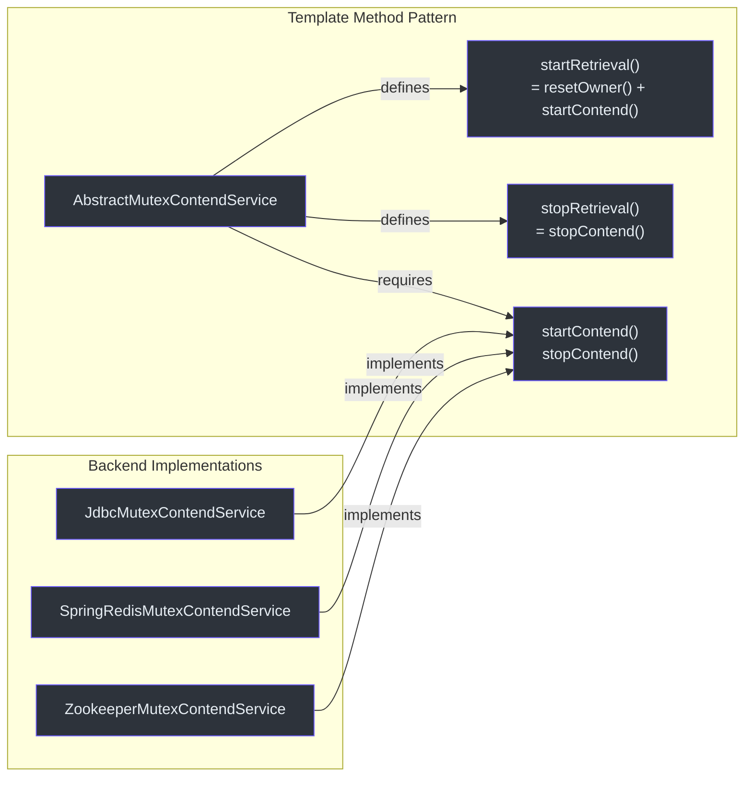
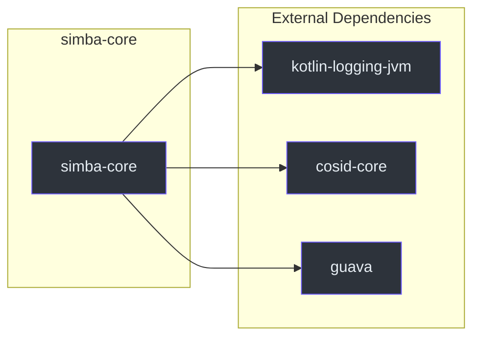

# simba-core 模块

`simba-core` 是 Simba 库的基础。它定义了所有接口、抽象基类、值对象和工具类型，由后端模块实现。应用代码通常只依赖此模块中的类型。

## 包结构

```
me.ahoo.simba
    Simba                  -- 品牌常量
    SimbaException         -- 根异常类
me.ahoo.simba.core
    MutexRetriever         -- 最小互斥回调接口
    MutexContender         -- 带生命周期回调的竞争者
    MutexRetrievalService  -- 具有生命周期管理的检索
    MutexContendService    -- 绑定竞争者的检索，支持所有权查询
    MutexRetrievalServiceFactory
    MutexContendServiceFactory
    AbstractMutexRetriever (via MutexRetriever)
    AbstractMutexContender -- 带默认日志的竞争者
    AbstractMutexRetrievalService -- 生命周期的模板方法
    AbstractMutexContendService -- 桥接到后端的 startContend/stopContend
    MutexOwner             -- 不可变所有权快照
    MutexState             -- 前/后转换对
    ContendPeriod          -- 调度延迟计算
    ContenderIdGenerator   -- ID 生成策略
me.ahoo.simba.locker
    Locker                 -- RAII 锁接口
    SimbaLocker            -- 基于 LockSupport 的实现
me.ahoo.simba.schedule
    AbstractScheduler      -- 领导者门控的周期执行器
    ScheduleConfig         -- 调度参数
me.ahoo.simba.util
    Threads                -- ThreadFactory 构建器
```



```mermaid
graph TB
    subgraph sg_90 ["me.ahoo.simba"]

        SB["Simba"]
        SE["SimbaException"]
    end
    subgraph sg_91 ["me.ahoo.simba.core"]

        MR["MutexRetriever"]
        MC["MutexContender"]
        MRS["MutexRetrievalService"]
        MCS["MutexContendService"]
        MRF["MutexRetrievalServiceFactory"]
        MCF["MutexContendServiceFactory"]
        AMRS["AbstractMutexRetrievalService"]
        AMCS["AbstractMutexContendService"]
        AMC["AbstractMutexContender"]
        MO["MutexOwner"]
        MS["MutexState"]
        CP["ContendPeriod"]
        CIG["ContenderIdGenerator"]
    end
    subgraph sg_92 ["me.ahoo.simba.locker"]

        LK["Locker"]
        SL["SimbaLocker"]
    end
    subgraph sg_93 ["me.ahoo.simba.schedule"]

        AS["AbstractScheduler"]
        SC["ScheduleConfig"]
    end
    subgraph sg_94 ["me.ahoo.simba.util"]

        TH["Threads"]
    end

    MC --> MR
    MCS --> MRS
    AMC --> MC
    AMRS --> MRS
    AMCS --> MCS
    AMCS --> AMRS
    AMRS --> MR
    AMCS --> MC
    MRS --> MR
    MCS --> MC
    MRF --> MRS
    MCF --> MCS
    MS --> MO
    AMRS --> MS
    AMRS --> MO
    CP --> MO
    SL --> LK
    SL --> AMC
    SL --> MCS
    AS --> AMC
    AS --> MCS

    style SB fill:#2d333b,stroke:#6d5dfc,color:#e6edf3
    style SE fill:#2d333b,stroke:#6d5dfc,color:#e6edf3
    style MR fill:#2d333b,stroke:#6d5dfc,color:#e6edf3
    style MC fill:#2d333b,stroke:#6d5dfc,color:#e6edf3
    style MRS fill:#2d333b,stroke:#6d5dfc,color:#e6edf3
    style MCS fill:#2d333b,stroke:#6d5dfc,color:#e6edf3
    style MRF fill:#2d333b,stroke:#6d5dfc,color:#e6edf3
    style MCF fill:#2d333b,stroke:#6d5dfc,color:#e6edf3
    style AMRS fill:#2d333b,stroke:#6d5dfc,color:#e6edf3
    style AMCS fill:#2d333b,stroke:#6d5dfc,color:#e6edf3
    style AMC fill:#2d333b,stroke:#6d5dfc,color:#e6edf3
    style MO fill:#2d333b,stroke:#6d5dfc,color:#e6edf3
    style MS fill:#2d333b,stroke:#6d5dfc,color:#e6edf3
    style CP fill:#2d333b,stroke:#6d5dfc,color:#e6edf3
    style CIG fill:#2d333b,stroke:#6d5dfc,color:#e6edf3
    style LK fill:#2d333b,stroke:#6d5dfc,color:#e6edf3
    style SL fill:#2d333b,stroke:#6d5dfc,color:#e6edf3
    style AS fill:#2d333b,stroke:#6d5dfc,color:#e6edf3
    style SC fill:#2d333b,stroke:#6d5dfc,color:#e6edf3
    style TH fill:#2d333b,stroke:#6d5dfc,color:#e6edf3
```

## 关键类

### 核心抽象链

核心抽象链遵循**模板方法**模式：



1. `AbstractMutexContendService.startRetrieval()` 调用 `resetOwner()` 然后调用 `startContend()`
2. 每个后端实现 `startContend()`（开始轮询/订阅/latch）和 `stopContend()`（清理）
3. `AbstractMutexRetrievalService` 管理 `Status` 状态机（`INITIAL` -> `STARTING` -> `RUNNING` -> `STOPPING` -> `INITIAL`）

### MutexOwner -- 所有权快照

`MutexOwner` 是一个不可变值对象，表示谁持有互斥锁以及键时间戳何时到期的时间点快照。

| 字段 | 含义 |
|---|---|
| `ownerId` | 当前所有者的 `contenderId` |
| `acquiredAt` | 获取锁的时间（纪元毫秒） |
| `ttlAt` | TTL 到期时间 -- 此后所有者应续期 |
| `transitionAt` | 宽限期结束时间 -- 所有者可以在此窗口期间优先续期 |

**转换期**（`transitionAt - ttlAt`）是一个关键设计要素：它通过给当前所有者一个宽限期窗口来进行续期，防止领导权频繁切换。

### ContendPeriod -- 调度延迟

`ContendPeriod` 计算竞争循环的下一个调度延迟：

- **所有者**：延迟 = `ttlAt - now`（在 TTL 到期前续期）
- **有转换期的非所有者**：延迟 = `transitionAt - now + random(-200, 1000)`（转换期结束后的抖动）
- **无转换期的非所有者**：延迟 = `transitionAt - now + random(0, 1000)`

抖动范围（`-200ms` 到 `+1000ms`）防止竞争者之间的惊群效应。

### ContenderIdGenerator -- ID 策略

| 策略 | 格式 | 来源 |
|---|---|---|
| `HOST`（默认） | `{counter}:{pid}@{host}` | `HostContenderIdGenerator` -- 使用 `cosid-core` 获取主机地址和 `ProcessId` |
| `UUID` | 不带连字符的 UUID | `UUIDContenderIdGenerator` |

`HOST` 策略人类可读，便于调试。示例：`0:12345@192.168.1.100`。

### SimbaLocker -- RAII 锁

`SimbaLocker` 使用 `LockSupport.park/unpark` 将 `MutexContendService` 包装为阻塞式的 `acquire()`/`close()` 模式。详见 [Locker API](/api/locker-api)。

### AbstractScheduler -- 领导者门控执行

`AbstractScheduler` 创建一个 `WorkContender` 内部类，根据领导权状态启动/停止 `ScheduledThreadPoolExecutor`。详见 [Scheduler API](/api/scheduler-api)。

## 设计模式

| 模式 | 使用位置 |
|---|---|
| **模板方法** | `AbstractMutexContendService` 定义 `startRetrieval`/`stopRetrieval`；后端实现 `startContend`/`stopContend` |
| **抽象工厂** | `MutexContendServiceFactory` / `MutexRetrievalServiceFactory` 创建服务实例 |
| **观察者 / 回调** | `MutexRetriever.notifyOwner` / `MutexContender.onAcquired`/`onReleased` |
| **RAII** | `SimbaLocker` 使用 `AutoCloseable` 实现自动锁释放 |
| **策略** | `ContenderIdGenerator.HOST` / `ContenderIdGenerator.UUID` |
| **状态机** | `MutexRetrievalService.Status` 使用原子 CAS 转换 |

## 依赖



| 依赖 | 用途 |
|---|---|
| `kotlin-logging-jvm` | 抽象类中的日志记录（`KotlinLogging.logger`） |
| `cosid-core` | `HostContenderIdGenerator` 使用的 `LocalHostAddressSupplier` 和 `ProcessId` |
| `guava` | `Threads.defaultFactory` 中的 `ThreadFactoryBuilder`、`MutexOwner` 上的 `@Immutable` 注解 |

## 异常层次结构

```
java.lang.RuntimeException
  └── SimbaException                       (me.ahoo.simba)
        └── NotFoundMutexOwnerException    (me.ahoo.simba.jdbc)
```

`SimbaException` 是一个开放类，具有所有标准 `RuntimeException` 构造函数。`NotFoundMutexOwnerException`（位于 `simba-jdbc`）继承它，用于互斥锁行未初始化的情况。

## 线程安全

simba-core 中的关键线程安全机制：

| 类 | 机制 |
|---|---|
| `AbstractMutexRetrievalService` | 在 `status` 字段上使用 `AtomicReferenceFieldUpdater` 进行 CAS 转换 |
| `SimbaLocker` | 在 `owner` 字段上使用 `AtomicReferenceFieldUpdater` 实现单一所有者强制 |
| `MutexOwner` | `@Immutable` -- 所有字段为 `val`，可安全跨线程共享 |
| `MutexState` | `data class` -- 不可变快照 |
| `ContenderIdGenerator` | `HostContenderIdGenerator` 中的 `AtomicLong` 计数器 |

## 另请参阅

- [API 参考](/api/) -- 完整 API 文档
- [simba-jdbc](./simba-jdbc) -- JDBC 后端实现
- [simba-spring-redis](./simba-spring-redis) -- Redis 后端实现
- [simba-zookeeper](./simba-zookeeper) -- Zookeeper 后端实现
