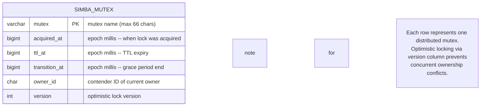
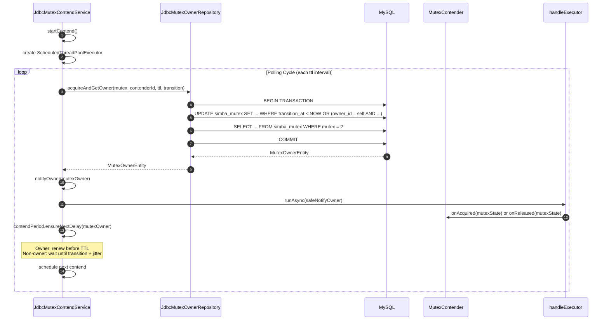

# simba-jdbc 模块

`simba-jdbc` 模块提供了基于 JDBC 的分布式互斥后端，使用 MySQL。它使用乐观锁（`version` 列）来确保对 `simba_mutex` 表的安全并发更新，并通过 `ScheduledThreadPoolExecutor` 轮询数据库以检测所有权变更。

## 模式 DDL

MySQL 模式定义在 [simba-jdbc/src/init-script/init-simba-mysql.sql](https://github.com/Ahoo-Wang/Simba/blob/main/simba-jdbc/src/init-script/init-simba-mysql.sql)：

```sql
CREATE DATABASE IF NOT EXISTS simba_db;
USE simba_db;

CREATE TABLE IF NOT EXISTS simba_mutex (
    mutex         VARCHAR(66)    NOT NULL PRIMARY KEY COMMENT 'mutex name',
    acquired_at   BIGINT UNSIGNED NOT NULL,
    ttl_at        BIGINT UNSIGNED NOT NULL,
    transition_at BIGINT UNSIGNED NOT NULL,
    owner_id      VARCHAR(128)   NOT NULL,
    version       INT UNSIGNED   NOT NULL
);
```

### ER 图



### 列语义

| 列 | 类型 | 描述 |
|---|---|---|
| `mutex` | `VARCHAR(66)` PK | 逻辑互斥锁名称。主键 -- 每个互斥锁一行。 |
| `acquired_at` | `BIGINT UNSIGNED` | 当前所有者获取锁时的纪元毫秒时间戳。无所有者时为 `0`。 |
| `ttl_at` | `BIGINT UNSIGNED` | TTL 到期的纪元毫秒时间戳。此后其他竞争者可以尝试获取。 |
| `transition_at` | `BIGINT UNSIGNED` | 宽限期结束的纪元毫秒时间戳。等于 `acquired_at + ttl + transition`。 |
| `owner_id` | `VARCHAR(128)` | 当前所有者的 `contenderId`。无所有者时为空字符串。 |
| `version` | `INT UNSIGNED` | 每次获取/释放时递增，用于乐观并发控制。 |

## 关键类

### MutexOwnerRepository 接口

**源码：** [simba-jdbc/.../MutexOwnerRepository.kt:23](https://github.com/Ahoo-Wang/Simba/blob/main/simba-jdbc/src/main/kotlin/me/ahoo/simba/jdbc/MutexOwnerRepository.kt#L23)

```kotlin
interface MutexOwnerRepository {
    fun initMutex(mutex: String): Boolean
    fun tryInitMutex(mutex: String): Boolean
    fun getOwner(mutex: String): MutexOwnerEntity
    fun acquire(mutex: String, contenderId: String, ttl: Long, transition: Long): Boolean
    fun acquireAndGetOwner(mutex: String, contenderId: String, ttl: Long, transition: Long): MutexOwnerEntity
    fun release(mutex: String, contenderId: String): Boolean
    fun ensureOwner(mutex: String): MutexOwnerEntity
}
```

| 方法 | 描述 |
|---|---|
| `initMutex` | 插入互斥锁行。如果已存在则抛出 `SQLIntegrityConstraintViolationException`。 |
| `tryInitMutex` | 安全包装：任何异常时返回 `false`。 |
| `getOwner` | 读取当前所有者。如果行不存在则抛出 `NotFoundMutexOwnerException`。 |
| `acquire` | 通过 `UPDATE ... WHERE` 尝试获取互斥锁。如果受影响行数 > 0 则返回 `true`。 |
| `acquireAndGetOwner` | 原子事务：获取互斥锁并回读完整的所有者状态。 |
| `release` | 通过重置行来释放互斥锁。仅在 `owner_id` 匹配时成功。 |
| `ensureOwner` | 获取所有者，如果行不存在则自动初始化。 |

### JdbcMutexOwnerRepository

**源码：** [simba-jdbc/.../JdbcMutexOwnerRepository.kt:27](https://github.com/Ahoo-Wang/Simba/blob/main/simba-jdbc/src/main/kotlin/me/ahoo/simba/jdbc/JdbcMutexOwnerRepository.kt#L27)

```kotlin
class JdbcMutexOwnerRepository(private val dataSource: DataSource) : MutexOwnerRepository
```

### ACQUIRE SQL 逻辑

获取操作使用条件 `UPDATE`：

```sql
UPDATE simba_mutex
SET acquired_at = NOW_MILLIS,
    ttl_at = NOW_MILLIS + ?,
    transition_at = NOW_MILLIS + ?,
    owner_id = ?,
    version = version + 1
WHERE mutex = ?
  AND (
    transition_at < NOW_MILLIS                    -- no active owner (transition expired)
    OR
    (owner_id = ? AND transition_at > NOW_MILLIS) -- same owner renewing within transition
  );
```

这确保了：
1. **无活跃所有者**：`transition_at` 已过期 -- 任何竞争者都可以获取。
2. **同一所有者续期**：当前所有者可以在转换期（领导权稳定性的宽限期）内续期。

### MutexOwnerEntity

**源码：** [simba-jdbc/.../MutexOwnerEntity.kt:22](https://github.com/Ahoo-Wang/Simba/blob/main/simba-jdbc/src/main/kotlin/me/ahoo/simba/jdbc/MutexOwnerEntity.kt#L22)

扩展 `MutexOwner`，增加 JDBC 特有字段：

```kotlin
class MutexOwnerEntity(
    val mutex: String,
    ownerId: String, acquiredAt: Long, ttlAt: Long, transitionAt: Long
) : MutexOwner(ownerId, acquiredAt, ttlAt, transitionAt) {
    var version: Int = 0
    var currentDbAt: Long = 0
}
```

| 字段 | 描述 |
|---|---|
| `version` | 来自数据库的乐观锁版本号。用于并发控制。 |
| `currentDbAt` | 数据库服务器的当前时间戳，用于防止应用服务器之间的时钟偏移问题。 |

### JdbcMutexContendService

**源码：** [simba-jdbc/.../JdbcMutexContendService.kt:32](https://github.com/Ahoo-Wang/Simba/blob/main/simba-jdbc/src/main/kotlin/me/ahoo/simba/jdbc/JdbcMutexContendService.kt#L32)

```kotlin
class JdbcMutexContendService(
    mutexContender: MutexContender,
    handleExecutor: Executor,
    private val mutexOwnerRepository: MutexOwnerRepository,
    private val initialDelay: Duration,
    private val ttl: Duration,
    private val transition: Duration
) : AbstractMutexContendService(mutexContender, handleExecutor)
```

| 参数 | 描述 |
|---|---|
| `mutexContender` | 绑定到此服务的竞争者 |
| `handleExecutor` | 用于异步所有者通知回调的执行器 |
| `mutexOwnerRepository` | 互斥状态的 JDBC 仓库 |
| `initialDelay` | 首次竞争尝试前的延迟 |
| `ttl` | 锁 TTL -- 所有者必须在此时间前续期 |
| `transition` | TTL 后的宽限期，当前所有者可以在此期间优先续期 |

### JdbcMutexContendServiceFactory

**源码：** [simba-jdbc/.../JdbcMutexContendServiceFactory.kt:27](https://github.com/Ahoo-Wang/Simba/blob/main/simba-jdbc/src/main/kotlin/me/ahoo/simba/jdbc/JdbcMutexContendServiceFactory.kt#L27)

```kotlin
class JdbcMutexContendServiceFactory(
    private val mutexOwnerRepository: MutexOwnerRepository,
    private val handleExecutor: Executor = ForkJoinPool.commonPool(),
    private val initialDelay: Duration,
    private val ttl: Duration,
    private val transition: Duration
) : MutexContendServiceFactory
```

## 时序图 -- 轮询竞争



## 属性

使用 `simba-spring-boot-starter` 时，JDBC 后端通过 `application.yml` 配置：

```yaml
simba:
  enabled: true          # 全局 Simba 启用（默认: true）
  jdbc:
    enabled: true        # JDBC 后端启用（默认: true）
    initial-delay: 0s    # 首次竞争前的延迟
    ttl: 10s             # 锁 TTL
    transition: 6s       # TTL 后的宽限期
```

**源码：** [simba-spring-boot-starter/.../JdbcProperties.kt:25](https://github.com/Ahoo-Wang/Simba/blob/main/simba-spring-boot-starter/src/main/kotlin/me/ahoo/simba/spring/boot/starter/jdbc/JdbcProperties.kt#L25)

| 属性 | 默认值 | 描述 |
|---|---|---|
| `simba.enabled` | `true` | 所有 Simba 后端的全局启用开关 |
| `simba.jdbc.enabled` | `true` | 启用 JDBC 后端 |
| `simba.jdbc.initial-delay` | `0s` | 首次竞争尝试前的延迟 |
| `simba.jdbc.ttl` | `10s` | 锁 TTL -- 锁被持有多长时间后需要续期 |
| `simba.jdbc.transition` | `6s` | TTL 后用于优先所有者续期的宽限期 |

## 错误处理

| 场景 | 行为 |
|---|---|
| 互斥锁行不存在 | 抛出 `NotFoundMutexOwnerException`；使用 `tryInitMutex()` 或 `ensureOwner()` 自动创建 |
| 并发获取冲突 | 通过 `version` 列进行乐观锁；`UPDATE` 返回 0 受影响行 |
| 竞争期间 SQL 错误 | 以 ERROR 级别记录日志；下次竞争在 `ttl` 周期后调度 |
| 事务回滚 | `acquireAndGetOwner` 在任何异常时回滚并包装为 `SimbaException` |

## 依赖

```
simba-jdbc
  ├── simba-core
  └── javax.sql.DataSource (由应用提供)
```

该模块不捆绑 JDBC 驱动。应用必须提供 MySQL 连接器（例如 `com.mysql:mysql-connector-j`）。

## 另请参阅

- [simba-core 模块](./simba-core) -- 核心接口和抽象
- [simba-spring-boot-starter](./simba-spring-boot-starter) -- 使用 `simba.jdbc.*` 属性的自动配置
- [simba-spring-redis](./simba-spring-redis) -- Redis 替代后端
