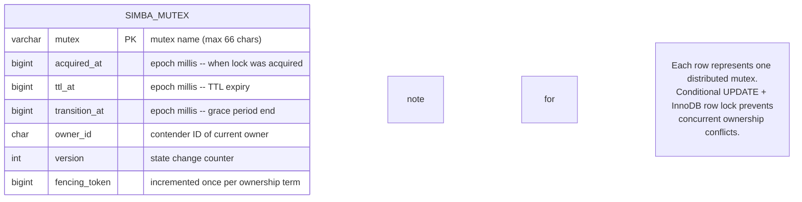
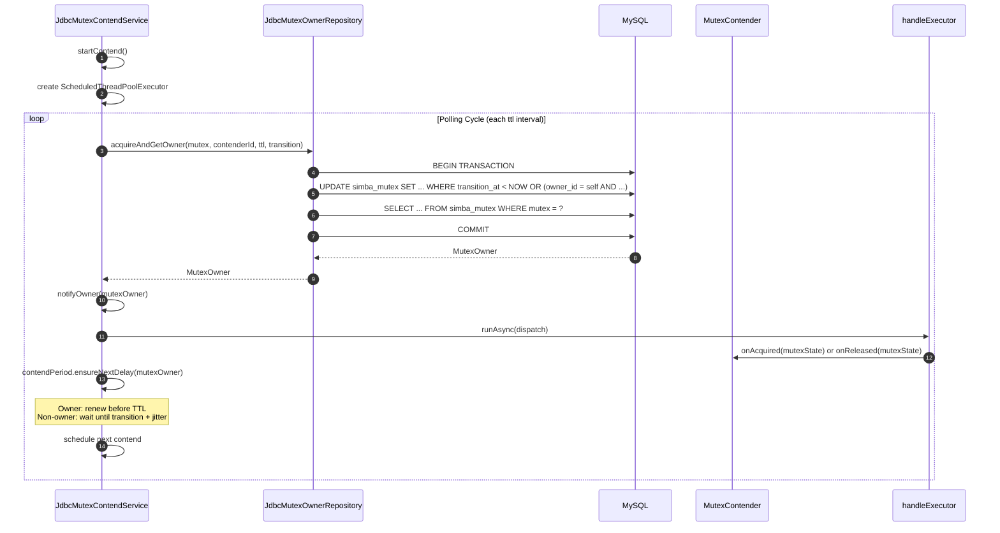

# simba-jdbc 模块

`simba-jdbc` 模块提供了基于 JDBC 的分布式互斥后端，使用 MySQL。它通过由 owner/transition 谓词守卫的原子条件 `UPDATE` 确保对 `simba_mutex` 表的并发安全，并通过 `ScheduledThreadPoolExecutor` 轮询数据库以检测所有权变更。

> **MySQL 版本要求**：后端通过 `UNIX_TIMESTAMP(CURRENT_TIMESTAMP(3))` 读取数据库时间。64 位平台的 MySQL 8.0.28+ 返回值有效期到 3001 年；更早版本的有效范围止于 2038-01-19 UTC，超范围调用返回 0，持有者时间戳会静默回退为 JVM 时钟。运行旧版本 MySQL 的部署请在此日期前规划升级。

## 模式 DDL

MySQL 模式定义在 [simba-jdbc/src/init-script/init-simba-mysql.sql](https://github.com/Ahoo-Wang/Simba/blob/main/simba-jdbc/src/init-script/init-simba-mysql.sql)：

```sql
CREATE DATABASE IF NOT EXISTS simba_db;
USE simba_db;

CREATE TABLE IF NOT EXISTS simba_mutex (
    mutex         VARCHAR(66)    NOT NULL PRIMARY KEY COMMENT 'mutex name',
    acquired_at   BIGINT UNSIGNED NOT NULL,
    ttl_at        BIGINT UNSIGNED NOT NULL,
    transition_at BIGINT UNSIGNED NOT NULL,
    owner_id      VARCHAR(128)   NOT NULL,
    version       INT UNSIGNED   NOT NULL,
    fencing_token BIGINT UNSIGNED NOT NULL DEFAULT 0
);
```

### ER 图


```mermaid
erDiagram
    SIMBA_MUTEX {
        varchar mutex PK "mutex name (max 66 chars)"
        bigint acquired_at "epoch millis -- when lock was acquired"
        bigint ttl_at "epoch millis -- TTL expiry"
        bigint transition_at "epoch millis -- grace period end"
        char owner_id "contender ID of current owner"
        int version "state change counter"
        bigint fencing_token "incremented once per ownership term"
    }

    note for SIMBA_MUTEX "Each row represents one distributed mutex.<br>Conditional UPDATE + InnoDB row lock prevents<br>concurrent ownership conflicts."
```

### 列语义

| 列 | 类型 | 描述 |
|---|---|---|
| `mutex` | `VARCHAR(66)` PK | 逻辑互斥锁名称。主键 -- 每个互斥锁一行。 |
| `acquired_at` | `BIGINT UNSIGNED` | 当前所有者获取锁时的纪元毫秒时间戳。无所有者时为 `0`。 |
| `ttl_at` | `BIGINT UNSIGNED` | TTL 到期的纪元毫秒时间戳。此后其他竞争者可以尝试获取。 |
| `transition_at` | `BIGINT UNSIGNED` | 宽限期结束的纪元毫秒时间戳。等于 `acquired_at + ttl + transition`。 |
| `owner_id` | `VARCHAR(128)` | 当前所有者的 `contenderId`。无所有者时为空字符串。 |
| `version` | `INT UNSIGNED` | 每次获取/释放时递增的状态变更计数器。不参与 `WHERE` 比较——并发由 owner/transition 谓词守卫。 |
| `fencing_token` | `BIGINT UNSIGNED` | Fencing token，启用 `simba.jdbc.fencing` 时每个持有任期递增一次。 |

### Fencing Token

设置 `simba.jdbc.fencing=true`（或 `JdbcMutexOwnerRepository(dataSource, fencing = true)`）后，获取锁的 `UPDATE` 只在开始新的持有任期时推进 `fencing_token`：被他人接管，或所有者自己的租约结束后重新获取。续期保持不变。该赋值位于 `SET` 列表的第一位，因为 MySQL 按从左到右的顺序、使用已更新的值计算赋值，而条件必须读取之前的持有者。参见 [ADR 0002](https://github.com/Ahoo-Wang/Simba/blob/main/docs/adr/0002-fencing-token.md)。

Fencing 需要 `fencing_token` 列，因此需要显式开启：新安装会通过 `init-simba-mysql.sql` 创建该列，已有的表需要先执行 [`upgrade-simba-mysql-fencing-token.sql`](https://github.com/Ahoo-Wang/Simba/blob/main/simba-jdbc/src/init-script/upgrade-simba-mysql-fencing-token.sql)。

## 关键类

### MutexOwnerRepository 接口

**源码：** [simba-jdbc/.../MutexOwnerRepository.kt:23](https://github.com/Ahoo-Wang/Simba/blob/main/simba-jdbc/src/main/kotlin/me/ahoo/simba/jdbc/MutexOwnerRepository.kt#L23)

```kotlin
interface MutexOwnerRepository {
    fun acquireAndGetOwner(mutex: String, contenderId: String, ttl: Long, transition: Long): MutexOwner
    fun release(mutex: String, contenderId: String): Boolean
}
```

该接口只包含竞争引擎需要的方法：

| 方法 | 描述 |
|---|---|
| `acquireAndGetOwner` | 原子事务：获取（或续期）互斥锁，行不存在时自动创建，并回读完整的所有者状态。 |
| `release` | 通过重置行来释放互斥锁。仅在 `owner_id` 匹配时成功。 |

`JdbcMutexOwnerRepository` 另外提供 `initMutex`、`tryInitMutex`、`getOwner`、`ensureOwner` 和 `acquire`，用于初始化与排查。

### JdbcMutexOwnerRepository

**源码：** [simba-jdbc/.../JdbcMutexOwnerRepository.kt:27](https://github.com/Ahoo-Wang/Simba/blob/main/simba-jdbc/src/main/kotlin/me/ahoo/simba/jdbc/JdbcMutexOwnerRepository.kt#L27)

```kotlin
class JdbcMutexOwnerRepository(private val dataSource: DataSource) : MutexOwnerRepository
```

### ACQUIRE SQL 逻辑

获取操作使用条件 `UPDATE`：

```sql
UPDATE simba_mutex
SET acquired_at = NOW_MILLIS,
    ttl_at = NOW_MILLIS + ?,
    transition_at = NOW_MILLIS + ?,
    owner_id = ?,
    version = version + 1
WHERE mutex = ?
  AND (
    transition_at < NOW_MILLIS                    -- no active owner (transition expired)
    OR
    (owner_id = ? AND transition_at > NOW_MILLIS) -- same owner renewing within transition
  );
```

这确保了：
1. **无活跃所有者**：`transition_at` 已过期 -- 任何竞争者都可以获取。
2. **同一所有者续期**：当前所有者可以在转换期（领导权稳定性的宽限期）内续期。

### 数据库时间

仓库返回普通的 `MutexOwner`，其 `observedAt` 是数据库服务器的 `current_timestamp(3)`。`currentAt` 用本地 monotonic 时钟推进这个值，因此每个节点都按数据库时钟判断租约。如果 MySQL 返回 0（8.0.28 之前的版本在 2038 年之后 `UNIX_TIMESTAMP` 超出范围），则改用 JVM 时间。

### JdbcMutexContendService

**源码：** [simba-jdbc/.../JdbcMutexContendService.kt:32](https://github.com/Ahoo-Wang/Simba/blob/main/simba-jdbc/src/main/kotlin/me/ahoo/simba/jdbc/JdbcMutexContendService.kt#L32)

```kotlin
class JdbcMutexContendService(
    mutexContender: MutexContender,
    handleExecutor: Executor,
    private val mutexOwnerRepository: MutexOwnerRepository,
    private val initialDelay: Duration,
    private val ttl: Duration,
    private val transition: Duration
) : AbstractMutexContendService(mutexContender, handleExecutor)
```

| 参数 | 描述 |
|---|---|
| `mutexContender` | 绑定到此服务的竞争者 |
| `handleExecutor` | 用于异步所有者通知回调的执行器 |
| `mutexOwnerRepository` | 互斥状态的 JDBC 仓库 |
| `initialDelay` | 首次竞争尝试前的延迟 |
| `ttl` | 锁 TTL -- 所有者必须在此时间前续期 |
| `transition` | TTL 后的宽限期，当前所有者可以在此期间优先续期 |

### JdbcMutexContendServiceFactory

**源码：** [simba-jdbc/.../JdbcMutexContendServiceFactory.kt:27](https://github.com/Ahoo-Wang/Simba/blob/main/simba-jdbc/src/main/kotlin/me/ahoo/simba/jdbc/JdbcMutexContendServiceFactory.kt#L27)

```kotlin
class JdbcMutexContendServiceFactory(
    private val mutexOwnerRepository: MutexOwnerRepository,
    private val handleExecutor: Executor = ForkJoinPool.commonPool(),
    private val initialDelay: Duration,
    private val ttl: Duration,
    private val transition: Duration
) : MutexContendServiceFactory
```

## 时序图 -- 轮询竞争


```mermaid
sequenceDiagram
autonumber
    participant Service as JdbcMutexContendService
    participant Repo as JdbcMutexOwnerRepository
    participant DB as MySQL
    participant Contender as MutexContender
    participant Executor as handleExecutor

    Service->>Service: startContend()
    Service->>Service: create ScheduledThreadPoolExecutor

    loop Polling Cycle (each ttl interval)
        Service->>Repo: acquireAndGetOwner(mutex, contenderId, ttl, transition)
        Repo->>DB: BEGIN TRANSACTION
        Repo->>DB: UPDATE simba_mutex SET ... WHERE transition_at < NOW OR (owner_id = self AND ...)
        Repo->>DB: SELECT ... FROM simba_mutex WHERE mutex = ?
        Repo->>DB: COMMIT
        DB-->>Repo: MutexOwner
        Repo-->>Service: MutexOwner

        Service->>Service: notifyOwner(mutexOwner)
        Service->>Executor: runAsync(dispatch)
        Executor->>Contender: onAcquired(mutexState) or onReleased(mutexState)

        Service->>Service: contendPeriod.ensureNextDelay(mutexOwner)
        Note over Service: Owner: renew before TTL<br>Non-owner: wait until transition + jitter
        Service->>Service: schedule next contend
    end
```

## 属性

使用 `simba-spring-boot-starter` 时，JDBC 后端通过 `application.yml` 配置：

```yaml
simba:
  enabled: true          # 全局 Simba 启用（默认: true）
  jdbc:
    enabled: true        # JDBC 后端启用（默认: true）
    initial-delay: 0s    # 首次竞争前的延迟
    ttl: 10s             # 锁 TTL
    transition: 6s       # TTL 后的宽限期
    fencing: false       # 签发 fencing token（需要 fencing_token 列）
```

**源码：** [simba-spring-boot-starter/.../JdbcProperties.kt:25](https://github.com/Ahoo-Wang/Simba/blob/main/simba-spring-boot-starter/src/main/kotlin/me/ahoo/simba/spring/boot/starter/jdbc/JdbcProperties.kt#L25)

| 属性 | 默认值 | 描述 |
|---|---|---|
| `simba.enabled` | `true` | 所有 Simba 后端的全局启用开关 |
| `simba.jdbc.enabled` | `true` | 启用 JDBC 后端 |
| `simba.jdbc.initial-delay` | `0s` | 首次竞争尝试前的延迟 |
| `simba.jdbc.ttl` | `10s` | 锁 TTL -- 锁被持有多长时间后需要续期 |
| `simba.jdbc.transition` | `6s` | TTL 后用于优先所有者续期的宽限期 |
| `simba.jdbc.fencing` | `false` | 从 `fencing_token` 列签发 fencing token |

## 错误处理

| 场景 | 行为 |
|---|---|
| 互斥锁行不存在 | 抛出 `NotFoundMutexOwnerException`；使用 `tryInitMutex()` 或 `ensureOwner()` 自动创建 |
| 并发获取冲突 | 由 owner/transition 谓词守卫的原子条件 `UPDATE`；失败方 `UPDATE` 影响 0 行 |
| 竞争期间 SQL 错误 | 以 ERROR 级别记录日志；下次竞争在 `ttl` 周期后调度 |
| 事务回滚 | `acquireAndGetOwner` 在任何异常时回滚并包装为 `SimbaException` |

## 依赖

```
simba-jdbc
  ├── simba-core
  └── javax.sql.DataSource (由应用提供)
```

该模块不捆绑 JDBC 驱动。应用必须提供 MySQL 连接器（例如 `com.mysql:mysql-connector-j`）。

## 另请参阅

- [simba-core 模块](./simba-core) -- 核心接口和抽象
- [simba-spring-boot-starter](./simba-spring-boot-starter) -- 使用 `simba.jdbc.*` 属性的自动配置
- [simba-spring-redis](./simba-spring-redis) -- Redis 替代后端
