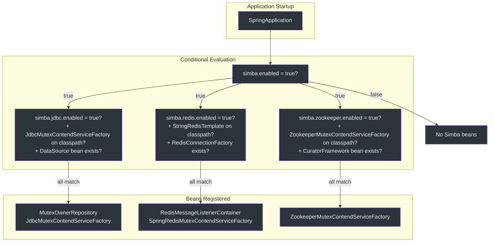
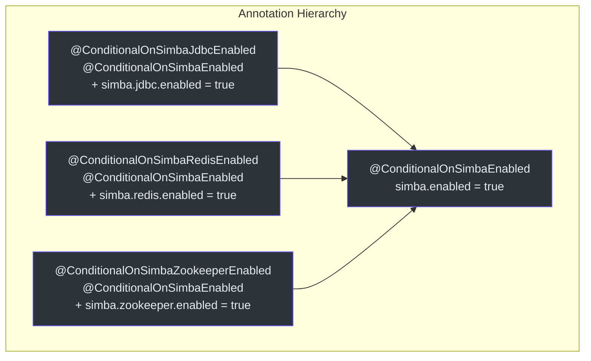
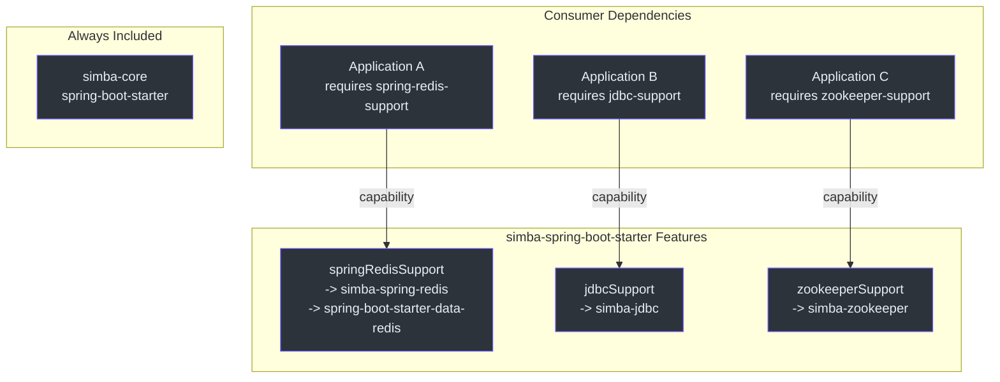

# simba-spring-boot-starter 模块

`simba-spring-boot-starter` 模块为所有三个 Simba 后端（JDBC、Redis、Zookeeper）提供 Spring Boot 自动配置。它使用条件注解和 Gradle 功能变体，使应用只引入所选后端的依赖。

## 自动配置类

该模块通过 Spring Boot 的标准机制注册三个自动配置类。

**源码：** [simba-spring-boot-starter/.../org.springframework.boot.autoconfigure.AutoConfiguration.imports](https://github.com/Ahoo-Wang/Simba/blob/main/simba-spring-boot-starter/src/main/resources/META-INF/spring/org.springframework.boot.autoconfigure.AutoConfiguration.imports)

```
me.ahoo.simba.spring.boot.starter.jdbc.SimbaJdbcAutoConfiguration
me.ahoo.simba.spring.boot.starter.redis.SimbaSpringRedisAutoConfiguration
me.ahoo.simba.spring.boot.starter.zookeeper.SimbaZookeeperAutoConfiguration
```

## 配置流程



## 条件注解

该模块使用两级条件注解层次结构：



### ConditionalOnSimbaEnabled

**源码：** [simba-spring-boot-starter/.../ConditionalOnSimbaEnabled.kt:23](https://github.com/Ahoo-Wang/Simba/blob/main/simba-spring-boot-starter/src/main/kotlin/me/ahoo/simba/spring/boot/starter/ConditionalOnSimbaEnabled.kt#L23)

```kotlin
@ConditionalOnProperty(
    value = ["simba.enabled"],
    matchIfMissing = true,
    havingValue = "true"
)
annotation class ConditionalOnSimbaEnabled
```

全局开关。属性未设置时默认为 `true`。

### ConditionalOnSimbaJdbcEnabled

**源码：** [simba-spring-boot-starter/.../ConditionalOnSimbaJdbcEnabled.kt:24](https://github.com/Ahoo-Wang/Simba/blob/main/simba-spring-boot-starter/src/main/kotlin/me/ahoo/simba/spring/boot/starter/jdbc/ConditionalOnSimbaJdbcEnabled.kt#L24)

```kotlin
@ConditionalOnSimbaEnabled
@ConditionalOnProperty(
    value = ["simba.jdbc.enabled"],
    matchIfMissing = true,
    havingValue = "true"
)
annotation class ConditionalOnSimbaJdbcEnabled
```

### ConditionalOnSimbaRedisEnabled

**源码：** [simba-spring-boot-starter/.../ConditionalOnSimbaRedisEnabled.kt:28](https://github.com/Ahoo-Wang/Simba/blob/main/simba-spring-boot-starter/src/main/kotlin/me/ahoo/simba/spring/boot/starter/redis/ConditionalOnSimbaRedisEnabled.kt#L28)

```kotlin
@ConditionalOnSimbaEnabled
@ConditionalOnProperty(
    value = ["simba.redis.enabled"],
    matchIfMissing = true,
    havingValue = "true"
)
annotation class ConditionalOnSimbaRedisEnabled
```

### ConditionalOnSimbaZookeeperEnabled

**源码：** [simba-spring-boot-starter/.../ConditionalOnSimbaZookeeperEnabled.kt:26](https://github.com/Ahoo-Wang/Simba/blob/main/simba-spring-boot-starter/src/main/kotlin/me/ahoo/simba/spring/boot/starter/zookeeper/ConditionalOnSimbaZookeeperEnabled.kt#L26)

```kotlin
@ConditionalOnSimbaEnabled
@ConditionalOnProperty(
    value = ["simba.zookeeper.enabled"],
    matchIfMissing = true,
    havingValue = "true"
)
annotation class ConditionalOnSimbaZookeeperEnabled
```

## 自动配置详情

### SimbaJdbcAutoConfiguration

**源码：** [simba-spring-boot-starter/.../SimbaJdbcAutoConfiguration.kt:32](https://github.com/Ahoo-Wang/Simba/blob/main/simba-spring-boot-starter/src/main/kotlin/me/ahoo/simba/spring/boot/starter/jdbc/SimbaJdbcAutoConfiguration.kt#L32)

```kotlin
@AutoConfiguration
@ConditionalOnSimbaJdbcEnabled
@ConditionalOnClass(JdbcMutexContendServiceFactory::class)
@EnableConfigurationProperties(JdbcProperties::class)
class SimbaJdbcAutoConfiguration(private val jdbcProperties: JdbcProperties) {

    @Bean @ConditionalOnMissingBean
    fun mutexOwnerRepository(dataSource: DataSource): MutexOwnerRepository

    @Bean @ConditionalOnMissingBean
    fun jdbcMutexContendServiceFactory(mutexOwnerRepository: MutexOwnerRepository): MutexContendServiceFactory
}
```

| 条件 | Bean |
|---|---|
| `simba.jdbc.enabled = true` + `JdbcMutexContendServiceFactory` 在类路径上 + `DataSource` Bean 存在 | `MutexOwnerRepository` |
| 同上 + `MutexOwnerRepository` Bean 存在 | `MutexContendServiceFactory`（即 `JdbcMutexContendServiceFactory`） |

### SimbaSpringRedisAutoConfiguration

**源码：** [simba-spring-boot-starter/.../SimbaSpringRedisAutoConfiguration.kt:34](https://github.com/Ahoo-Wang/Simba/blob/main/simba-spring-boot-starter/src/main/kotlin/me/ahoo/simba/spring/boot/starter/redis/SimbaSpringRedisAutoConfiguration.kt#L34)

```kotlin
@AutoConfiguration(after = [DataRedisAutoConfiguration::class])
@ConditionalOnSimbaRedisEnabled
@ConditionalOnClass(StringRedisTemplate::class)
@EnableConfigurationProperties(RedisProperties::class)
class SimbaSpringRedisAutoConfiguration(private val redisProperties: RedisProperties) {

    @Bean @ConditionalOnMissingBean @ConditionalOnSingleCandidate(RedisConnectionFactory::class)
    fun simbaRedisMessageListenerContainer(connectionFactory: RedisConnectionFactory): RedisMessageListenerContainer

    @Bean @ConditionalOnMissingBean @ConditionalOnBean(StringRedisTemplate::class)
    fun redisMutexContendServiceFactory(
        redisTemplate: StringRedisTemplate,
        listenerContainer: RedisMessageListenerContainer
    ): MutexContendServiceFactory
}
```

| 条件 | Bean |
|---|---|
| `simba.redis.enabled = true` + `StringRedisTemplate` 在类路径上 + `RedisConnectionFactory` 存在 | `RedisMessageListenerContainer` |
| 同上 + `StringRedisTemplate` Bean 存在 | `MutexContendServiceFactory`（即 `SpringRedisMutexContendServiceFactory`） |

该配置运行在 `after = DataRedisAutoConfiguration` 之后，以确保 Redis 基础设施 Bean 可用。

### SimbaZookeeperAutoConfiguration

**源码：** [simba-spring-boot-starter/.../SimbaZookeeperAutoConfiguration.kt:30](https://github.com/Ahoo-Wang/Simba/blob/main/simba-spring-boot-starter/src/main/kotlin/me/ahoo/simba/spring/boot/starter/zookeeper/SimbaZookeeperAutoConfiguration.kt#L30)

```kotlin
@AutoConfiguration
@ConditionalOnSimbaZookeeperEnabled
@ConditionalOnClass(ZookeeperMutexContendServiceFactory::class)
@EnableConfigurationProperties(ZookeeperProperties::class)
class SimbaZookeeperAutoConfiguration {

    @Bean @ConditionalOnBean(CuratorFramework::class) @ConditionalOnMissingBean
    fun zookeeperMutexContendServiceFactory(curatorFramework: CuratorFramework): ZookeeperMutexContendServiceFactory
}
```

| 条件 | Bean |
|---|---|
| `simba.zookeeper.enabled = true` + `ZookeeperMutexContendServiceFactory` 在类路径上 + `CuratorFramework` Bean 存在 | `MutexContendServiceFactory`（即 `ZookeeperMutexContendServiceFactory`） |

## 属性绑定

所有属性绑定在 `simba` 前缀下。

### 完整属性参考

```yaml
simba:
  enabled: true                # 全局开关（默认: true）

  jdbc:
    enabled: true              # JDBC 后端（默认: true）
    initial-delay: 0s          # 首次竞争前的延迟
    ttl: 10s                   # 锁 TTL
    transition: 6s             # 宽限期

  redis:
    enabled: true              # Redis 后端（默认: true）
    ttl: 10s                   # 锁 TTL
    transition: 6s             # 宽限期

  zookeeper:
    enabled: true              # Zookeeper 后端（默认: true）
```

| 属性 | 来源类 | 默认值 |
|---|---|---|
| `simba.enabled` | `ConditionalOnSimbaEnabled` | `true` |
| `simba.jdbc.enabled` | `JdbcProperties` | `true` |
| `simba.jdbc.initial-delay` | `JdbcProperties` | `0s` |
| `simba.jdbc.ttl` | `JdbcProperties` | `10s` |
| `simba.jdbc.transition` | `JdbcProperties` | `6s` |
| `simba.redis.enabled` | `RedisProperties` | `true` |
| `simba.redis.ttl` | `RedisProperties` | `10s` |
| `simba.redis.transition` | `RedisProperties` | `6s` |
| `simba.zookeeper.enabled` | `ZookeeperProperties` | `true` |

## Gradle 功能变体

该 starter 使用 Gradle 的 `registerFeature` 创建可选的功能变体。这确保消费者只引入所需的后端依赖。

**源码：** [simba-spring-boot-starter/build.gradle.kts:18](https://github.com/Ahoo-Wang/Simba/blob/main/simba-spring-boot-starter/build.gradle.kts#L18)

```kotlin
java {
    registerFeature("springRedisSupport") {
        usingSourceSet(sourceSets[SourceSet.MAIN_SOURCE_SET_NAME])
        capability(group.toString(), "spring-redis-support", version.toString())
    }
    registerFeature("jdbcSupport") {
        usingSourceSet(sourceSets[SourceSet.MAIN_SOURCE_SET_NAME])
        capability(group.toString(), "jdbc-support", version.toString())
    }
    registerFeature("zookeeperSupport") {
        usingSourceSet(sourceSets[SourceSet.MAIN_SOURCE_SET_NAME])
        capability(group.toString(), "zookeeper-support", version.toString())
    }
}
```



### 使用功能变体

在消费应用的 `build.gradle.kts` 中：

```kotlin
dependencies {
    // 仅引入 Redis 后端
    implementation("me.ahoo.simba:simba-spring-boot-starter") {
        capabilities {
            requireCapability("me.ahoo.simba:spring-redis-support")
        }
    }
}
```

这会引入 `simba-spring-redis` 和 `spring-boot-starter-data-redis`，但不会引入 `simba-jdbc` 或 `simba-zookeeper`。

## Enabled 后缀约定

所有后端的 enabled 属性使用 `.enabled` 后缀常量：

**源码：** [simba-spring-boot-starter/.../EnabledSuffix.kt:20](https://github.com/Ahoo-Wang/Simba/blob/main/simba-spring-boot-starter/src/main/kotlin/me/ahoo/simba/spring/boot/starter/EnabledSuffix.kt#L20)

```kotlin
object EnabledSuffix {
    const val KEY = ".enabled"
}
```

## 禁用后端

### 禁用所有 Simba

```yaml
simba:
  enabled: false
```

### 禁用特定后端

```yaml
simba:
  jdbc:
    enabled: false
  redis:
    enabled: false
  zookeeper:
    enabled: false
```

### 仅启用一个后端

```yaml
simba:
  jdbc:
    enabled: false
  redis:
    enabled: true
    ttl: 15s
    transition: 8s
  zookeeper:
    enabled: false
```

## 另请参阅

- [simba-core 模块](./simba-core) -- 核心接口和抽象类
- [simba-jdbc](./simba-jdbc) -- JDBC 后端详情和属性
- [simba-spring-redis](./simba-spring-redis) -- Redis 后端详情和 Lua 脚本
- [simba-zookeeper](./simba-zookeeper) -- Zookeeper 后端详情
