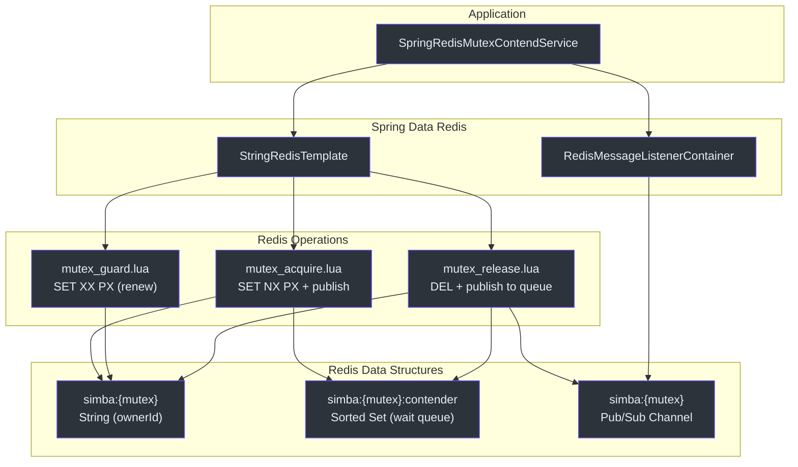
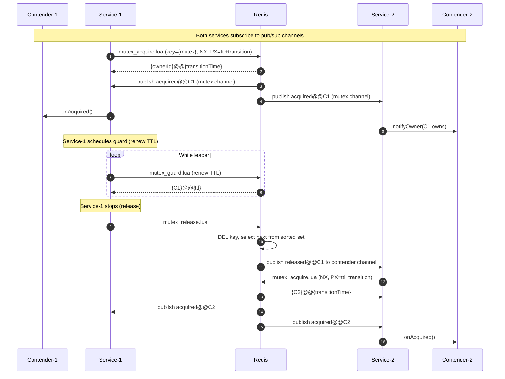
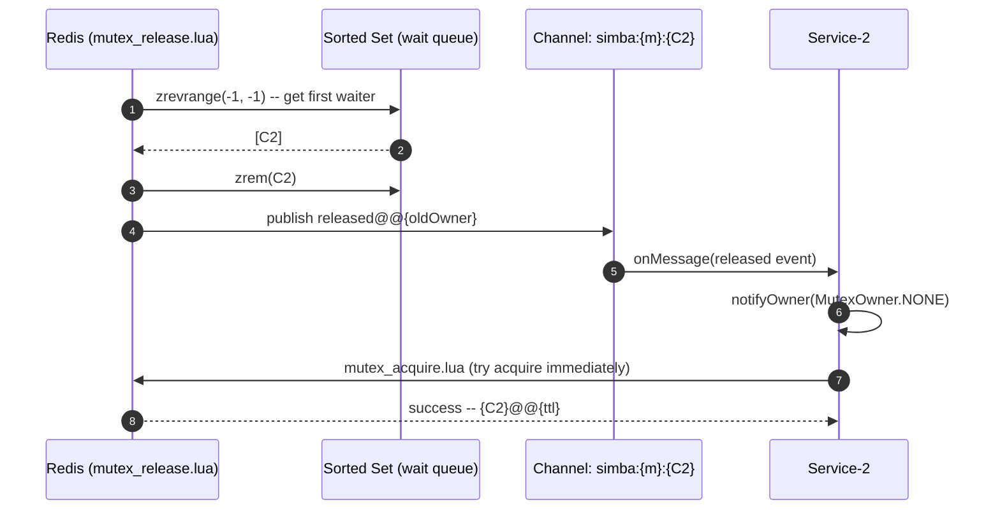

# simba-spring-redis 模块

`simba-spring-redis` 模块提供了基于 Redis 的分布式互斥后端，使用 Spring Data Redis。它通过在服务端执行的 Lua 脚本实现原子锁操作，并使用 Redis 发布/订阅实现近乎即时的所有权变更通知。

## 架构概览



## Redis 数据结构

该模块使用哈希标签约定（`{mutex}`）确保给定互斥锁的所有键落在同一个 Redis 集群槽位上。

| 键 | 类型 | 用途 |
|---|---|---|
| `simba:{mutex}` | String | 存储当前所有者的 `contenderId`。通过 `PX`（毫秒）设置 TTL。 |
| `simba:{mutex}:contender` | Sorted Set | 等待队列。成员为 `contenderId` 值；分值为插入时间戳。 |
| 频道：`simba:{mutex}` | Pub/Sub | 当竞争者获取锁时广播 `acquired@@{ownerId}`。 |
| 频道：`simba:{mutex}:{contenderId}` | Pub/Sub | 每个竞争者独立的频道。当锁被释放且此竞争者在等待队列首位时接收 `released@@{ownerId}`。 |

## Lua 脚本

### mutex_acquire.lua

**源码：** [simba-spring-redis/src/main/resources/mutex_acquire.lua](https://github.com/Ahoo-Wang/Simba/blob/main/simba-spring-redis/src/main/resources/mutex_acquire.lua)

```lua
redis.replicate_commands();

local mutex = KEYS[1];
local contenderId = ARGV[1];
local transition = ARGV[2];
local mutexKey = 'simba:' .. mutex;

-- 1. Try to acquire the lock (SET NX PX)
local succeed = redis.call('set', mutexKey, contenderId, 'nx', 'px', transition)

if succeed then
    -- Publish acquisition event to the mutex channel
    local message = 'acquired@@' .. contenderId;
    redis.call('publish', mutexKey, message)
    return contenderId..'@@'..transition;
end

-- 2. Failed: add self to wait queue (sorted set)
local contenderQueueKey = mutexKey .. ':contender';
local nowTime = redis.call('time')[1];
redis.call('zadd', contenderQueueKey, 'nx', nowTime, contenderId)

-- Return current owner and remaining TTL
local ownerId = redis.call('get', mutexKey)
local ttl = redis.call('pttl', mutexKey)
return ownerId..'@@'..ttl;
```

**逻辑：**
1. 尝试 `SET key value NX PX ttl` -- 原子锁获取。
2. 成功时：向互斥频道发布 `acquired@@{contenderId}`，返回所有者和转换时间。
3. 失败时：将自身添加到有序集合等待队列（分值 = 当前服务器时间戳），返回当前所有者和剩余 TTL。

### mutex_guard.lua

**源码：** [simba-spring-redis/src/main/resources/mutex_guard.lua](https://github.com/Ahoo-Wang/Simba/blob/main/simba-spring-redis/src/main/resources/mutex_guard.lua)

```lua
local mutex = KEYS[1];
local contenderId = ARGV[1];
local transition = ARGV[2];
local mutexKey = 'simba:' .. mutex;

local function getCurrentOwner(mutexKey)
    local ownerId = redis.call('get', mutexKey)
    if ownerId then
        local ttl = redis.call('pttl', mutexKey)
        return ownerId .. '@@' .. ttl;
    end
    return '@@';
end

-- Check if current owner is this contender
if redis.call('get', mutexKey) ~= contenderId then
    return getCurrentOwner(mutexKey)
end

-- Renew the TTL (SET XX PX)
if redis.call('set', mutexKey, contenderId, 'xx', 'px', transition) then
    return contenderId .. '@@' .. transition;
else
    return getCurrentOwner(mutexKey)
end
```

**逻辑：**
1. 验证调用者是当前所有者（`GET` 检查）。
2. 如果是所有者，使用 `SET key value XX PX ttl` 续期 TTL（仅在键存在时设置）。
3. 返回所有者和 TTL 信息。

### mutex_release.lua

**源码：** [simba-spring-redis/src/main/resources/mutex_release.lua](https://github.com/Ahoo-Wang/Simba/blob/main/simba-spring-redis/src/main/resources/mutex_release.lua)

```lua
local mutex = KEYS[1];
local contenderId = ARGV[1];
local mutexKey = 'simba:' .. mutex;
local contenderQueueKey = mutexKey .. ':contender';

-- 1. Verify caller is the owner
if redis.call('get', mutexKey) ~= contenderId then
    redis.call('zrem', contenderQueueKey, contenderId)
    return 0;
end

-- 2. Delete the lock key
local succeed = redis.call('del', mutexKey)
if not succeed then return succeed; end

-- 3. Notify the next contender in the wait queue
local contenderQueue = redis.call('zrevrange', contenderQueueKey, -1, -1);
if #contenderQueue == 0 then return succeed; end

local nextContender = contenderQueue[1];
redis.call('zrem', contenderQueueKey, nextContender)

local channel = mutexKey .. ':' .. nextContender;
local message = 'released@@' .. contenderId;
redis.call('publish', channel, message)

return succeed;
```

**逻辑：**
1. 验证调用者是当前所有者。如果不是，从等待队列中移除自身并返回失败。
2. 删除锁键。
3. 从有序集合中弹出第一个竞争者（最低分值 = 最长等待者）并向该竞争者的个人频道发布 `released@@{ownerId}`。

## 关键类

### SpringRedisMutexContendService

**源码：** [simba-spring-redis/.../SpringRedisMutexContendService.kt:42](https://github.com/Ahoo-Wang/Simba/blob/main/simba-spring-redis/src/main/kotlin/me/ahoo/simba/spring/redis/SpringRedisMutexContendService.kt#L42)

```kotlin
class SpringRedisMutexContendService(
    contender: MutexContender,
    handleExecutor: Executor,
    private val ttl: Duration,
    private val transition: Duration,
    private val redisTemplate: StringRedisTemplate,
    private val listenerContainer: RedisMessageListenerContainer,
    private val scheduledExecutorService: ScheduledExecutorService
) : AbstractMutexContendService(contender, handleExecutor)
```

| 参数 | 描述 |
|---|---|
| `contender` | 互斥竞争者 |
| `handleExecutor` | 用于异步所有者通知回调的执行器 |
| `ttl` | 锁 TTL（作为 Lua 脚本中 guard 的 PX 值，以及 acquire 中转换的一部分） |
| `transition` | 宽限期；键的总 TTL 为 `ttl + transition` |
| `redisTemplate` | 用于执行 Lua 脚本的 `StringRedisTemplate` |
| `listenerContainer` | 用于发布/订阅的 `RedisMessageListenerContainer` |
| `scheduledExecutorService` | 调度竞争/守护周期 |

### 频道

服务订阅两个主题：

| 频道 | 用途 |
|---|---|
| `simba:{mutex}` | 全局互斥频道 -- 接收 `acquired@@{ownerId}` 广播 |
| `simba:{mutex}:{contenderId}` | 每个竞争者独立的频道 -- 当此竞争者从等待队列中被选中时接收 `released@@{ownerId}` |

### AcquireResult

**源码：** [simba-spring-redis/.../AcquireResult.kt:22](https://github.com/Ahoo-Wang/Simba/blob/main/simba-spring-redis/src/main/kotlin/me/ahoo/simba/spring/redis/AcquireResult.kt#L22)

解析 Lua 脚本返回格式 `{ownerId}@@{ttl}`：

```kotlin
data class AcquireResult(val ownerId: String, val transitionAt: Long)
```

### OwnerEvent

**源码：** [simba-spring-redis/.../OwnerEvent.kt:20](https://github.com/Ahoo-Wang/Simba/blob/main/simba-spring-redis/src/main/kotlin/me/ahoo/simba/spring/redis/OwnerEvent.kt#L20)

解析发布/订阅消息格式 `{event}@@{ownerId}`：

```kotlin
data class OwnerEvent(val event: String, val ownerId: String, val eventAt: Long)
```

| 事件 | 触发条件 |
|---|---|
| `acquired` | 竞争者成功获取锁（来自 `mutex_acquire.lua`） |
| `released` | 当前所有者释放锁且此竞争者在队列首位（来自 `mutex_release.lua`） |

## 时序图 -- Redis 锁获取



## 时序图 -- 发布/订阅驱动的移交



## 属性

```yaml
simba:
  enabled: true
  redis:
    enabled: true       # Redis 后端启用（默认: true）
    ttl: 10s            # 锁 TTL
    transition: 6s      # TTL 后的宽限期
```

**源码：** [simba-spring-boot-starter/.../RedisProperties.kt:25](https://github.com/Ahoo-Wang/Simba/blob/main/simba-spring-boot-starter/src/main/kotlin/me/ahoo/simba/spring/boot/starter/redis/RedisProperties.kt#L25)

| 属性 | 默认值 | 描述 |
|---|---|---|
| `simba.redis.enabled` | `true` | 启用 Redis 后端 |
| `simba.redis.ttl` | `10s` | 锁 TTL -- guard 时键的 PX 值，以及 acquire 时 PX 的一部分 |
| `simba.redis.transition` | `6s` | 宽限期；acquire 时键的总 TTL = `ttl + transition` |

## 工厂

**源码：** [simba-spring-redis/.../SpringRedisMutexContendServiceFactory.kt:31](https://github.com/Ahoo-Wang/Simba/blob/main/simba-spring-redis/src/main/kotlin/me/ahoo/simba/spring/redis/SpringRedisMutexContendServiceFactory.kt#L31)

```kotlin
class SpringRedisMutexContendServiceFactory(
    private val ttl: Duration,
    private val transition: Duration,
    private val redisTemplate: StringRedisTemplate,
    private val listenerContainer: RedisMessageListenerContainer,
    private val handleExecutor: Executor = ForkJoinPool.commonPool(),
    private val scheduledExecutorService: ScheduledExecutorService = Executors.newScheduledThreadPool(1)
) : MutexContendServiceFactory
```

## Redis 集群兼容性

所有键中的 `{mutex}` 哈希标签确保 `simba:{mutex}`、`simba:{mutex}:contender` 和关联的发布/订阅频道都哈希到同一个 Redis 集群槽位。这是必需的，因为 Lua 脚本需要原子地访问多个键 -- 所有键必须位于同一节点上。

```
Key: simba:{order-lock}         -> slot = hash("order-lock")
Key: simba:{order-lock}:contender -> slot = hash("order-lock")
```

## 依赖

```
simba-spring-redis
  ├── simba-core
  └── spring-data-redis
```

该模块依赖 `spring-data-redis` 提供的 `StringRedisTemplate`、`RedisScript` 和 `RedisMessageListenerContainer`。应用必须提供 Redis 连接工厂。

## 另请参阅

- [simba-core 模块](./simba-core) -- 核心接口
- [simba-spring-boot-starter](./simba-spring-boot-starter) -- 使用 `simba.redis.*` 属性的自动配置
- [simba-jdbc](./simba-jdbc) -- JDBC 替代后端
