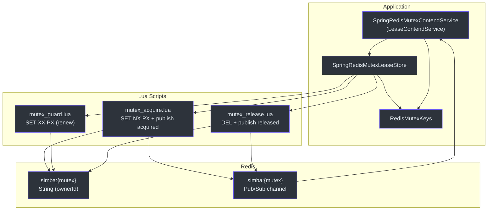
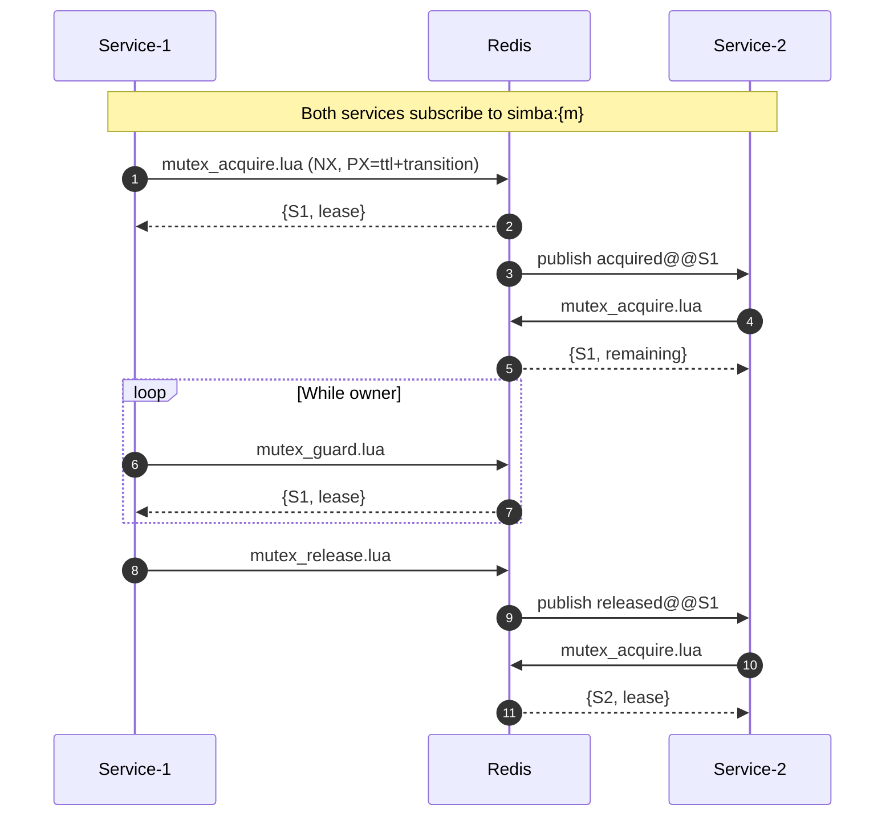

# simba-spring-redis 模块

`simba-spring-redis` 模块基于 Spring Data Redis 提供 Redis 分布式互斥锁后端。锁操作是在服务端执行的原子 Lua 脚本，Redis 发布/订阅负责广播所有权变更，等待中的竞争者可以立即响应，而不必等到下一次轮询。

## 架构概览


```mermaid
graph TB
    subgraph sg_app ["Application"]
        SVC["SpringRedisMutexContendService<br>(LeaseContendService)"]
        STORE["SpringRedisMutexLeaseStore"]
        KEYS["RedisMutexKeys"]
    end
    subgraph sg_lua ["Lua Scripts"]
        ACQ["mutex_acquire.lua<br>SET NX PX + publish acquired"]
        GRD["mutex_guard.lua<br>SET XX PX (renew)"]
        REL["mutex_release.lua<br>DEL + publish released"]
    end
    subgraph sg_data ["Redis"]
        KEY["simba:{mutex}<br>String (ownerId)"]
        CHAN["simba:{mutex}<br>Pub/Sub channel"]
    end

    SVC --> STORE
    STORE --> KEYS
    SVC --> KEYS
    STORE --> ACQ
    STORE --> GRD
    STORE --> REL
    ACQ --> KEY
    ACQ --> CHAN
    GRD --> KEY
    REL --> KEY
    REL --> CHAN
    CHAN --> SVC

    style SVC fill:#2d333b,stroke:#6d5dfc,color:#e6edf3
    style STORE fill:#2d333b,stroke:#6d5dfc,color:#e6edf3
    style KEYS fill:#2d333b,stroke:#6d5dfc,color:#e6edf3
    style ACQ fill:#2d333b,stroke:#6d5dfc,color:#e6edf3
    style GRD fill:#2d333b,stroke:#6d5dfc,color:#e6edf3
    style REL fill:#2d333b,stroke:#6d5dfc,color:#e6edf3
    style KEY fill:#2d333b,stroke:#6d5dfc,color:#e6edf3
    style CHAN fill:#2d333b,stroke:#6d5dfc,color:#e6edf3
```

## Redis 键与频道

所有名称共享 `{mutex}` 哈希标签，因此落在同一个 Redis Cluster 槽位。[`RedisMutexKeys`](https://github.com/Ahoo-Wang/Simba/blob/main/simba-spring-redis/src/main/kotlin/me/ahoo/simba/spring/redis/RedisMutexKeys.kt) 是 Kotlin 侧这些名称的唯一来源。

| 名称 | 类型 | 用途 |
|---|---|---|
| `simba:{mutex}` | String | 当前持有者的 `contenderId`，在 `ttl + transition` 后过期（`PX`）。 |
| `simba:{mutex}` | Pub/Sub 频道 | 向所有竞争者广播 `acquired@@{ownerId}` 和 `released@@{ownerId}`。 |
| `simba:{mutex}:{contenderId}` | Pub/Sub 频道 | 仍会订阅，以便滚动升级期间 Simba < 3.2 的持有者（只向一个排队竞争者发送释放消息）能唤醒本节点。 |
| `simba:{mutex}:fence` | String（计数器） | Fencing 计数器，每个持有任期自增一次；不过期。 |
| `simba:{mutex}:token` | String | 当前任期的 fencing token；随租约过期。 |
| `simba:{mutex}:contender` | 有序集合（遗留） | 仅由 Simba < 3.2 写入的等待队列；每次释放时删除。 |

## Lua 脚本

所有脚本都通过 `KEYS` 接收键（符合 Redis Cluster 规范）。`mutex_acquire.lua` 和 `mutex_guard.lua` 返回 `{ownerId, 剩余租约毫秒数, fencing token}`，没有持有者时返回 `{'', 0, 0}`。

### mutex_acquire.lua

[`mutex_acquire.lua`](https://github.com/Ahoo-Wang/Simba/blob/main/simba-spring-redis/src/main/resources/mutex_acquire.lua)

```lua
if redis.call('set', mutexKey, contenderId, 'nx', 'px', lease) then
    local token = redis.call('incr', fenceKey)
    redis.call('set', tokenKey, token, 'px', lease)
    redis.call('publish', mutexKey, 'acquired@@' .. contenderId)
    return { contenderId, tonumber(lease), token };
end
local ownerId = redis.call('get', mutexKey)
if not ownerId then
    return { '', 0, 0 };
end
return { ownerId, redis.call('pttl', mutexKey), tonumber(redis.call('get', tokenKey) or '0') };
```

`SET NX PX` 以 `ttl + transition` 为时长原子获取并宣告新持有者。获取失败时返回当前持有者及其剩余租约。

### mutex_guard.lua

[`mutex_guard.lua`](https://github.com/Ahoo-Wang/Simba/blob/main/simba-spring-redis/src/main/resources/mutex_guard.lua) 仅在调用者仍持有租约时续期（`SET XX PX`），否则返回当前持有者。它不会重新创建已经过期的租约。

### mutex_release.lua

[`mutex_release.lua`](https://github.com/Ahoo-Wang/Simba/blob/main/simba-spring-redis/src/main/resources/mutex_release.lua)

```lua
if redis.call('get', mutexKey) ~= contenderId then
    redis.call('zrem', legacyQueueKey, contenderId)
    return 0;
end
redis.call('del', mutexKey, legacyQueueKey, tokenKey)
redis.call('publish', mutexKey, 'released@@' .. contenderId)
return 1;
```

只有持有者能释放。释放消息在 mutex 频道上广播，所有存活的竞争者立即竞争、其中一个获胜；不会因为某个竞争者崩溃而丢失唤醒。

## 关键类

| 类 | 职责 |
|---|---|
| [`SpringRedisMutexContendService`](https://github.com/Ahoo-Wang/Simba/blob/main/simba-spring-redis/src/main/kotlin/me/ahoo/simba/spring/redis/SpringRedisMutexContendService.kt) | `LeaseContendService` 子类；在 `onStart()` 订阅、`onStop()` 退订，并响应所有者事件。 |
| [`SpringRedisMutexLeaseStore`](https://github.com/Ahoo-Wang/Simba/blob/main/simba-spring-redis/src/main/kotlin/me/ahoo/simba/spring/redis/SpringRedisMutexLeaseStore.kt) | `MutexLeaseStore`：续期时执行 `mutex_guard.lua`，否则执行 `mutex_acquire.lua`；释放执行 `mutex_release.lua`。 |
| [`AcquireResult`](https://github.com/Ahoo-Wang/Simba/blob/main/simba-spring-redis/src/main/kotlin/me/ahoo/simba/spring/redis/AcquireResult.kt) | 将脚本返回解析为持有者和租约结束的绝对时间（`transitionAt`）。 |
| [`OwnerEvent`](https://github.com/Ahoo-Wang/Simba/blob/main/simba-spring-redis/src/main/kotlin/me/ahoo/simba/spring/redis/OwnerEvent.kt) | 解析发布/订阅消息 `{event}@@{ownerId}`。 |

| 事件 | 响应 |
|---|---|
| `acquired` | 更新观测到的持有者。 |
| `released` | 清除观测到的持有者，并调用 `contendNow()` 立即竞争。 |

## 时序图 -- 获取与交接


```mermaid
sequenceDiagram
autonumber
    participant S1 as Service-1
    participant Redis as Redis
    participant S2 as Service-2

    Note over S1,S2: Both services subscribe to simba:{m}
    S1->>Redis: mutex_acquire.lua (NX, PX=ttl+transition)
    Redis-->>S1: {S1, lease}
    Redis->>S2: publish acquired@@S1
    S2->>Redis: mutex_acquire.lua
    Redis-->>S2: {S1, remaining}
    loop While owner
        S1->>Redis: mutex_guard.lua
        Redis-->>S1: {S1, lease}
    end
    S1->>Redis: mutex_release.lua
    Redis->>S2: publish released@@S1
    S2->>Redis: mutex_acquire.lua
    Redis-->>S2: {S2, lease}
```

## 配置属性

| 属性 | 默认值 | 说明 |
|---|---|---|
| `simba.redis.enabled` | `true` | 启用 Redis 后端 |
| `simba.redis.ttl` | `10s` | 获取后持有者发起续期的时间 |
| `simba.redis.transition` | `6s` | 宽限期；键在 `ttl + transition` 后过期 |

## 工厂

[`SpringRedisMutexContendServiceFactory`](https://github.com/Ahoo-Wang/Simba/blob/main/simba-spring-redis/src/main/kotlin/me/ahoo/simba/spring/redis/SpringRedisMutexContendServiceFactory.kt)

```kotlin
class SpringRedisMutexContendServiceFactory(
    ttl: Duration,
    transition: Duration,
    redisTemplate: StringRedisTemplate,
    listenerContainer: RedisMessageListenerContainer,
    handleExecutor: Executor = ForkJoinPool.commonPool(),
    scheduledExecutorService: ScheduledExecutorService = ContendExecutors.newScheduler("simba-redis"),
    ioExecutor: ExecutorService = ContendExecutors.newIoExecutor("simba-redis-io")
) : MutexContendServiceFactory, AutoCloseable
```

所有服务共享调度器（竞争触发与租约看门狗）和 I/O 执行器（脚本调用）。工厂持有二者并在 `close()` 时关闭。Spring Boot starter 会把 `simbaHandleExecutor` bean 作为 `handleExecutor` 传入。

### Fencing Token

一次成功的 `SET NX` 开始一个新的持有任期：`mutex_acquire.lua` 对 `simba:{mutex}:fence` 自增，并把结果以与租约相同的 `PX` 写入 `simba:{mutex}:token`。`mutex_guard.lua` 续期这两个键并保持 token 不变，`mutex_release.lua` 删除 token 键但保留计数器。因此 token 按任期严格递增、任期内保持不变（参见 [ADR 0002](https://github.com/Ahoo-Wang/Simba/blob/main/docs/adr/0002-fencing-token.md)）。

节点会忽略关于自己获取锁的 `acquired@@{ownerId}` 广播：脚本返回值带有 token，而广播无法携带，因为旧节点只按两个字段解析该消息。

::: warning 持久化
单调性要求 Redis 持久化计数器（AOF 且 `appendfsync always`，或同等配置）。如果 Redis 在没有持久化的情况下重启，计数器会被重置，token 可能倒退。
:::

## 从 Simba < 3.2 滚动升级

键和频道名称没有变化。旧节点订阅了 mutex 频道，并且无论消息来自哪个频道都会处理 `released`，因此仍能收到释放通知；新节点保留每竞争者频道，用于接收旧持有者发出的释放消息。只存在于遗留队列中的旧竞争者，在所有节点升级完成前可能要等到下一次轮询。

## 依赖

```
simba-spring-redis
  ├── simba-core
  └── spring-data-redis
```

## 另请参阅

- [simba-core 模块](./simba-core) -- 核心接口与 `LeaseContendService`
- [simba-spring-boot-starter](./simba-spring-boot-starter) -- 使用 `simba.redis.*` 属性的自动配置
- [simba-jdbc](./simba-jdbc) -- JDBC 替代后端
