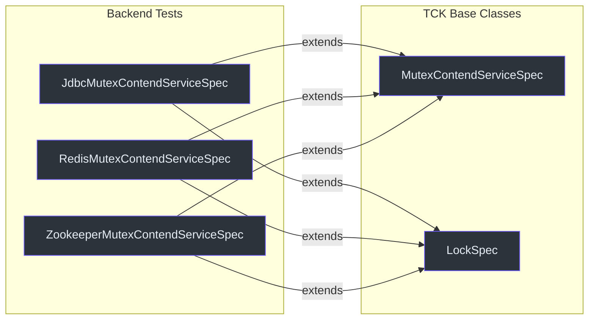
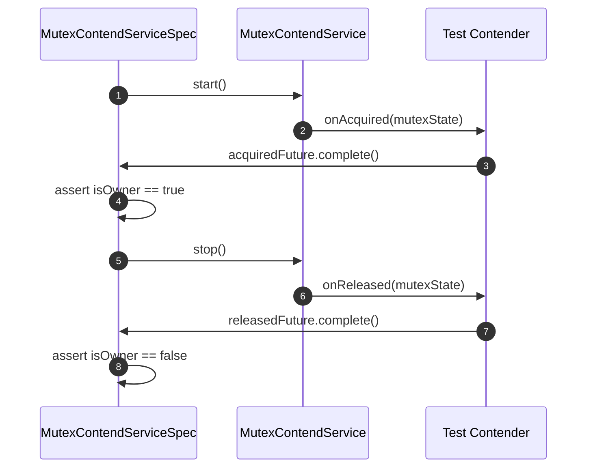
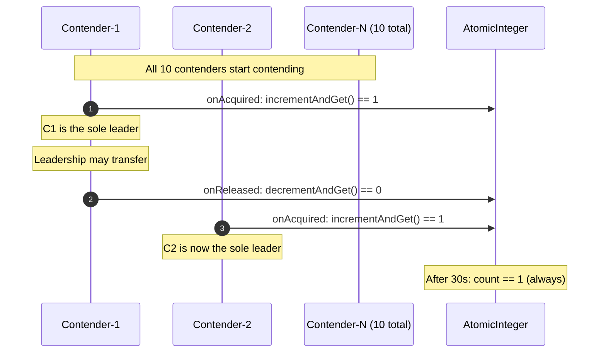
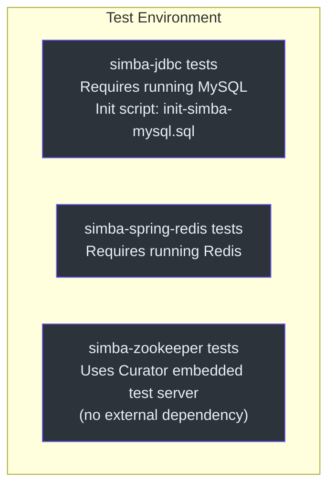

# simba-test 模块

`simba-test` 模块提供了构成技术兼容性套件（TCK）的抽象测试基类，用于 Simba 后端实现。每个后端模块扩展这些基类来验证其 `MutexContendService` 实现的行为是否正确。

## 用途



每个后端测试类提供：
- 一个 `MutexContendServiceFactory` 实例（针对该后端配置）
- 基础设施设置（例如 MySQL 连接、Redis 实例、嵌入式 ZK 服务器）

TCK 测试方法验证通用的竞争契约。

## MutexContendServiceSpec

**源码：** [simba-test/.../MutexContendServiceSpec.kt:34](https://github.com/Ahoo-Wang/Simba/blob/main/simba-test/src/main/kotlin/me/ahoo/simba/test/MutexContendServiceSpec.kt#L34)

```kotlin
abstract class MutexContendServiceSpec {
    abstract val mutexContendServiceFactory: MutexContendServiceFactory
}
```

后端测试类必须提供 `mutexContendServiceFactory` 属性。

### 测试用例

该规范定义了五个测试用例，覆盖核心竞争生命周期：

#### start

**源码：** [simba-test/.../MutexContendServiceSpec.kt:47](https://github.com/Ahoo-Wang/Simba/blob/main/simba-test/src/main/kotlin/me/ahoo/simba/test/MutexContendServiceSpec.kt#L47)

```kotlin
@Test open fun start()
```

验证基本的获取/释放生命周期：
1. 创建一个竞争者，其 `onAcquired` 和 `onReleased` 回调连接到 `CompletableFuture`。
2. 启动竞争服务并等待 `onAcquired` 触发。
3. 断言 `contendService.isOwner == true`。
4. 停止服务并等待 `onReleased`。
5. 断言 `contendService.isOwner == false`。



#### restart

**源码：** [simba-test/.../MutexContendServiceSpec.kt:72](https://github.com/Ahoo-Wang/Simba/blob/main/simba-test/src/main/kotlin/me/ahoo/simba/test/MutexContendServiceSpec.kt#L72)

```kotlin
@Test open fun restart()
```

验证竞争服务可以停止后重新启动：
1. 启动、获取、断言为所有者、停止、断言不是所有者。
2. 再次启动（重启）、再次获取、断言为所有者、停止、断言不是所有者。

这测试了 `INITIAL -> STARTING -> RUNNING -> STOPPING -> INITIAL` 循环可以重复执行。

#### guard

**源码：** [simba-test/.../MutexContendServiceSpec.kt:112](https://github.com/Ahoo-Wang/Simba/blob/main/simba-test/src/main/kotlin/me/ahoo/simba/test/MutexContendServiceSpec.kt#L112)

```kotlin
@Test open fun guard()
```

验证所有者可以在 TTL 续期中维持领导权：
1. 启动并等待获取。
2. 休眠 3 秒（比典型竞争周期长）。
3. 断言所有者仍然是同一竞争者。
4. 停止并验证释放。

这验证了 `guard` / 续期机制。

#### multiContend

**源码：** [simba-test/.../MutexContendServiceSpec.kt:140](https://github.com/Ahoo-Wang/Simba/blob/main/simba-test/src/main/kotlin/me/ahoo/simba/test/MutexContendServiceSpec.kt#L140)

```kotlin
@Test open fun multiContend()
```

验证 10 个并发竞争者的互斥性：
1. 为同一互斥锁创建 10 个竞争者，每个带有 `AtomicInteger` 计数器。
2. `onAcquired` 断言 `count.incrementAndGet() == 1`（恰好一个所有者）。
3. `onReleased` 断言 `count.decrementAndGet() == 0`。
4. 休眠 30 秒以观察竞争行为。
5. 断言 `count == 1`（任意时刻恰好一个所有者）。
6. 所有竞争者对同一 `ownerId` 达成一致。



#### schedule

**源码：** [simba-test/.../MutexContendServiceSpec.kt:176](https://github.com/Ahoo-Wang/Simba/blob/main/simba-test/src/main/kotlin/me/ahoo/simba/test/MutexContendServiceSpec.kt#L176)

```kotlin
@Test fun schedule()
```

验证 `AbstractScheduler` 集成：
1. 创建一个在 `work()` 中带有 `CountDownLatch` 的 `AbstractScheduler` 子类。
2. 断言初始 `running == false`。
3. 启动调度器，断言 `running == true`。
4. 等待 latch（work 在 5 秒内被调用）。
5. 停止调度器，断言 `running == false`。

### 测试互斥锁名称

| 常量 | 值 | 使用者 |
|---|---|---|
| `START_MUTEX` | `"start"` | `start()` |
| `RESTART_MUTEX` | `"restart"` | `restart()` |
| `GUARD_MUTEX` | `"guard"` | `guard()` |
| `MULTI_CONTEND_MUTEX` | `"multiContend"` | `multiContend()` |
| `SCHEDULE_MUTEX` | `"schedule"` | `schedule()` |

## LockSpec

**源码：** [simba-test/.../LockSpec.kt:16](https://github.com/Ahoo-Wang/Simba/blob/main/simba-test/src/main/kotlin/me/ahoo/simba/test/LockSpec.kt#L16)

```kotlin
abstract class LockSpec
```

目前是一个空的抽象类，为未来的 Locker 特定 TCK 测试预留。后端测试类应同时扩展此类和 `MutexContendServiceSpec`。

## 扩展 TCK

### 示例：JDBC 后端测试

```kotlin
class JdbcMutexContendServiceSpec : MutexContendServiceSpec() {
    override val mutexContendServiceFactory: MutexContendServiceFactory =
        JdbcMutexContendServiceFactory(
            mutexOwnerRepository = JdbcMutexOwnerRepository(dataSource),
            initialDelay = Duration.ZERO,
            ttl = Duration.ofSeconds(3),
            transition = Duration.ofSeconds(2)
        )
}
```

### 示例：Redis 后端测试

```kotlin
class RedisMutexContendServiceSpec : MutexContendServiceSpec() {
    override val mutexContendServiceFactory: MutexContendServiceFactory =
        SpringRedisMutexContendServiceFactory(
            ttl = Duration.ofSeconds(3),
            transition = Duration.ofSeconds(2),
            redisTemplate = stringRedisTemplate,
            listenerContainer = listenerContainer
        )
}
```

### 示例：Zookeeper 后端测试

```kotlin
class ZookeeperMutexContendServiceSpec : MutexContendServiceSpec() {
    override val mutexContendServiceFactory: MutexContendServiceFactory =
        ZookeeperMutexContendServiceFactory(
            handleExecutor = ForkJoinPool.commonPool(),
            curatorFramework = curatorFramework
        )
}
```

## 测试基础设施要求



| 后端 | 测试基础设施 |
|---|---|
| `simba-jdbc` | 运行中的 MySQL 实例。模式必须通过 `init-simba-mysql.sql` 初始化。 |
| `simba-spring-redis` | 运行中的 Redis 实例。 |
| `simba-zookeeper` | Curator 的嵌入式测试服务器（无需外部 ZK）。 |

## 依赖

```
simba-test
  ├── simba-core
  ├── JUnit 5 (jupiter)
  └── Hamcrest (assertions)
```

## 另请参阅

- [simba-core 模块](./simba-core) -- 被测试的接口
- [simba-jdbc](./simba-jdbc) -- JDBC 后端 TCK 测试
- [simba-spring-redis](./simba-spring-redis) -- Redis 后端 TCK 测试
- [simba-zookeeper](./simba-zookeeper) -- Zookeeper 后端 TCK 测试
