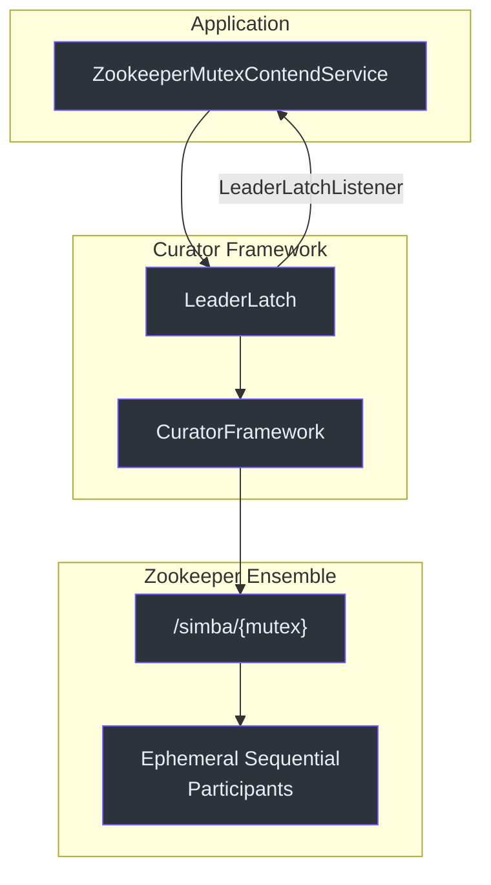
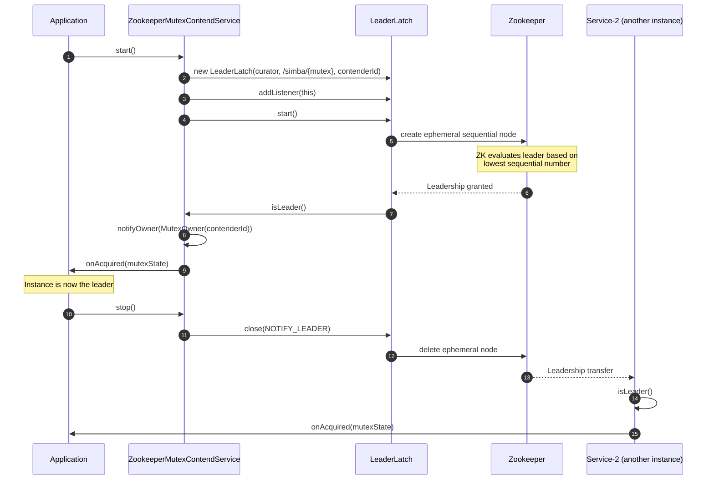
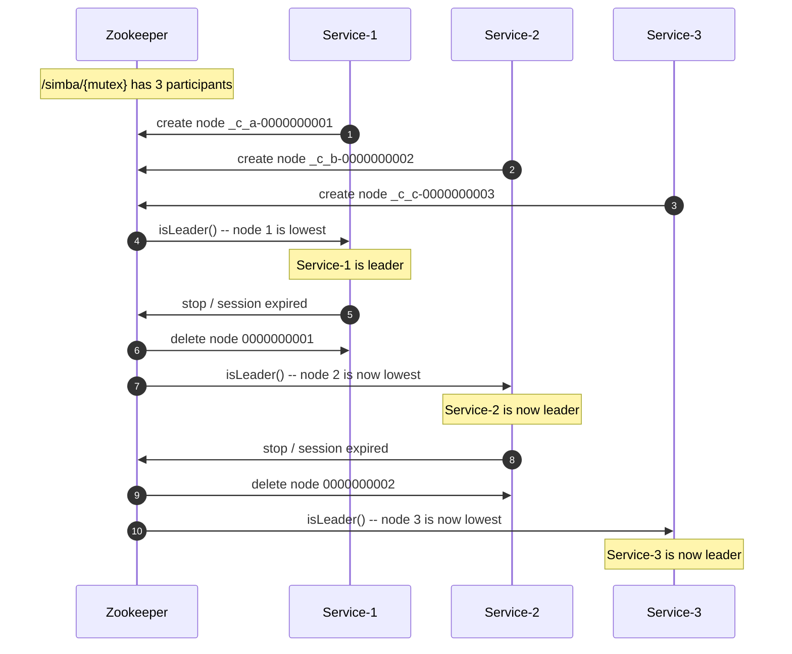
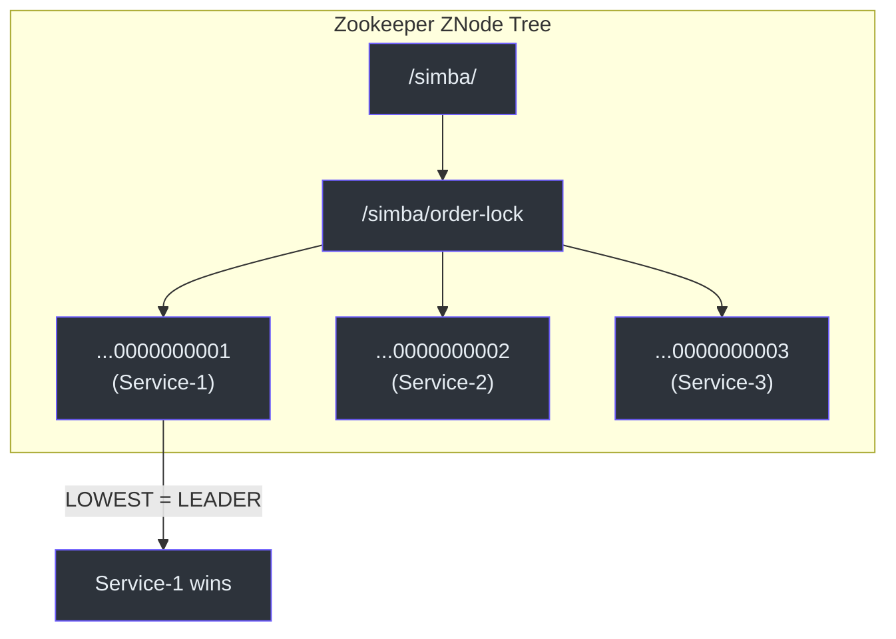

# simba-zookeeper 模块

`simba-zookeeper` 模块提供了基于 Zookeeper 的分布式互斥后端，使用 Apache Curator 的 `LeaderLatch`。与使用基于轮询竞争的 JDBC 和 Redis 后端不同，Zookeeper 通过临时顺序 znode 提供基于推送的领导选举。

## 架构



## 路径结构

Zookeeper 中所有 Simba 互斥锁使用路径前缀 `/simba/`：

```
/simba/
  └── {mutex}              -- 互斥资源（例如 "order-settlement"）
      ├── _c_<guid>-0000000001  -- 参与者 1（临时顺序节点）
      ├── _c_<guid>-0000000002  -- 参与者 2（临时顺序节点）
      └── _c_<guid>-0000000003  -- 参与者 3（临时顺序节点）
```

常量 `RESOURCE_PREFIX` 定义为 `"/simba/"`：

**源码：** [simba-zookeeper/.../ZookeeperMutexContendService.kt:59](https://github.com/Ahoo-Wang/Simba/blob/main/simba-zookeeper/src/main/kotlin/me/ahoo/simba/zookeeper/ZookeeperMutexContendService.kt#L59)

```kotlin
companion object {
    const val RESOURCE_PREFIX = "/simba/"
}
```

名为 `"order-settlement"` 的互斥锁最终路径为 `/simba/order-settlement`。

## 关键类

### ZookeeperMutexContendService

**源码：** [simba-zookeeper/.../ZookeeperMutexContendService.kt:29](https://github.com/Ahoo-Wang/Simba/blob/main/simba-zookeeper/src/main/kotlin/me/ahoo/simba/zookeeper/ZookeeperMutexContendService.kt#L29)

```kotlin
class ZookeeperMutexContendService(
    contender: MutexContender,
    handleExecutor: Executor,
    private val curatorFramework: CuratorFramework
) : AbstractMutexContendService(contender, handleExecutor), LeaderLatchListener
```

| 参数 | 描述 |
|---|---|
| `contender` | 互斥竞争者 |
| `handleExecutor` | 用于异步所有者通知回调的执行器 |
| `curatorFramework` | 用于 Zookeeper 通信的 Curator 客户端 |

该类实现了 `LeaderLatchListener` 以接收基于推送的领导权通知：

```kotlin
interface LeaderLatchListener {
    fun isLeader()      // 当此参与者成为领导者时调用
    fun notLeader()     // 当此参与者失去领导权时调用
}
```

### 实现细节

```kotlin
override fun startContend() {
    leaderLatch = LeaderLatch(curatorFramework, mutexPath, contenderId)
    leaderLatch!!.addListener(this)
    leaderLatch!!.start()
}

override fun stopContend() {
    leaderLatch!!.close(CloseMode.NOTIFY_LEADER)
    leaderLatch = null
}

override fun isLeader() {
    notifyOwner(MutexOwner(contenderId))
}

override fun notLeader() {
    notifyOwner(MutexOwner.NONE)
}
```

| 方法 | 行为 |
|---|---|
| `startContend()` | 在 `/simba/{mutex}` 创建 `LeaderLatch`，注册自身为监听器，并启动 latch。竞争者的 `contenderId` 用作 latch 参与者 ID。 |
| `stopContend()` | 使用 `CloseMode.NOTIFY_LEADER` 关闭 latch，这会触发领导权转移到下一个参与者。 |
| `isLeader()` | 当此参与者赢得领导权时由 Curator 调用。使用新的 `MutexOwner` 通知服务。 |
| `notLeader()` | 当此参与者失去领导权时由 Curator 调用。使用 `MutexOwner.NONE` 通知。 |

### CloseMode.NOTIFY_LEADER

当 latch 使用 `NOTIFY_LEADER` 关闭时，Curator 触发下一个参与者的 `isLeader()` 回调，实现无缝的领导权移交，无需轮询延迟。

### ZookeeperMutexContendServiceFactory

**源码：** [simba-zookeeper/.../ZookeeperMutexContendServiceFactory.kt:26](https://github.com/Ahoo-Wang/Simba/blob/main/simba-zookeeper/src/main/kotlin/me/ahoo/simba/zookeeper/ZookeeperMutexContendServiceFactory.kt#L26)

```kotlin
class ZookeeperMutexContendServiceFactory(
    private val handleExecutor: Executor,
    private val curatorFramework: CuratorFramework
) : MutexContendServiceFactory
```

| 参数 | 描述 |
|---|---|
| `handleExecutor` | 用于异步所有者通知回调的执行器 |
| `curatorFramework` | 所有互斥锁共享的 Curator 客户端 |

与 JDBC 和 Redis 后端不同，Zookeeper 后端没有 `ttl` 或 `transition` 参数。Zookeeper 通过临时节点（基于会话）处理过期。

## 时序图 -- Zookeeper 领导选举



## 时序图 -- 多实例领导权



## LeaderLatch 工作原理



每个 `LeaderLatch` 参与者在互斥路径下创建一个临时顺序 znode。序列号最小的参与者是领导者。当领导者的节点被移除（显式关闭或会话过期）时，Zookeeper 通知下一个序列号最小的参与者。

## 属性

```yaml
simba:
  enabled: true
  zookeeper:
    enabled: true       # Zookeeper 后端启用（默认: true）
```

**源码：** [simba-spring-boot-starter/.../ZookeeperProperties.kt:24](https://github.com/Ahoo-Wang/Simba/blob/main/simba-spring-boot-starter/src/main/kotlin/me/ahoo/simba/spring/boot/starter/zookeeper/ZookeeperProperties.kt#L24)

| 属性 | 默认值 | 描述 |
|---|---|---|
| `simba.zookeeper.enabled` | `true` | 启用 Zookeeper 后端 |

Zookeeper 后端没有 `ttl` 或 `transition` 属性，因为 Zookeeper 的临时节点机制通过会话管理自动处理过期。

## 与其他后端的对比

| 方面 | Zookeeper | JDBC | Redis |
|---|---|---|---|
| **通知模型** | 推送（watcher） | 拉取（轮询） | 推送（发布/订阅） |
| **获取延迟** | 低（基于 watcher） | 高（轮询间隔） | 低（发布/订阅） |
| **外部依赖** | ZK 集群 | MySQL | Redis |
| **TTL 管理** | 基于会话（临时节点） | 应用层（ttl 列） | Redis PX 过期 |
| **配置** | 仅 `enabled` 标志 | `ttl`、`transition`、`initialDelay` | `ttl`、`transition` |
| **最适合** | 强一致性，已有 ZK 基础设施 | 简单基础设施，已有 RDBMS | 高吞吐量，低延迟 |

## 依赖

```
simba-zookeeper
  ├── simba-core
  └── curator-recipes
```

应用必须提供已配置的 `CuratorFramework` 实例。通常通过 Spring Boot 的自动配置或手动创建：

```kotlin
val curatorFramework = CuratorFrameworkFactory.builder()
    .connectString("localhost:2181")
    .retryPolicy(ExponentialBackoffRetry(1000, 3))
    .build()
curatorFramework.start()
```

## 另请参阅

- [simba-core 模块](./simba-core) -- 核心接口
- [simba-spring-boot-starter](./simba-spring-boot-starter) -- 使用 `simba.zookeeper.*` 属性的自动配置
- [simba-spring-redis](./simba-spring-redis) -- Redis 替代后端
