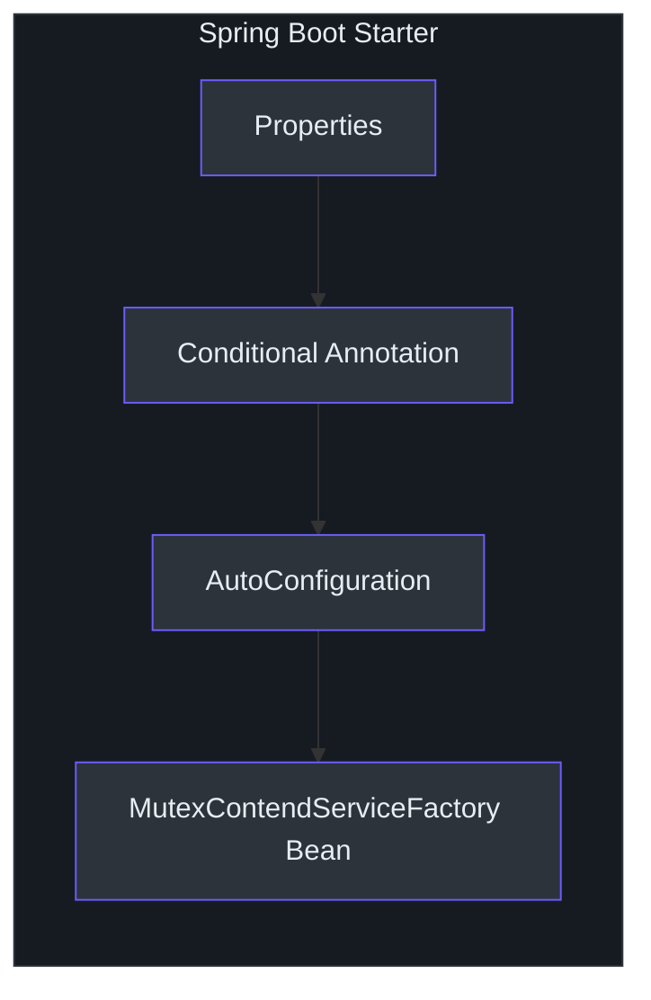
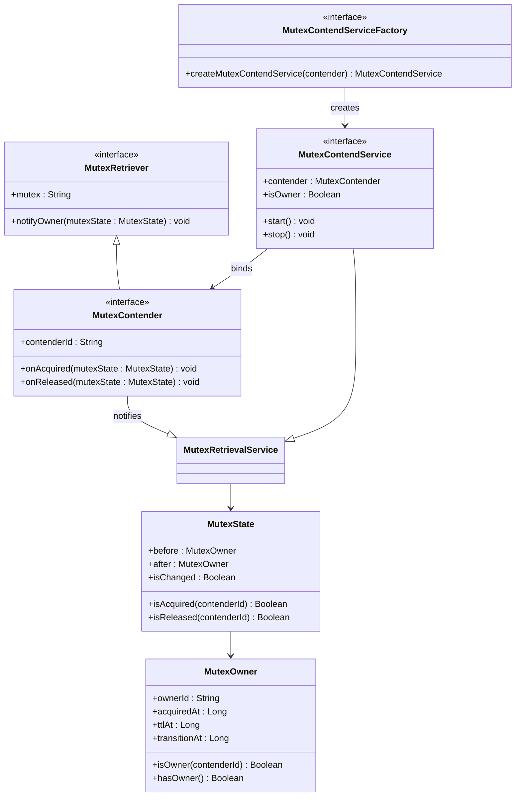
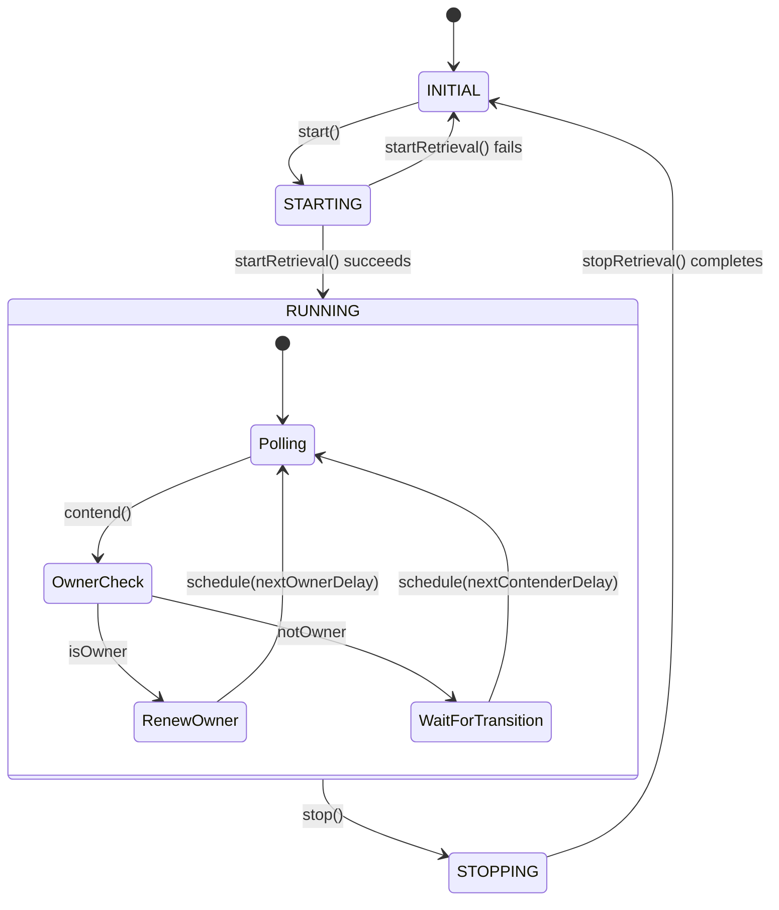
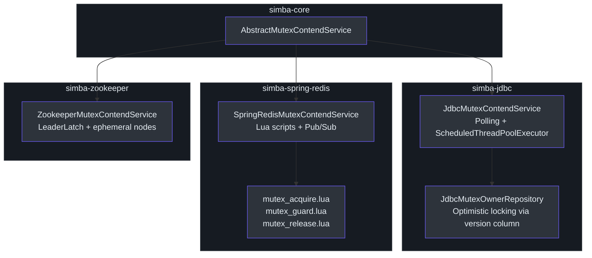
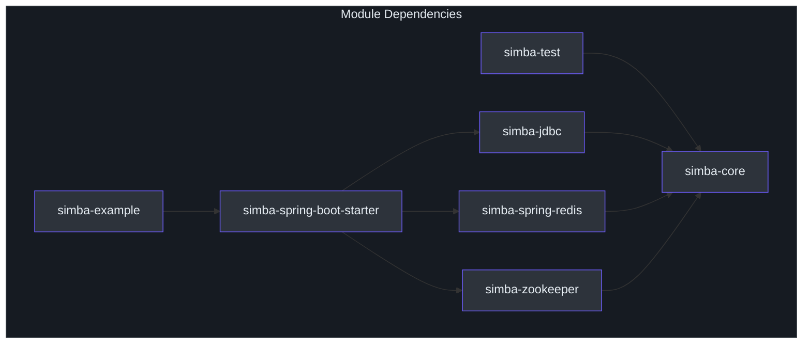

# 贡献者指南

欢迎来到 Simba。本指南假设你精通 Kotlin 和/或 Java，并希望快速在这个代码库中高效工作。本指南分为三部分：语言和框架基础、Simba 的架构和领域模型，以及通过设置、测试和贡献来快速上手。

---

## 第一部分：语言和框架基础

### 本代码库的 Kotlin 要点

Simba 使用 Kotlin 2.3.20 编写，目标平台为 JVM 17。如果你来自 Java，以下是本项目中大量使用的 Kotlin 模式。

#### 扩展函数和属性

Kotlin 扩展函数为现有类型添加方法而无需继承。Simba 在测试断言库中使用了它们：

```kotlin
import me.ahoo.test.asserts.assert

// 而不是 assertThat(value).isEqualTo(expected)（AssertJ）
value.assert().isEqualTo(expected)
```

`.assert()` 扩展将值包装在流畅的断言上下文中。这是项目标准 -- 永远不要直接使用 AssertJ 的 `assertThat()`。

#### 数据类

[`MutexState`](https://github.com/Ahoo-Wang/Simba/blob/main/simba-core/src/main/kotlin/me/ahoo/simba/core/MutexState.kt) 是一个数据类。Kotlin 自动生成 `equals()`、`hashCode()`、`toString()`、`copy()` 和解构：

```kotlin
data class MutexState(val before: MutexOwner, val after: MutexOwner)
// 用法：
val (before, after) = mutexState  // 解构
```

#### `object` 声明（单例）

[`Simba`](https://github.com/Ahoo-Wang/Simba/blob/main/simba-core/src/main/kotlin/me/ahoo/simba/Simba.kt) 和 [`ContenderIdGenerator`](https://github.com/Ahoo-Wang/Simba/blob/main/simba-core/src/main/kotlin/me/ahoo/simba/core/ContenderIdGenerator.kt) 伴生对象使用 Kotlin 的 `object` 实现线程安全的单例：

```kotlin
object Simba {
    const val SIMBA = "simba"
    const val SIMBA_PREFIX = "$SIMBA."
}
```

#### `@Volatile` 和 `AtomicReferenceFieldUpdater`

Simba 使用 Java 的 `AtomicReferenceFieldUpdater` 实现无锁状态转换。在 [`AbstractMutexRetrievalService`](https://github.com/Ahoo-Wang/Simba/blob/main/simba-core/src/main/kotlin/me/ahoo/simba/core/AbstractMutexRetrievalService.kt) 中，`status` 字段是原子更新的：

```kotlin
@Volatile
override var status = Status.INITIAL

companion object {
    val STATUS: AtomicReferenceFieldUpdater<...> =
        AtomicReferenceFieldUpdater.newUpdater(...)
}
```

`compareAndSet` 模式确保只有一个线程可以将状态从 `INITIAL` 转换到 `STARTING`。

#### `lateinit` 和 Lazy 委托

测试使用 `lateinit var` 用于在 `@BeforeAll` 中初始化的属性：

```kotlin
override lateinit var mutexContendServiceFactory: MutexContendServiceFactory
```

`ContenderIdGenerator` 使用 `by lazy` 进行延迟主机解析：

```kotlin
private val host: String by lazy {
    LocalHostAddressSupplier.INSTANCE.hostAddress
}
```

#### 协程 vs 线程

Simba 刻意**不**使用 Kotlin 协程。所有并发都通过 `java.util.concurrent` 原语处理：

- `ScheduledThreadPoolExecutor` 用于定期竞争周期
- `CompletableFuture` 用于异步所有者通知
- `Executor` 接口用于回调分发
- `LockSupport.park/unpark` 用于 `SimbaLocker`
- `ForkJoinPool.commonPool()` 作为默认处理执行器

这是一个刻意的设计选择：库面向服务端 JVM 应用，`java.util.concurrent` 被充分理解、可预测，并且不需要协程上下文管理。

### Gradle Kotlin DSL

构建系统使用 Gradle Kotlin DSL。关键文件：

| 文件 | 用途 |
|---|---|
| [`build.gradle.kts`](https://github.com/Ahoo-Wang/Simba/blob/main/build.gradle.kts) | 根项目配置 |
| [`settings.gradle.kts`](https://github.com/Ahoo-Wang/Simba/blob/main/settings.gradle.kts) | 模块包含和仓库配置 |
| [`gradle/libs.versions.toml`](https://github.com/Ahoo-Wang/Simba/blob/main/gradle/libs.versions.toml) | 所有依赖的版本目录 |
| [`gradle.properties`](https://github.com/Ahoo-Wang/Simba/blob/main/gradle.properties) | 项目级 Gradle 属性 |

#### 版本目录

所有依赖版本集中在 `libs.versions.toml` 中。模块通过以下方式引用它们：

```kotlin
dependencies {
    implementation(libs.some.dependency)
}
```

永远不要在各个模块的 `build.gradle.kts` 文件中硬编码版本字符串。

#### 功能能力

Spring Boot starter 使用 Gradle 功能能力，允许消费者只引入他们需要的后端。这在 starter 的 `build.gradle.kts` 中声明：

```kotlin
java {
    registerFeature("springRedisSupport") { ... }
    registerFeature("jdbcSupport") { ... }
    registerFeature("zookeeperSupport") { ... }
}
```

### Spring Boot 自动配置

[`simba-spring-boot-starter`](https://github.com/Ahoo-Wang/Simba/blob/main/simba-spring-boot-starter) 模块为所有三个后端提供自动配置。每个后端有：

1. 一个 `Properties` 类（例如 `RedisProperties`、`JdbcProperties`、`ZookeeperProperties`）
2. 一个 `ConditionalOnSimba*Enabled` 注解（条件为 `simba.{backend}.enabled=true`）
3. 一个 `AutoConfiguration` 类，注册 `MutexContendServiceFactory` Bean

自动配置类注册在 `META-INF/spring/org.springframework.boot.autoconfigure.AutoConfiguration.imports` 中。



**应用属性**遵循 `simba.{backend}.{property}` 模式：

```properties
simba.redis.enabled=true
simba.redis.ttl=5000
simba.redis.transition=2000
simba.jdbc.enabled=true
simba.jdbc.initial-delay=2000
simba.zookeeper.enabled=true
simba.zookeeper.connect-string=localhost:2181
```

---

## 第二部分：Simba 架构和领域模型

### 领域：分布式互斥锁

从领域驱动设计的角度来看，Simba 将**分布式互斥**建模为一个限界上下文。核心实体和值对象包括：



#### 聚合根：互斥锁

每个命名互斥锁（由字符串标识，如 `"my-leader-election"`）是聚合根。它具有：
- 当前所有者（`MutexOwner`）
- TTL（所有权声明的生存时间）
- 转换期（所有者续期的宽限期）
- 版本/乐观锁（在 JDBC 后端中）

#### 领域事件：所有权变更

`MutexState` 表示领域事件 -- 从一个所有者到另一个所有者的转换。`isChanged` 属性指示所有权是否实际发生了变更。`isAcquired()` 和 `isReleased()` 方法确定哪个竞争者获得了或失去了所有权。

### 竞争生命周期



### 模板方法模式

[`AbstractMutexContendService`](https://github.com/Ahoo-Wang/Simba/blob/main/simba-core/src/main/kotlin/me/ahoo/simba/core/AbstractMutexContendService.kt) 使用模板方法模式。它定义了骨架：

```kotlin
abstract class AbstractMutexContendService(
    override val contender: MutexContender,
    handleExecutor: Executor
) : AbstractMutexRetrievalService(contender, handleExecutor),
    MutexContendService {

    override fun startRetrieval() {
        resetOwner()
        startContend()  // <-- 抽象方法，后端实现
    }

    override fun stopRetrieval() {
        stopContend()   // <-- 抽象方法，后端实现
    }

    protected abstract fun startContend()
    protected abstract fun stopContend()
}
```

每个后端提供：
- `startContend()` -- 开始竞争锁
- `stopContend()` -- 释放锁并清理

父类（`AbstractMutexRetrievalService`）处理：
- 状态机转换（`INITIAL -> STARTING -> RUNNING -> STOPPING -> INITIAL`）
- 所有者通知分发（通过处理执行器上的 `CompletableFuture.runAsync`）
- 通过 `AtomicReferenceFieldUpdater` 进行线程安全的状态管理

### 后端实现



#### JDBC 后端

- [`JdbcMutexContendService`](https://github.com/Ahoo-Wang/Simba/blob/main/simba-jdbc/src/main/kotlin/me/ahoo/simba/jdbc/JdbcMutexContendService.kt) 使用 `ScheduledThreadPoolExecutor` 定期轮询 MySQL
- [`JdbcMutexOwnerRepository`](https://github.com/Ahoo-Wang/Simba/blob/main/simba-jdbc/src/main/kotlin/me/ahoo/simba/jdbc/JdbcMutexOwnerRepository.kt) 执行 `UPDATE simba_mutex SET ... WHERE mutex = ? AND version = ?` 进行乐观锁
- `simba_mutex` 表的列包括：`mutex`、`acquired_at`、`ttl_at`、`transition_at`、`owner_id`、`version`

#### Redis 后端

- [`SpringRedisMutexContendService`](https://github.com/Ahoo-Wang/Simba/blob/main/simba-spring-redis/src/main/kotlin/me/ahoo/simba/spring/redis/SpringRedisMutexContendService.kt) 使用原子 Lua 脚本进行锁操作
- 通过 `RedisMessageListenerContainer` 进行发布/订阅，提供锁释放时的实时通知
- 两种频道类型：全局频道（`simba:{mutex}`）用于所有权广播，按竞争者频道（`simba:{mutex}:{contenderId}`）用于定向消息

#### Zookeeper 后端

- [`ZookeeperMutexContendService`](https://github.com/Ahoo-Wang/Simba/blob/main/simba-zookeeper/src/main/kotlin/me/ahoo/simba/zookeeper/ZookeeperMutexContendService.kt) 封装了 Curator 的 `LeaderLatch`
- 使用 `/simba/{mutex}` 下的临时顺序 znode
- 最简单的后端：领导权变更通过 `LeaderLatchListener` 事件驱动

### 三种 API 风格

#### 1. MutexContender（回调 API）

最底层的 API。你实现 `onAcquired()` 和 `onReleased()` 回调：

```kotlin
val contender = object : AbstractMutexContender("my-resource") {
    override fun onAcquired(mutexState: MutexState) {
        // 我现在是领导者
    }
    override fun onReleased(mutexState: MutexState) {
        // 我失去了领导权
    }
}
val service = factory.createMutexContendService(contender)
service.start()
// ... 之后
service.stop()
```

#### 2. SimbaLocker（RAII API）

[`SimbaLocker`](https://github.com/Ahoo-Wang/Simba/blob/main/simba-core/src/main/kotlin/me/ahoo/simba/locker/SimbaLocker.kt) 提供阻塞式锁获取：

```kotlin
SimbaLocker("my-resource", factory).use { locker ->
    locker.acquire()
    // 临界区
} // 通过 AutoCloseable 自动释放
```

内部实现中，`acquire()` 使用 `LockSupport.park()` 阻塞调用线程，当 `onAcquired` 触发时解除阻塞。

#### 3. AbstractScheduler（领导权门控任务）

[`AbstractScheduler`](https://github.com/Ahoo-Wang/Simba/blob/main/simba-core/src/main/kotlin/me/ahoo/simba/schedule/AbstractScheduler.kt) 仅在实例持有领导权时运行周期性工作：

```kotlin
val scheduler = object : AbstractScheduler("my-task", factory) {
    override val config = ScheduleConfig.delay(Duration.ZERO, Duration.ofSeconds(30))
    override val worker = "CleanupWorker"
    override fun work() {
        // 每 30 秒运行一次，仅在领导者上
    }
}
scheduler.start()
```

### 竞争时序

[`ContendPeriod`](https://github.com/Ahoo-Wang/Simba/blob/main/simba-core/src/main/kotlin/me/ahoo/simba/core/ContendPeriod.kt) 计算下一个竞争周期应何时发生：

- **所有者**：在 `ttlAt` 之前安排续期（防止过期）
- **竞争者**：在 `transitionAt` 附近安排尝试，带有 -200ms 到 +1000ms 之间的随机抖动

抖动防止了惊群效应 -- 当当前锁过期时，所有等待的竞争者不会同时尝试获取。

```mermaid
gantt
    title Contention Timeline for One Cycle
    dateFormat X
    axisFormat %Lms

    section Current Owner
    TTL Active           :active, 0, 2000
    Transition Period    :active, 2000, 5000

    section Contender A
    Wait (with jitter)   :done, 0, 4800
    Attempt acquire      :crit, 4800, 4900

    section Contender B
    Wait (with jitter)   :done, 0, 5500
    Attempt acquire      :crit, 5500, 5600
```



---

## 第三部分：快速上手

### 环境设置

#### 前提条件

- JDK 17+（推荐 Temurin）
- Docker（用于 MySQL 和 Redis 集成测试）
- Git

#### 克隆和构建

```bash
git clone https://github.com/Ahoo-Wang/Simba.git
cd Simba
./gradlew build
```

#### 运行测试

```bash
# 核心单元测试（不需要基础设施）
./gradlew simba-core:check

# Zookeeper 测试（内嵌服务器，不需要基础设施）
./gradlew simba-zookeeper:check

# JDBC 测试（需要 MySQL）
docker compose -f docker-compose-test.yml up -d mysql
./gradlew simba-jdbc:check

# Redis 测试（需要 Redis）
docker compose -f docker-compose-test.yml up -d redis
./gradlew simba-spring-redis:check

# 所有测试
./gradlew check
```

#### 静态分析

```bash
./gradlew detekt
```

Detekt 配置：[`config/detekt/detekt.yml`](https://github.com/Ahoo-Wang/Simba/blob/main/config/detekt/detekt.yml)。关键设置：`autoCorrect = true`。

#### 代码覆盖率

```bash
./gradlew codeCoverageReport
```

报告位置：`code-coverage-report/build/reports/jacoco/`

### 项目详解：理解一个后端

让我们以 JDBC 后端为例进行详细讲解。

#### 步骤 1：工厂

[`JdbcMutexContendServiceFactory`](https://github.com/Ahoo-Wang/Simba/blob/main/simba-jdbc/src/main/kotlin/me/ahoo/simba/jdbc/JdbcMutexContendServiceFactory.kt) 创建 `JdbcMutexContendService` 实例。它接收配置（仓库、初始延迟、TTL、转换期），并将其传递给每个新服务。

#### 步骤 2：服务

[`JdbcMutexContendService`](https://github.com/Ahoo-Wang/Simba/blob/main/simba-jdbc/src/main/kotlin/me/ahoo/simba/jdbc/JdbcMutexContendService.kt)：

1. `startContend()` 创建一个 `ScheduledThreadPoolExecutor` 并调度第一次竞争
2. `safeHandleContend()` 调用 `contend()`，`contend()` 调用 `mutexOwnerRepository.acquireAndGetOwner()`
3. 仓库对 `simba_mutex` 执行 `UPDATE ... WHERE version = ?`
4. 结果是一个表示谁获胜的 `MutexOwner`
5. `notifyOwner()` 通过处理执行器将状态变更分发给竞争者的回调
6. `nextSchedule()` 使用 `ContendPeriod` 计算下一次延迟并调度下一个周期

#### 步骤 3：仓库

[`JdbcMutexOwnerRepository`](https://github.com/Ahoo-Wang/Simba/blob/main/simba-jdbc/src/main/kotlin/me/ahoo/simba/jdbc/JdbcMutexOwnerRepository.kt) 封装了 JDBC `DataSource`。它使用乐观锁（`version` 列）来确保在所有应用实例中每个周期只有一个竞争者获胜。

#### 步骤 4：清理

`stopContend()` 取消已调度的 future，关闭执行器，通知 `MutexOwner.NONE`，并释放数据库中的互斥锁行。

### 贡献工作流程

1. 在 GitHub 上 **Fork** 仓库
2. 从 `main` **创建功能分支**
3. 按照下面的编码规范**进行修改**
4. **编写测试** -- 所有新代码必须有测试覆盖
5. **运行 `./gradlew check`** -- 所有测试和 detekt 必须通过
6. 向 `main` **提交 pull request**

### 编码规范

- 遵循 Kotlin 编码规范（函数/属性使用 camelCase，类使用 PascalCase）
- 使用 `KotlinLogging` 进行日志记录：`private val log = KotlinLogging.logger {}`
- 所有断言使用 `me.ahoo.test.asserts.assert`
- 优先使用 `data class` 作为不可变值对象
- 使用 `@Volatile` 和 `AtomicReferenceFieldUpdater` 处理并发状态
- 不使用协程 -- 使用 `java.util.concurrent` 原语
- 所有公共 API 应有 KDoc 注释

### 静态分析规则

强制执行的关键 Detekt 规则：
- `TooGenericExceptionCaught` -- 当有意捕获 `Throwable` 时使用 `@Suppress`（在服务生命周期方法中很常见）
- `LongParameterList` -- 当参数确实需要时使用 `@Suppress`（在工厂构造函数中很常见）
- `MaxLineLength` -- 120 个字符
- `TooManyFunctions` -- 对于确实需要多个方法的类（如 `SpringRedisMutexContendService`）使用 `@Suppress`

### 编写新后端：逐步详解

如果你需要添加新后端（例如 etcd、Consul 或自定义存储），请按照以下详细步骤操作。

#### 步骤 1：创建模块

创建一个新的 Gradle 模块 `simba-{backend}`，使用标准目录结构：

```
simba-{backend}/
  build.gradle.kts
  src/
    main/kotlin/me/ahoo/simba/{backend}/
      {Backend}MutexContendService.kt
      {Backend}MutexContendServiceFactory.kt
    test/kotlin/me/ahoo/simba/{backend}/
      {Backend}MutexContendServiceTest.kt
```

在 `build.gradle.kts` 中：

```kotlin
plugins {
    id("simba.library-conventions")
}

dependencies {
    api(project(":simba-core"))
    testImplementation(project(":simba-test"))
    testImplementation(libs.junit.jupiter)
    // 后端特定依赖
}
```

#### 步骤 2：实现服务

服务类扩展 `AbstractMutexContendService` 并实现两个抽象方法。以下是骨架：

```kotlin
class MyBackendMutexContendService(
    contender: MutexContender,
    handleExecutor: Executor,
    private val ttl: Duration,
    private val transition: Duration,
    // 后端特定依赖
) : AbstractMutexContendService(contender, handleExecutor) {

    private val contendPeriod = ContendPeriod(contenderId)

    override fun startContend() {
        // 1. 订阅后端中的所有权变更
        // 2. 尝试初始获取
        // 3. 调度下一个竞争周期
    }

    override fun stopContend() {
        // 1. 取消任何已调度的任务
        // 2. 在后端释放锁
        // 3. 取消订阅变更
        // 4. notifyOwner(MutexOwner.NONE)
    }

    private fun handleContend() {
        // 1. 尝试获取/续期锁
        // 2. 从结果构建 MutexOwner
        // 3. 调用 notifyOwner(mutexOwner)
        // 4. 使用 contendPeriod.ensureNextDelay() 调度下一个周期
    }
}
```

#### 步骤 3：实现工厂

```kotlin
class MyBackendMutexContendServiceFactory(
    private val ttl: Duration,
    private val transition: Duration,
    private val handleExecutor: Executor = ForkJoinPool.commonPool(),
    // 后端特定依赖
) : MutexContendServiceFactory {

    override fun createMutexContendService(
        mutexContender: MutexContender
    ): MutexContendService {
        return MyBackendMutexContendService(
            mutexContender,
            handleExecutor,
            ttl,
            transition,
            // ...
        )
    }
}
```

#### 步骤 4：编写 TCK 测试

```kotlin
@TestInstance(TestInstance.Lifecycle.PER_CLASS)
internal class MyBackendMutexContendServiceTest : MutexContendServiceSpec() {

    override lateinit var mutexContendServiceFactory: MutexContendServiceFactory
    // 后端特定资源

    @BeforeAll
    fun setup() {
        // 初始化后端连接
        mutexContendServiceFactory = MyBackendMutexContendServiceFactory(
            ttl = Duration.ofSeconds(2),
            transition = Duration.ofSeconds(5)
        )
    }

    @AfterAll
    fun destroy() {
        // 清理后端资源
    }
}
```

运行 `./gradlew simba-{backend}:check` 并确保所有 5 个 TCK 测试通过。

#### 步骤 5：（可选）添加 Spring Boot 自动配置

如果需要 Spring Boot 集成，在 `simba-spring-boot-starter` 中创建三个文件：

1. **Properties 类**：`@ConfigurationProperties("simba.{backend}")`
2. **条件注解**：`@ConditionalOnProperty("simba.{backend}.enabled")` 和 `@ConditionalOnClass` 的组合
3. **自动配置类**：创建工厂 Bean 的 `@AutoConfiguration`

注册到 `META-INF/spring/org.springframework.boot.autoconfigure.AutoConfiguration.imports`。

#### 步骤 6：注册模块

在 `settings.gradle.kts` 中添加新模块：

```kotlin
include("simba-{backend}")
```

如果使用 Spring Boot 功能能力，在 starter 的 `build.gradle.kts` 中添加相应的功能。

### 示例：Redis 后端的结构

以 [`SpringRedisMutexContendService`](https://github.com/Ahoo-Wang/Simba/blob/main/simba-spring-redis/src/main/kotlin/me/ahoo/simba/spring/redis/SpringRedisMutexContendService.kt) 为例进行讲解：

1. **`startContend()`**：
   - 调用 `startSubscribe()` 在 Redis 发布/订阅频道上注册 `MessageListener`
   - 调用 `nextSchedule(0)` 进行立即的首次竞争尝试

2. **`nextSchedule(delay)`**：
   - 如果已经是所有者则调度 `guard()`，否则调度 `acquire()`
   - 使用 `ScheduledExecutorService.schedule()`

3. **`acquire()`**：
   - 通过 `redisTemplate.execute()` 执行 `mutex_acquire.lua`
   - 将结果解析为 `AcquireResult`（所有者 ID + 转换时间）
   - 调用 `notifyOwnerAndScheduleNext()`，构建 `MutexOwner`，发送通知，并调度下一个周期

4. **`guard()`**：
   - 执行 `mutex_guard.lua` 以续期 TTL
   - 解析结果并调度下一个周期

5. **`release()`**：
   - 执行 `mutex_release.lua` 释放锁
   - 通过 Lua 脚本发布释放事件
   - 通知 `MutexOwner.NONE`

6. **`MutexMessageListener.onMessage()`**：
   - 处理两种事件类型：`acquired`（另一个竞争者获胜）和 `released`（锁空闲）
   - 收到 `released`：清除所有权并立即尝试获取
   - 收到 `acquired`：更新本地所有权状态

### 新依赖的版本目录条目

添加后端特定依赖时，将它们添加到 `gradle/libs.versions.toml`：

```toml
[versions]
my-backend-client = "1.0.0"

[libraries]
my-backend-client = { module = "com.example:my-backend-client", version.ref = "my-backend-client" }
```

然后在 `build.gradle.kts` 中引用：

```kotlin
dependencies {
    implementation(libs.my.backend.client)
}
```

永远不要在模块构建文件中硬编码版本字符串。

### 错误处理模式

Simba 在所有后端中使用一致的错误处理策略。

#### `safe*` 模式

以 `safe` 为前缀的方法将实际逻辑包装在 try-catch 中，记录错误但不传播异常。这防止了一个失败的竞争周期导致整个服务崩溃：

```kotlin
// 来自 JdbcMutexContendService
private fun safeHandleContend() {
    try {
        val mutexOwner = contend()
        notifyOwner(mutexOwner)
        val nextDelay = contendPeriod.ensureNextDelay(mutexOwner)
        nextSchedule(nextDelay)
    } catch (throwable: Throwable) {
        log.error(throwable) { "safeHandleContend failed" }
        nextSchedule(ttl.toMillis())  // TTL 后重试
    }
}
```

关键要点：
- 竞争中的错误不会停止服务 -- 它们会安排重试
- 重试延迟默认为 TTL 持续时间，避免紧密的错误循环
- `@Suppress("TooGenericExceptionCaught")` 注解用于在生命周期方法中有意捕获 `Throwable`

#### 状态机守卫

[`AbstractMutexRetrievalService`](https://github.com/Ahoo-Wang/Simba/blob/main/simba-core/src/main/kotlin/me/ahoo/simba/core/AbstractMutexRetrievalService.kt) 使用 `compareAndSet` 防止无效状态转换：

```kotlin
override fun start() {
    check(STATUS.compareAndSet(this, Status.INITIAL, Status.STARTING)) {
        "Cannot start from state [$status]. Expected: [${Status.INITIAL}]"
    }
    try {
        startRetrieval()
        STATUS.set(this, Status.RUNNING)
    } catch (error: Throwable) {
        STATUS.set(this, Status.INITIAL)  // 失败时回滚
        throw error
    }
}
```

这意味着：
- 调用两次 `start()` 会抛出 `IllegalStateException`
- 在 `start()` 之前调用 `stop()` 会抛出 `IllegalStateException`
- 如果 `startRetrieval()` 失败，状态回滚到 `INITIAL`

### 日志规范

Simba 全程使用 [`io.github.oshai.kotlinlogging.KotlinLogging`](https://github.com/oshai/kotlin-logging)。每个类声明自己的日志记录器：

```kotlin
companion object {
    private val log = KotlinLogging.logger {}
}
```

使用的日志级别：
- **INFO**：生命周期事件（`start`、`stop`、`onAcquired`、`onReleased`）
- **DEBUG**：竞争周期、调度决策、Redis 操作
- **WARN**：非致命问题（例如非活跃状态下的调度）
- **ERROR**：`safe*` 方法中捕获的异常

Lambda 语法 `log.info { "message" }` 在日志级别禁用时避免字符串构造。

### Spring Boot Starter 详解

自动配置模块（[`simba-spring-boot-starter`](https://github.com/Ahoo-Wang/Simba/blob/main/simba-spring-boot-starter)）使用 Gradle 功能能力来选择性地包含后端依赖。这意味着消费者只引入他们选择的后端代码。

#### 功能能力如何工作

在 starter 的 `build.gradle.kts` 中：

```kotlin
java {
    registerFeature("springRedisSupport") {
        usingSourceSet(sourceSets.main.get())
    }
    registerFeature("jdbcSupport") {
        usingSourceSet(sourceSets.main.get())
    }
    registerFeature("zookeeperSupport") {
        usingSourceSet(sourceSets.main.get())
    }
}
```

当消费者声明 `implementation("me.ahoo.simba:simba-spring-boot-starter")` 时，他们只获得核心 starter。要启用特定后端，他们添加相应的能力依赖。条件注解（`@ConditionalOnSimbaRedisEnabled` 等）确保仅在后端同时通过属性启用且后端类在类路径上时才创建自动配置 Bean。

#### 属性结构

每个后端都有自己的属性类，遵循 `simba.{backend}` 前缀：

- [`RedisProperties`](https://github.com/Ahoo-Wang/Simba/blob/main/simba-spring-boot-starter/src/main/kotlin/me/ahoo/simba/spring/boot/starter/redis/RedisProperties.kt)：`simba.redis.enabled`、`simba.redis.ttl`、`simba.redis.transition`
- [`JdbcProperties`](https://github.com/Ahoo-Wang/Simba/blob/main/simba-spring-boot-starter/src/main/kotlin/me/ahoo/simba/spring/boot/starter/jdbc/JdbcProperties.kt)：`simba.jdbc.enabled`、`simba.jdbc.initial-delay`、`simba.jdbc.ttl`、`simba.jdbc.transition`
- [`ZookeeperProperties`](https://github.com/Ahoo-Wang/Simba/blob/main/simba-spring-boot-starter/src/main/kotlin/me/ahoo/simba/spring/boot/starter/zookeeper/ZookeeperProperties.kt)：`simba.zookeeper.enabled`、`simba.zookeeper.connect-string`、`simba.zookeeper.session-timeout`、`simba.zookeeper.connection-timeout`

### 常见陷阱和解决方案

#### 陷阱 1：忘记停止服务

`MutexContendService` 持有线程池和（对于 Redis）订阅。如果你调用了 `start()` 但没有最终调用 `stop()`，将泄漏线程和连接。

**解决方案**：始终使用 `try/finally` 或 Kotlin 的 `.use {}`（用于实现了 `AutoCloseable` 的 `SimbaLocker`）。

#### 陷阱 2：在测试中使用 AssertJ 的 assertThat

项目标准是 `me.ahoo.test.asserts.assert`。直接使用 AssertJ 的 `assertThat()` 在 Kotlin 中不是空安全的，会导致代码审查不通过。

**解决方案**：始终使用 `import me.ahoo.test.asserts.assert` 和 `.assert()` 扩展。

#### 陷阱 3：阻塞处理执行器

`handleExecutor` 分发 `onAcquired`/`onReleased` 回调。如果你的回调长时间阻塞，它会延迟使用同一执行器的其他互斥锁的通知。

**解决方案**：保持回调轻量。将繁重工作卸载到单独的线程池。

#### 陷阱 4：跨重启重用竞争者 ID

如果应用重启并创建了一个与仍在运行的旧实例具有相同 ID 的新竞争者（例如缓存的 ID），两个实例可能都认为自己是所有者。

**解决方案**：使用默认的 `ContenderIdGenerator.HOST`，它包含进程 ID 和原子计数器。每个 JVM 进程生成唯一 ID。

### 调试竞争问题

当互斥锁行为不符合预期时，请按照以下清单排查：

1. **验证后端可达**：检查从应用实例到 MySQL/Redis/Zookeeper 的连接。

2. **检查互斥锁初始化**：对于 JDBC，确保 `simba_mutex` 表有你的互斥锁名称对应的行。测试类为每个互斥锁常量调用 `tryInitMutex()`。

3. **检查日志输出**：将 `me.ahoo.simba` 的日志级别设置为 DEBUG 以查看竞争周期细节：哪个竞争者尝试了，谁获胜了，下一次调度延迟是多少。

4. **检查时钟偏移**：如果使用多台服务器，确保它们的时钟同步（NTP）。虽然 Simba 能容忍小的时钟偏移，但较大的差异可能导致意外行为。

5. **审查 TTL 和 transition 值**：如果 TTL 太短，所有者会频繁续期，造成高负载。如果太长，故障转移需要很长时间。建议从 5 秒 TTL 和 5 秒 transition 开始。

6. **检查 `simba_mutex` 表**（仅 JDBC）：查看 `owner_id`、`ttl_at`、`transition_at` 和 `version` 列以了解当前状态。

---

## 术语表

| 术语 | 定义 |
|---|---|
| **互斥锁（Mutex）** | 一个命名的分布式锁资源。由字符串标识（例如 `"my-task"`）。 |
| **竞争者（Contender）** | 竞争互斥锁所有权的应用实例。每个竞争者有唯一的 `contenderId`。 |
| **所有者（Owner）** | 当前持有互斥锁的竞争者。任意时刻只有一个所有者存在。 |
| **TTL** | 生存时间。所有权声明的有效持续时间。所有者必须在过期前续期。 |
| **转换期（Transition）** | TTL 过期后的宽限期。在转换期内，现有所有者仍然可以续期。这稳定了领导权。 |
| **竞争（Contention）** | 多个竞争者竞争互斥锁所有权的过程。 |
| **守卫（Guard）** | TTL 续期机制。所有者通过在过期前定期续期来"守护"其所有权。 |
| **TCK** | 技术兼容性套件。所有后端必须通过的共享测试基类。 |
| **轮询（Polling）** | JDBC 后端的竞争模型：定期查询数据库以尝试获取。 |
| **发布/订阅（Pub/Sub）** | Redis 后端使用发布/订阅进行实时锁释放通知。 |
| **LeaderLatch** | Zookeeper 后端用于领导选举的 Curator 原语。 |
| **ContendPeriod** | 计算调度延迟。所有者延迟在 TTL 附近续期；竞争者延迟在转换期附近包含随机抖动。 |
| **处理执行器（Handle Executor）** | 分发所有者通知（`onAcquired`/`onReleased`）的 `Executor`。 |
| **SimbaLocker** | RAII 风格的锁封装器，阻塞调用线程直到获取成功。 |

## 关键文件参考

| 文件 | 行数 | 描述 |
|---|---|---|
| [`simba-core/.../MutexRetriever.kt`](https://github.com/Ahoo-Wang/Simba/blob/main/simba-core/src/main/kotlin/me/ahoo/simba/core/MutexRetriever.kt) | 约 34 | 基础接口：`mutex` + `notifyOwner()` |
| [`simba-core/.../MutexContender.kt`](https://github.com/Ahoo-Wang/Simba/blob/main/simba-core/src/main/kotlin/me/ahoo/simba/core/MutexContender.kt) | 约 52 | 扩展 `MutexRetriever`，添加 `onAcquired`/`onReleased` |
| [`simba-core/.../MutexContendService.kt`](https://github.com/Ahoo-Wang/Simba/blob/main/simba-core/src/main/kotlin/me/ahoo/simba/core/MutexContendService.kt) | 约 39 | 服务接口：`start()`、`stop()`、`isOwner` |
| [`simba-core/.../MutexContendServiceFactory.kt`](https://github.com/Ahoo-Wang/Simba/blob/main/simba-core/src/main/kotlin/me/ahoo/simba/core/MutexContendServiceFactory.kt) | 约 22 | 工厂接口 |
| [`simba-core/.../AbstractMutexRetrievalService.kt`](https://github.com/Ahoo-Wang/Simba/blob/main/simba-core/src/main/kotlin/me/ahoo/simba/core/AbstractMutexRetrievalService.kt) | 约 109 | 状态机、通知分发 |
| [`simba-core/.../AbstractMutexContendService.kt`](https://github.com/Ahoo-Wang/Simba/blob/main/simba-core/src/main/kotlin/me/ahoo/simba/core/AbstractMutexContendService.kt) | 约 42 | 模板方法：`startContend()`/`stopContend()` |
| [`simba-core/.../AbstractMutexContender.kt`](https://github.com/Ahoo-Wang/Simba/blob/main/simba-core/src/main/kotlin/me/ahoo/simba/core/AbstractMutexContender.kt) | 约 46 | 带日志的基础竞争者 |
| [`simba-core/.../MutexOwner.kt`](https://github.com/Ahoo-Wang/Simba/blob/main/simba-core/src/main/kotlin/me/ahoo/simba/core/MutexOwner.kt) | 约 87 | 不可变所有者值对象 |
| [`simba-core/.../MutexState.kt`](https://github.com/Ahoo-Wang/Simba/blob/main/simba-core/src/main/kotlin/me/ahoo/simba/core/MutexState.kt) | 约 53 | 状态转换（before/after） |
| [`simba-core/.../ContendPeriod.kt`](https://github.com/Ahoo-Wang/Simba/blob/main/simba-core/src/main/kotlin/me/ahoo/simba/core/ContendPeriod.kt) | 约 52 | 带抖动的时序计算 |
| [`simba-core/.../ContenderIdGenerator.kt`](https://github.com/Ahoo-Wang/Simba/blob/main/simba-core/src/main/kotlin/me/ahoo/simba/core/ContenderIdGenerator.kt) | 约 51 | UUID 和基于主机的 ID 生成器 |
| [`simba-core/.../SimbaLocker.kt`](https://github.com/Ahoo-Wang/Simba/blob/main/simba-core/src/main/kotlin/me/ahoo/simba/locker/SimbaLocker.kt) | 约 91 | 使用 `LockSupport.park/unpark` 的 RAII 锁 |
| [`simba-core/.../AbstractScheduler.kt`](https://github.com/Ahoo-Wang/Simba/blob/main/simba-core/src/main/kotlin/me/ahoo/simba/schedule/AbstractScheduler.kt) | 约 105 | 领导权门控周期任务运行器 |
| [`simba-core/.../ScheduleConfig.kt`](https://github.com/Ahoo-Wang/Simba/blob/main/simba-core/src/main/kotlin/me/ahoo/simba/schedule/ScheduleConfig.kt) | 约 39 | FIXED_RATE vs FIXED_DELAY 配置 |
| [`simba-jdbc/.../JdbcMutexContendService.kt`](https://github.com/Ahoo-Wang/Simba/blob/main/simba-jdbc/src/main/kotlin/me/ahoo/simba/jdbc/JdbcMutexContendService.kt) | 约 96 | JDBC 后端：轮询 + 调度执行器 |
| [`simba-jdbc/.../JdbcMutexOwnerRepository.kt`](https://github.com/Ahoo-Wang/Simba/blob/main/simba-jdbc/src/main/kotlin/me/ahoo/simba/jdbc/JdbcMutexOwnerRepository.kt) | -- | 使用乐观锁的 MySQL 仓库 |
| [`simba-spring-redis/.../SpringRedisMutexContendService.kt`](https://github.com/Ahoo-Wang/Simba/blob/main/simba-spring-redis/src/main/kotlin/me/ahoo/simba/spring/redis/SpringRedisMutexContendService.kt) | 约 247 | Redis 后端：Lua 脚本 + 发布/订阅 |
| [`simba-zookeeper/.../ZookeeperMutexContendService.kt`](https://github.com/Ahoo-Wang/Simba/blob/main/simba-zookeeper/src/main/kotlin/me/ahoo/simba/zookeeper/ZookeeperMutexContendService.kt) | 约 61 | Zookeeper 后端：LeaderLatch |
| [`simba-test/.../MutexContendServiceSpec.kt`](https://github.com/Ahoo-Wang/Simba/blob/main/simba-test/src/main/kotlin/me/ahoo/simba/test/MutexContendServiceSpec.kt) | 约 198 | TCK：5 个强制测试用例 |
| [`simba-spring-boot-starter/.../SimbaSpringRedisAutoConfiguration.kt`](https://github.com/Ahoo-Wang/Simba/blob/main/simba-spring-boot-starter/src/main/kotlin/me/ahoo/simba/spring/boot/starter/redis/SimbaSpringRedisAutoConfiguration.kt) | 约 68 | Redis 的 Spring Boot 自动配置 |
| [`simba-jdbc/src/init-script/init-simba-mysql.sql`](https://github.com/Ahoo-Wang/Simba/blob/main/simba-jdbc/src/init-script/init-simba-mysql.sql) | 约 14 | MySQL 表 DDL |

## 模块依赖图



## 下一步

- 阅读 [高级工程师指南](./staff-engineer.md) 以获取深入的架构分析
- 探索 [测试文档](../testing/index.md) 以了解测试策略细节
- 从 `simba-core/src/main/kotlin/me/ahoo/simba/core/` 开始查看源代码

## 常见问题解答

**问：我可以在不使用 Spring Boot 的情况下使用 Simba 吗？**
答：可以。核心库（`simba-core`）和所有后端模块（`simba-jdbc`、`simba-spring-redis`、`simba-zookeeper`）没有 Spring 依赖。`simba-spring-boot-starter` 是可选的。你可以手动创建 `MutexContendServiceFactory` 并直接使用 API。

**问：如何测试使用 Simba 的代码？**
答：使用 MockK mock `MutexContendServiceFactory`。[单元测试指南](../testing/unit-testing.md) 提供了详细模式。你不需要真实后端来对应用代码进行单元测试。

**问：如果我调用 `start()` 但没有调用 `stop()` 会怎样？**
答：服务将继续运行，持有线程池资源和（对于 Redis）发布/订阅订阅。完成后始终调用 `stop()`。使用 `SimbaLocker` 配合 `use {}` 实现自动清理。

**问：两个不同的互斥锁可以共享同一个工厂吗？**
答：可以。工厂为每个互斥锁创建独立的 `MutexContendService` 实例。多个互斥锁可以共存而互不干扰。

**问：`MutexContendService.isOwner` 和 `MutexContendService.afterOwner.isOwner(contenderId)` 有什么区别？**
答：`isOwner` 是调用 `afterOwner.isOwner(contenderId)` 的便捷属性。它们是等价的。`afterOwner` 让你访问带有时间戳的完整 `MutexOwner` 对象。

**问：抖动如何防止惊群效应？**
答：当锁过期时，所有等待的竞争者在 `transitionAt + random(-200ms, +1000ms)` 调度下一次尝试。由于随机成分因竞争者而异，它们在略微不同的时间尝试，减少了后端负载的峰值。

**问：我可以用 Simba 做分布式计数或限流吗？**
答：Simba 为互斥（一次一个访问）设计。它不适合计数或限流。对于这些用例，使用 Redis 的 `INCR` 配合过期时间，或使用专用限流库。

**问：工厂构造函数中的 `handleExecutor` 参数是什么？**
答：它是分发 `onAcquired`/`onReleased` 回调的 `Executor`。默认使用 `ForkJoinPool.commonPool()`。在生产环境中，考虑创建专用执行器以避免与其他 ForkJoinPool 用户的资源竞争。

**问：如何在 `FIXED_RATE` 和 `FIXED_DELAY` 调度策略之间选择？**
答：当工作必须在一致的挂钟时间间隔运行时（例如每 30 秒）使用 `FIXED_RATE`。当想要在工作完成之间有最小间隔时使用 `FIXED_DELAY`。`FIXED_DELAY` 对于长时间运行的工作更安全，因为它防止任务堆积。

**问：在哪里报告 bug 或提问？**
答：在 [GitHub 仓库](https://github.com/Ahoo-Wang/Simba/issues) 上提交 issue。包括你的后端类型、配置和日志输出以获得最快的解决。
