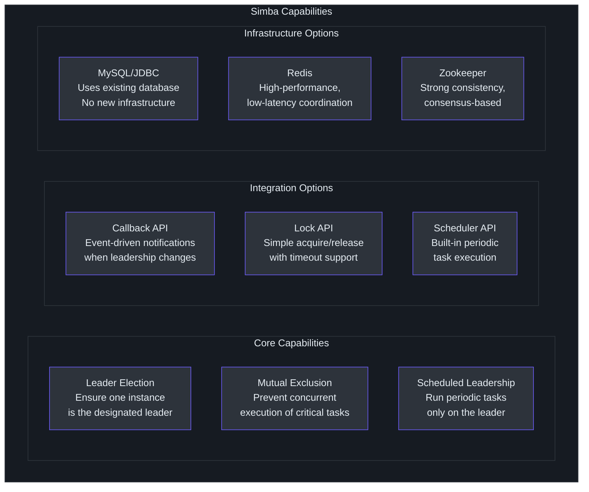
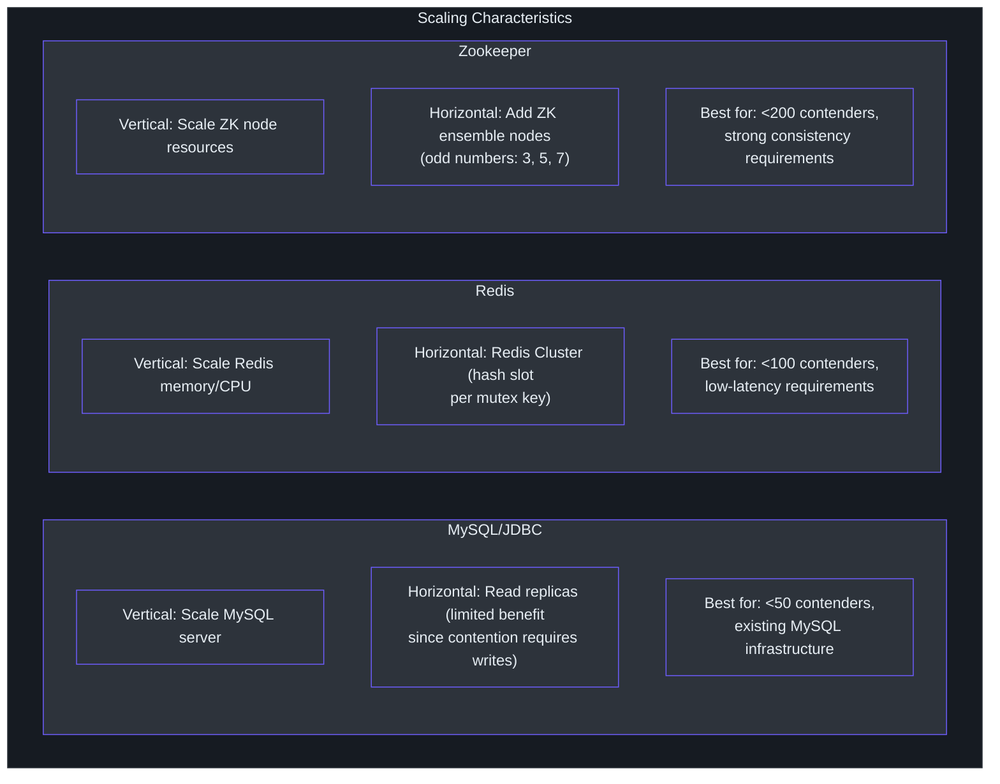
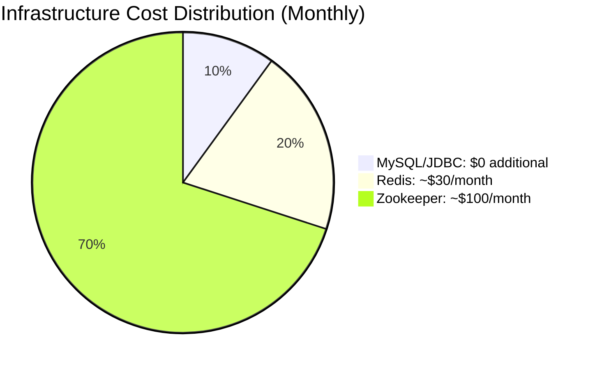
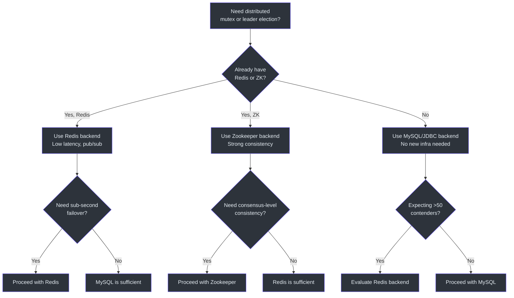
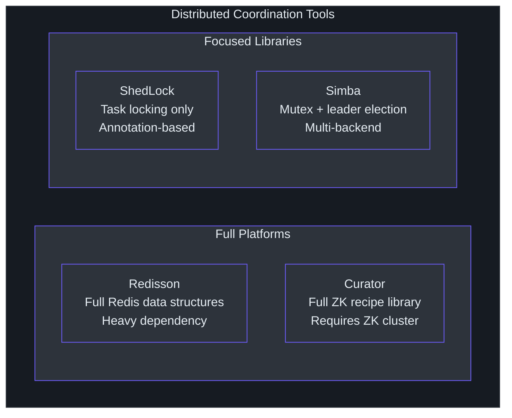

# 管理层指南

本指南提供 Simba 的领导层概览：它做什么、为什么重要、有什么风险，以及如何将其作为技术投资进行评估。不包含代码片段。

---

## Simba 做什么

Simba 是一个确保**软件服务的仅一个实例在任意给定时间执行特定任务**的库。在多个应用副本同时运行的分布式系统中，某些操作 -- 如发送定时报告、处理批队列或协调部署 -- 必须由恰好一个实例执行，以避免重复、数据冲突或相互矛盾的操作。

Simba 通过提供**分布式互斥锁**（跨所有实例共享的锁）来解决这个问题，支持三种后端存储选项：MySQL 数据库、Redis 缓存或 Apache Zookeeper 集群。开发者将 Simba 集成到他们的应用中，库自动处理协调。

### 能力图谱

### 它解决什么问题

| 问题 | 没有 Simba | 有 Simba |
|---|---|---|
| 定时批处理任务 | 所有实例同时运行任务，导致重复和数据冲突 | 只有领导者实例运行任务 |
| 资源清理 | 多个实例同时尝试清理，有竞态条件风险 | 一个实例持有锁并独占执行清理 |
| 数据迁移 | 不清楚哪个实例应驱动迁移过程 | 领导选举指定恰好一个驱动者 |
| 外部 API 限流 | 所有实例独立调用 API，有被限流风险 | 领导者批处理和限流外部调用 |

---

## 风险评估

### 按后端的单点故障分析

```mermaid
flowchart LR
    subgraph risk["Failure Risk by Backend"]
        style risk fill:#161b22,stroke:#30363d,color:#e6edf3

        subgraph mysql_risk["MySQL/JDBC"]
            style mysql_risk fill:#161b22,stroke:#30363d,color:#e6edf3
            M1["Database goes down"]
            M2["All contenders stop<br>acquiring locks"]
            M3["No split-brain risk"]
            M4["Auto-recovers when<br>DB is restored"]
            M1 --> M2 --> M3 --> M4
        end

        subgraph redis_risk["Redis"]
            style redis_risk fill:#161b22,stroke:#30363d,color:#e6edf3
            R1["Redis goes down"]
            R2["Subscribers lose pub/sub"]
            R3["No split-brain risk"]
            R4["Auto-recovers when<br>Redis is restored"]
            R1 --> R2 --> R3 --> R4
        end

        subgraph zk_risk["Zookeeper"]
            style zk_risk fill:#161b22,stroke:#30363d,color:#e6edf3
            Z1["ZK ensemble loses quorum"]
            Z2["No new leader elected"]
            Z3["No split-brain risk"]
            Z4["Auto-recovers when<br>quorum restored"]
            Z1 --> Z2 --> Z3 --> Z4
        end
    end

    style mysql_risk fill:#2d333b,stroke:#6d5dfc,color:#e6edf3
    style redis_risk fill:#2d333b,stroke:#6d5dfc,color:#e6edf3
    style zk_risk fill:#2d333b,stroke:#6d5dfc,color:#e6edf3
    style M1 fill:#2d333b,stroke:#6d5dfc,color:#e6edf3
    style M2 fill:#2d333b,stroke:#6d5dfc,color:#e6edf3
    style M3 fill:#2d333b,stroke:#6d5dfc,color:#e6edf3
    style M4 fill:#2d333b,stroke:#6d5dfc,color:#e6edf3
    style R1 fill:#2d333b,stroke:#6d5dfc,color:#e6edf3
    style R2 fill:#2d333b,stroke:#6d5dfc,color:#e6edf3
    style R3 fill:#2d333b,stroke:#6d5dfc,color:#e6edf3
    style R4 fill:#2d333b,stroke:#6d5dfc,color:#e6edf3
    style Z1 fill:#2d333b,stroke:#6d5dfc,color:#e6edf3
    style Z2 fill:#2d333b,stroke:#6d5dfc,color:#e6edf3
    style Z3 fill:#2d333b,stroke:#6d5dfc,color:#e6edf3
    style Z4 fill:#2d333b,stroke:#6d5dfc,color:#e6edf3
```

### 风险矩阵

| 风险 | 可能性 | 影响 | 缓解措施 |
|---|---|---|---|
| **存储后端宕机** | 中 | 高 -- 无法选出领导者，任务暂停 | 后端特定高可用（MySQL 复制、Redis Sentinel/Cluster、ZK 集群） |
| **网络分区** | 低 | 中 -- 转换窗口内可能出现临时双领导者 | TTL + 转换期设计将双领导窗口限制在转换持续时间内 |
| **领导者 GC 暂停** | 中 | 低 -- 领导者错过续期，领导权转移 | 转换期吸收长达转换持续时间的 GC 暂停 |
| **时钟偏移** | 低 | 低 -- 竞争时序略有偏差 | 所有时序相对于单个后端的时钟；跨节点时钟偏移仅影响抖动 |
| **库漏洞** | 低 | 中 -- 取决于严重程度 | Apache 2.0 许可证，积极维护，极少依赖树 |
| **后端容量耗尽** | 中 | 中 -- 竞争查询压垮存储 | 抖动分散负载；连接池限制并发查询 |

### 关键安全属性

Simba 的设计保证**正常运行下无脑裂**。即使两个实例同时认为自己是领导者（在转换期间可能），这个窗口是有界的且可配置的。转换期是一个刻意的权衡：以短暂的歧义窗口为代价提供稳定性。

---

## 技术投资论证

### 为什么投资 Simba

1. **基础设施灵活性**：与锁定到单一后端的替代方案不同，Simba 让团队选择匹配现有基础设施的存储。已经运行 MySQL 的团队可以添加分布式锁而无需部署 Redis 或 Zookeeper。

2. **最小运维占用**：库的依赖树很小。对于 MySQL 后端，完全不需要额外基础设施 -- `simba_mutex` 表是唯一添加到现有数据库的东西。

3. **Spring Boot 集成**：自动配置将集成工作量减少到添加一个依赖和设置几个属性。

4. **经过验证的测试方法**：TCK（技术兼容性套件）确保所有后端行为一致。任何新后端必须通过相同的 5 个测试用例，降低行为不一致的风险。

5. **Kotlin on JVM**：运行在主导的服务端平台（JVM 17）上，同时受益于 Kotlin 的空安全和简洁性。

### 投资风险

1. **社区规模**：Simba 是一个利基库。贡献者基数小于 Redisson 或 ShedLock。
2. **Kotlin 采用**：没有 Kotlin 经验的团队可能面临学习曲线，不过 Kotlin 与 Java 的互操作是无缝的。
3. **无内置监控**：库不暴露指标（锁获取率、竞争频率、延迟）。团队需要自行添加监控。

---

## 扩展模型

### 每个后端如何扩展

### 成本影响

| 后端 | 额外基础设施成本 | 运维开销 |
|---|---|---|
| MySQL/JDBC | 无（使用现有数据库） | 低 -- 仅增加一张表 |
| Redis | Redis 实例成本（小型云实例约 $15-50/月） | 低 -- 标准 Redis 运维 |
| Zookeeper | ZK 集群（3+ 节点，约 $45-150/月） | 高 -- 需要 ZK 运维专业知识 |

---

## 可操作建议

### 对于刚开始使用分布式锁的团队

1. **从 MySQL/JDBC 后端开始**。它不需要新基础设施，并与现有的 Spring Boot 数据访问模式集成。

2. **使用调度器 API** 实现领导权门控的周期性任务。它提供了最简单的思维模型：一个实例按调度运行任务，如果该实例宕机则领导权自动转移。

3. **初期设置保守的 TTL 值**（5-10 秒）。更短的 TTL 意味着更快的故障转移但更多数据库负载。更长的 TTL 减少负载但增加故障转移时间。

### 对于大规模团队

1. **评估 Redis 后端**，如果你需要亚秒级领导权转移延迟且已经运维 Redis 基础设施。

2. **监控你的后端存储**。Simba 不直接发出指标，因此确保你的 MySQL/Redis/Zookeeper 监控涵盖查询量和延迟。

3. **在预发布环境测试故障场景**：终止领导者实例并测量新领导者被选出的速度。这验证你的 TTL 和转换期设置是否合适。

### 对于平台团队

1. **标准化一个后端**以减少组织的运维复杂性。

2. **在你的服务模板中包含 Simba**，如果你的平台频繁使用领导选举模式。

3. **贡献监控钩子**，如果库不满足你的可观测性需求。回调 API（`onAcquired`/`onReleased`）是指标的天然集成点。

---

## 实施时间线估算

| 阶段 | 持续时间 | 活动 |
|---|---|---|
| **评估** | 1-2 天 | 开发者阅读文档，确定后端，创建概念验证 |
| **集成** | 2-5 天 | 添加依赖，配置后端，编写任务逻辑，本地测试 |
| **预发布验证** | 3-5 天 | 多实例测试，故障转移测试，时序调优 |
| **生产上线** | 1-2 天 | 部署并监控，观察领导选举行为 |
| **总计** | 1-2 周 | 从评估到生产 |

这些估算假设是一个具有现有 MySQL 或 Redis 基础设施的 Spring Boot 应用。如果需要配置 Zookeeper 基础设施则增加 1-2 周。

## 组织影响

### 团队职责

| 团队 | 职责 | 时间投入 |
|---|---|---|
| **后端开发** | 将 Simba 集成到应用代码，编写任务逻辑 | 每个应用 3-5 天 |
| **平台/基础设施** | 确保后端基础设施（MySQL/Redis/ZK）高可用 | 现有高可用设置 + 监控 |
| **SRE/DevOps** | 在生产中监控领导选举，处理故障转移事件 | 初始设置：1-2 天 |
| **架构** | 审查和批准后端选择，设置时序标准 | 1-2 小时 |

### 所需技能

- **Kotlin 或 Java 熟练度** -- 集成所需
- **分布式系统认知** -- 有助于理解故障模式
- **Spring Boot 经验** -- 简化自动配置集成
- **数据库或 Redis 运维** -- 使用 JDBC 或 Redis 后端时所需

## 成本效益分析

### 成本

| 成本类别 | 估算 | 备注 |
|---|---|---|
| 集成开发 | 3-5 个开发者天 | 每个应用 |
| 基础设施（MySQL 后端） | 额外 $0 | 使用现有数据库 |
| 基础设施（Redis 后端） | $15-50/月 | 小型 Redis 实例 |
| 基础设施（Zookeeper 后端） | $45-150/月 | 3 节点集群 |
| 持续维护 | < 1 天/季度 | 库更新，时序调优 |
| 监控设置 | 1-2 个开发者天 | 每个应用一次性 |

### 收益

| 收益 | 影响 | 没有 Simba |
|---|---|---|
| 消除重复任务执行 | 防止数据损坏、重复发送 | 手动协调或听天由命 |
| 自动故障转移 | 秒级 vs. 手动干预 | 值班工程师必须手动重启 |
| 减少运维事故 | 更少的"多个实例运行了同一任务"的 bug | 生产问题的常见来源 |
| 更快的开发 | 预构建的领导选举 vs. 自定义实现 | 从零构建需要 2-4 周 |
| 后端灵活性 | 选择合适的基础设施 | 锁定在一种方法 |

### ROI 计算

如果一个团队否则需要花 2-4 周构建自定义领导选举解决方案（基于典型分布式系统开发的保守估算），Simba 提供了即时的 8-16 个开发者天的节省。持续成本接近零，因为库不需要单独的基础设施（使用 MySQL 后端时）。

## 风险缓解策略

### 存储后端故障

| 后端 | 高可用策略 | 故障转移时间 |
|---|---|---|
| MySQL | 主从复制带自动故障转移（如 RDS Multi-AZ） | 30-60 秒 |
| Redis | Redis Sentinel 或 Redis Cluster | 10-30 秒 |
| Zookeeper | 3 或 5 节点集群带自动领导选举 | 2-10 秒 |

### 库问题

- **固定版本**：使用特定版本（如 `3.0.2`）而非动态版本范围
- **监控 GitHub 仓库**：关注安全公告和破坏性变更
- **准备回滚计划**：Simba 是库而非服务 -- 回滚意味着回退代码部署

### 应用配置错误

- **使用预发布环境**：在生产前测试故障转移场景
- **设置保守的 TTL**：从 5-10 秒 TTL 值开始，仅在需要时下调
- **初始启用调试日志**：确认行为正确后切换到 INFO 级别

## 快速决策指南

## 竞争定位

### Simba 在市场中的位置

Simba 占据了一个特定的利基市场：它是一个**聚焦的库**（不是完整平台），提供**后端灵活性**（不锁定到一种存储）。这使其非常适合需要领导选举但不想引入新基础设施依赖的团队。

### 何时选择 Simba 而非替代方案

| 场景 | 推荐工具 |
|---|---|
| 需要领导选举 + 已有 MySQL | **Simba**（无需新基础设施） |
| 需要领导选举 + 已有 Redis | **Simba** 或 Redisson（Simba 更轻量） |
| 需要 Redis 上的完整分布式数据结构 | Redisson |
| 仅需基于注解的任务锁 | ShedLock |
| 已投入 Zookeeper 生态系统 | Curator（更深的 ZK 集成） |
| 需要多后端灵活性 | **Simba**（唯一选项） |

## 合规和治理

| 方面 | 状态 |
|---|---|
| **许可证** | Apache License 2.0 -- 宽松，允许商业使用 |
| **依赖** | 极少；核心无 Spring 依赖 |
| **漏洞管理** | 活跃的 Renovate 机器人用于依赖更新 |
| **代码质量** | Detekt 静态分析，JaCoCo 覆盖率报告 |
| **测试** | TCK 驱动，每个后端 5 个强制测试用例 |
| **版本管理** | 语义化版本（当前：3.0.2） |

## 总结

Simba 是一个轻量级、基础设施灵活的 JVM 应用分布式互斥锁库。它的主要价值主张是**后端选择** -- 团队可以使用现有的 MySQL、Redis 或 Zookeeper 基础设施而无需部署新系统。库测试充分（TCK 驱动），依赖占用小，与 Spring Boot 清晰集成。主要风险是其利基社区和缺乏内置监控，对于已有可观测性基础设施的团队来说这两个风险都是可管理的。
