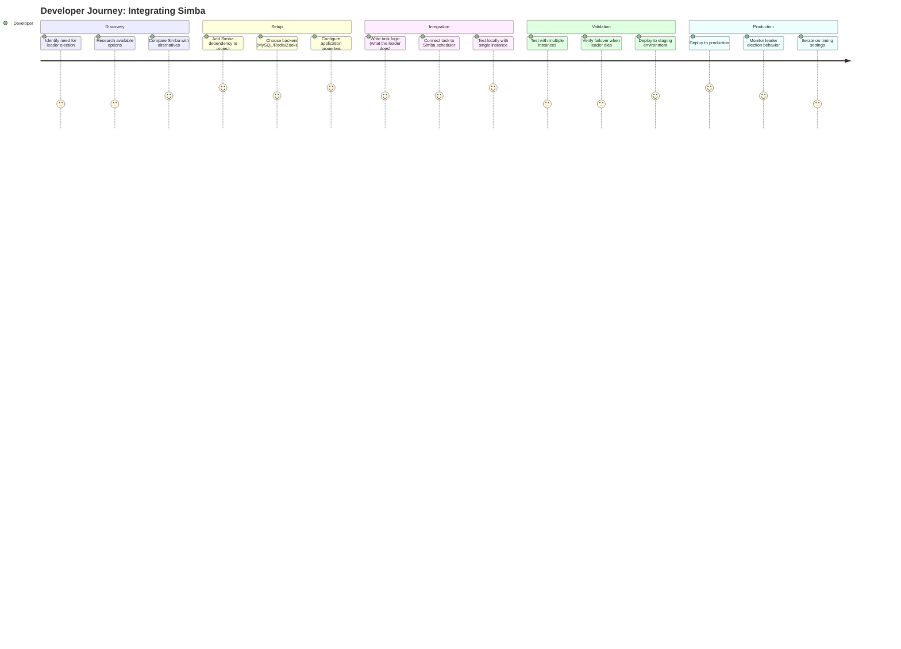
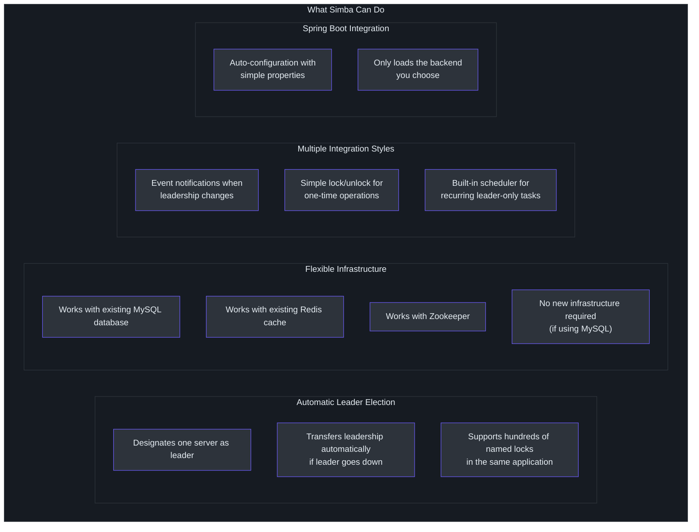
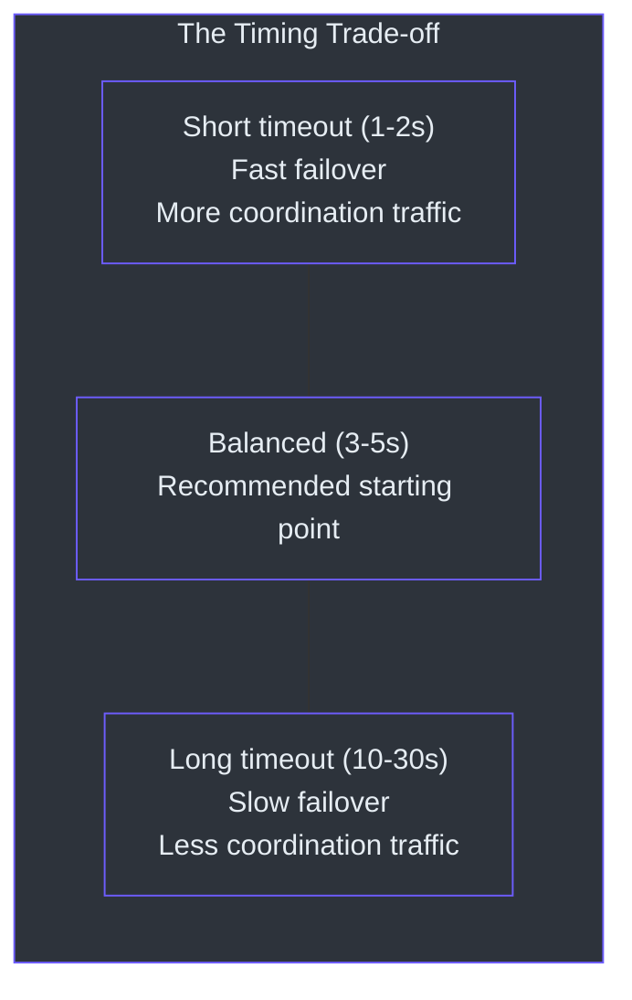
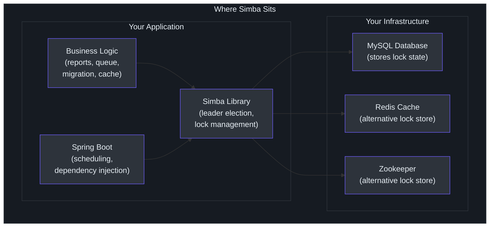
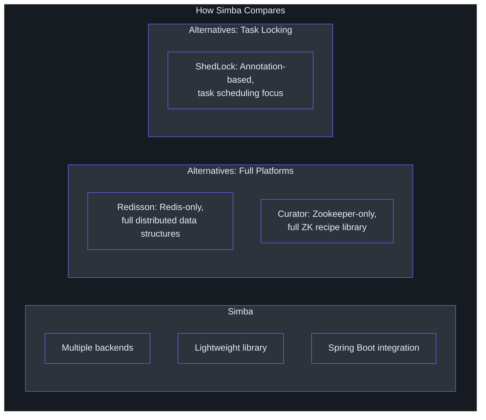

# 产品经理指南

本指南以非技术语言解释 Simba。它涵盖产品解决什么问题、谁使用它、它能做什么和不能做什么，并回答常见问题。

---

## Simba 解决什么问题？

想象一下，你的公司在多台服务器上运行一个 Web 应用（比如说，同一应用的 5 个副本同时运行以处理用户流量）。有时，你需要一个任务只由其中**一台**服务器执行。例如：

- **发送每日报告**：你只想让一台服务器发送，而不是全部五台（那样每个收件人都会收到五份）。
- **处理工作项队列**：如果多个服务器处理同一个项目，你会得到重复的结果或冲突的写入。
- **运行清理例程**：如果多个服务器同时尝试清理相同数据，它们可能会相互干扰。

Simba 确保**恰好一台服务器**被指定为给定任务的"领导者"。如果该服务器宕机，另一台服务器会自动接管。

可以把它想象成会议中的"话语权" -- 只有拿着话语权的人才能发言。当他们说完（或离开房间），把它传给其他人。

---

## 谁使用 Simba？

**主要用户**：构建和运营分布式应用的软件开发者和平台工程师。

**涉及采用的典型角色**：

| 角色 | 参与程度 |
|---|---|
| 后端开发者 | 将 Simba 集成到应用代码中 |
| 平台工程师 | 确保支持基础设施（数据库、Redis 或 Zookeeper）可用 |
| DevOps / SRE | 监控系统并处理故障转移场景 |
| 工程经理 | 批准技术选择和集成时间线 |
| 产品经理 | 了解能力用于路线图规划和功能范围确定 |

---

## 用户旅程：开发者集成 Simba

### 旅程地图

### 集成步骤（通俗语言）

1. **添加库**：开发者将 Simba 作为依赖添加到他们的项目中，就像给书添加一个章节。

2. **选择存储"话语权"的位置**：Simba 需要一个共享位置来跟踪谁是当前领导者。开发者选择一个：
   - 他们现有的数据库（MySQL）-- 不需要新系统
   - 他们现有的缓存（Redis）-- 快速、低延迟
   - 协调服务（Zookeeper）-- 非常可靠

3. **编写任务**：开发者编写当他们的服务器成为领导者时应该发生什么（例如"发送每日报告"）。

4. **让 Simba 处理其余部分**：库自动在所有服务器之间协调，确保只有一个领导者，并在服务器宕机时转移领导权。

---

## 功能能力图谱

### 功能详情

| 功能 | 含义 | 适用场景 |
|---|---|---|
| **领导选举** | 任意时刻只有一台服务器是指定的"领导者" | 当一个任务必须在恰好一台服务器上运行时 |
| **自动故障转移** | 如果领导者停止响应，另一台服务器在数秒内接管 | 当你不能承受领导任务停机时 |
| **多个锁** | 你可以在同一应用中拥有许多独立的锁（例如一个用于报告，一个用于清理，一个用于数据同步） | 当不同功能需要独立的领导权时 |
| **MySQL 后端** | 使用你现有的数据库，无需部署新系统 | 当你想要最简单的设置时 |
| **Redis 后端** | 使用你现有的缓存进行更快的协调 | 当你需要亚秒级领导权转移时 |
| **Zookeeper 后端** | 使用专用协调服务获得最强保证 | 当你需要最高可靠性时 |
| **调度器集成** | 库按调度运行你的任务，但只在领导者服务器上 | 当你有周期性任务时（每 30 秒、每小时等） |
| **Spring Boot 支持** | 一行配置即可启用 | 当你的应用使用 Spring Boot 时 |
| **测试套件** | 内置测试确保所有后端行为一致 | 当你想要确保切换后端不会破坏任何东西时 |

---

## 何时不应使用 Simba

Simba 并非适合所有场景。以下是使用不同方法会更好的情况：

| 场景 | 为什么 Simba 不理想 | 更好的替代方案 |
|---|---|---|
| **你需要完整的作业调度器**（重试逻辑、作业历史、监控仪表板） | Simba 只确保一个实例运行任务；它不管理作业生命周期 | 使用专用作业调度器（Quartz、Spring Batch、Apache Airflow），可选添加 Simba 进行领导选举 |
| **你的所有服务都是无状态且幂等的** | 如果运行两次任务没有负面影响（如检查新邮件），协调会增加不必要的复杂性 | 让所有实例运行任务即可 |
| **你不在 JVM 上** | Simba 是 JVM 库（Java/Kotlin） | 使用具有语言无关 API 的协调服务（etcd、Consul）或特定语言的库 |
| **你需要亚毫秒级协调** | Simba 最快的后端（Redis）协调延迟在毫秒范围 | 在单个进程内使用应用级并发控制 |
| **你需要跨多系统的分布式事务** | Simba 提供互斥而非事务协调 | 使用分布式事务框架（Seata、Axon） |

---

## 已知限制

### Simba 不做什么

| 限制 | 说明 | 替代方案 |
|---|---|---|
| **无内置监控仪表板** | Simba 不提供 Web UI 或指标端点来查看哪台服务器是领导者 | 开发者可以通过回调 API 添加日志或指标 |
| **无自动后端选择** | 开发者必须选择使用哪个后端（MySQL、Redis 或 Zookeeper） | 决策指南帮助根据现有基础设施选择 |
| **无跨区域协调** | Simba 假设所有服务器可以访问相同的后端（数据库、Redis 或 Zookeeper） | 对于跨区域场景，需要具有多区域复制的集中协调服务 |
| **不加密锁数据** | 锁所有权信息原样存储在后端中 | 适用标准基础设施安全（加密连接、访问控制） |
| **无基于优先级的选举** | 所有竞争者具有相同优先级；第一个获取锁的获胜 | 自定义优先级逻辑必须由开发者在回调中实现 |
| **仅限 JVM** | Simba 运行在 Java 虚拟机上（Java 或 Kotlin 应用） | 非 JVM 服务需要不同的协调解决方案 |
| **不是完整的作业调度器** | Simba 确保只有领导者运行任务，但不管理任务定义、重试或作业历史 | 配合作业调度器（Quartz、Spring Scheduler）使用以获得完整的作业管理 |

### 时序权衡

检测领导者已失败并将领导权转移到另一台服务器所需的时间是可配置的。更快的检测意味着更少的停机时间但更多的服务器间通信。更慢的检测减少流量但增加没有领导者的窗口期。

---

## 常见问题

### 通用问题

**问：Simba 是一个我部署的独立产品，还是开发者添加到代码中的库？**
答：它是一个库。开发者将其添加到应用代码中，就像添加任何其他构建块一样。没有需要部署的单独服务器或服务。

**问：我需要购买或授权 Simba 吗？**
答：不需要。Simba 是 Apache License 2.0 下的开源软件。你可以免费使用、修改并在商业产品中部署。

**问：多少台服务器可以同时使用 Simba？**
答：这取决于后端。使用 MySQL，约 50 台服务器可以高效地竞争同一个锁。使用 Redis，约 100 台。使用 Zookeeper，约 200 台。这些限制是针对单个锁的；你可以拥有许多独立的锁。

**问：如果数据库/Redis/Zookeeper 宕机会怎样？**
答：后端恢复之前无法选出新的领导者。当前领导者继续其工作（它不需要后端来保持运行其任务）。当后端恢复时，领导权正常恢复。没有数据损坏或脑裂风险。

**问：两台服务器会意外同时成为领导者吗？**
答：存在一个短暂的、可配置的窗口（称为"转换期"，通常 1-5 秒），理论上这是可能的。这是设计如此 -- 它提供稳定性，使当前领导者不会因微小延迟而失去位置。对于大多数业务任务，这个短暂的重叠是可以接受的，因为任务结果是幂等的（运行两次产生相同结果）。

### 集成问题

**问：集成 Simba 需要多长时间？**
答：对于使用 MySQL 的 Spring Boot 应用，开发者可以在不到一小时内集成 Simba。过程包括添加依赖、设置配置属性和编写 10-20 行代码。

**问：我们应该使用哪个后端？**
答：如果你已经有 MySQL，从那里开始 -- 不需要新基础设施。如果你需要更快的故障转移（亚秒级）且已经有 Redis，使用 Redis 后端。如果你需要最强的一致性保证且已经运维 Zookeeper，使用那个。

**问：Simba 与我们现有的监控工具兼容吗？**
答：Simba 不直接发出指标，但开发者可以利用领导权变更回调将事件发送到你的监控系统（Datadog、Prometheus 等）。

**问：我们可以用 Simba 做每 5 分钟运行一次的任务吗？**
答：可以。内置的调度器 API 正是为此设计的。配置调度间隔，Simba 确保只有领导者服务器运行任务。

### 运维问题

**问：部署期间（滚动重启）会发生什么？**
答：在滚动重启期间，实例逐个停止和启动。当领导者实例停止时，Simba 自动将领导权转移到另一个运行中的实例。重新启动的服务器的新实例将像任何其他竞争者一样竞争领导权。

**问：如何在生产前测试 Simba？**
答：在本地或预发布环境中运行应用的多个实例。终止领导者实例并验证另一个实例接管。库包含内置测试套件（TCK），开发者运行它来验证后端配置。

**问：持续维护负担是什么？**
答：极少。Simba 是一个没有单独基础设施需要维护的库（使用 MySQL/Redis 后端时）。通过标准依赖管理保持库版本更新。

---

## 场景和用例

### 场景 1：定时报告发送

**问题**：你的应用每天早上 9 点向管理团队发送每日销售报告。你运行 4 个应用实例进行负载均衡。没有协调时，4 个实例都发送报告，因此管理层收到 4 份副本。

**使用 Simba**：一个实例被指定为领导者。只有该实例发送报告。如果领导者实例宕机（例如在部署期间），另一个实例自动成为领导者并发送下一份报告。

**集成工作量**：开发者添加 Simba 并编写连接到调度器的报告发送任务。预计时间：半天。

### 场景 2：队列处理去重

**问题**：你的应用处理来自工作队列的项目（例如图片调整大小、邮件发送）。多个实例同时从队列拉取项目。有时两个实例处理同一个项目，导致重复邮件或浪费计算资源。

**使用 Simba**：使用 Simba 确保一次只有一个实例处理项目。领导者实例处理队列；其他实例待命。当领导者宕机时，另一个接管并恢复处理。

**替代方案**：如果队列系统已经处理了队列级去重（例如 SQS 可见性超时），对于这个特定用例可能不需要 Simba。根据你的队列保证进行评估。

### 场景 3：数据库迁移协调

**问题**：当部署包含数据库迁移的新版本应用时，你需要恰好一个实例在其他实例开始提供流量之前运行迁移。

**使用 Simba**：第一个启动的实例成为领导者，运行迁移，其他实例等待直到迁移完成。这消除了多个实例尝试相同迁移的竞态条件。

### 场景 4：缓存预热

**问题**：你的应用需要在启动时预加载缓存（例如配置数据、参考数据）。如果所有实例同时这样做，它们会压垮源系统。

**使用 Simba**：一个实例（领导者）预热缓存。其他实例要么等待，要么从已预热的缓存读取。这将源系统的负载减少了 N 倍（N 是实例数量）。

### 场景 5：外部 API 限流

**问题**：你的应用调用有速率限制的外部 API（例如每分钟 100 次请求）。有 5 个实例各自独立调用 API，你可能超出限制。

**使用 Simba**：领导者实例充当外部 API 调用的网关，跨所有实例批处理和限流请求。这提供集中的速率控制。

---

## Simba 如何融入你的技术栈

Simba 作为库存在于你的应用内部。它不需要单独的部署、单独的服务器或单独的团队来运维。它使用你现有的数据库或缓存基础设施在实例之间进行协调。

---

## 成功指标

评估 Simba 是否在你的系统中正常工作时，关注以下指标：

| 指标 | 含义 | 如何衡量 |
|---|---|---|
| **零重复任务执行** | 只有一个实例运行领导者专属任务 | 检查任务日志中每个调度只有单次执行 |
| **快速故障转移** | 当领导者宕机时，另一个快速接管 | 从领导者失败到新领导者执行任务的时间 |
| **无脑裂事件** | 两个实例从不同时认为自己是领导者 | 监控是否有重复的任务输出 |
| **低基础设施开销** | Simba 不对你的数据库/缓存增加显著负载 | 监控数据库查询量和 Redis 内存 |

---

## 对比总结

| 维度 | Simba | Redisson | Curator | ShedLock |
|---|---|---|---|---|
| 所需基础设施 | 可选择 MySQL、Redis 或 ZK | 仅 Redis | 仅 Zookeeper | MySQL、Redis、Mongo 或 ZK |
| 主要用途 | 领导选举和分布式互斥 | 完整分布式数据结构 | Zookeeper 配方 | 定时任务锁 |
| 集成风格 | 带回调和调度器 API 的库 | 带数据结构 API 的库 | 带配方 API 的库 | 基于注解 |
| 运维成本 | 低（特别是使用 MySQL） | 低 | 高（ZK 集群） | 低 |
| 最适合 | 想要后端灵活性的团队 | 已投入 Redis 的团队 | 已投入 ZK 的团队 | 想要简单任务锁的团队 |

---

## 快速入门清单

如果你的团队正在为项目评估 Simba，请按以下步骤操作：

- [ ] **确定需求**：哪个具体任务需要单实例执行？
- [ ] **检查基础设施**：你已经有 MySQL、Redis 还是 Zookeeper？
- [ ] **阅读[贡献者指南](./contributor.md)**：分享给将要进行集成的开发者
- [ ] **原型验证**：在一个非关键任务上构建概念验证（1-2 天）
- [ ] **测试故障转移**：在预发布环境终止领导者实例并验证另一个接管
- [ ] **设置监控**：围绕领导权变更（onAcquired/onReleased 事件）添加日志
- [ ] **部署生产**：从一个任务开始，验证后扩展

## 术语表（非技术）

| 术语 | 通俗解释 |
|---|---|
| **分布式互斥锁** | 多个服务器用来协调谁执行任务的共享锁 |
| **领导选举** | 选择一台服务器负责特定任务的过程 |
| **故障转移** | 当前领导者停止工作时，另一台服务器自动接管 |
| **TTL（生存时间）** | 服务器对领导权的声明可以持续多久，之后必须续期 |
| **转换期** | 防止领导权过于突然变更的宽限期 |
| **后端** | Simba 用来跟踪谁是领导者的存储系统（MySQL、Redis 或 Zookeeper） |
| **竞争** | 多个服务器争当领导者 |
| **回调** | 当特定事件发生时发送给你的代码的通知（例如"你现在是领导者"） |
| **RAII** | 一种模式，资源（如锁）在你用完后自动释放 |
| **Spring Boot** | 构建 Java/Kotlin Web 应用的流行框架 |

## 下一步

如果你的团队正在为项目评估 Simba：

1. **让开发者阅读[贡献者指南](./contributor.md)** 以了解技术细节
2. **确定哪个后端**匹配你的现有基础设施
3. **从概念验证开始**，在单个非关键定时任务上
4. **查阅[高级工程师指南](./staff-engineer.md)** 获取架构深度分析和风险分析
