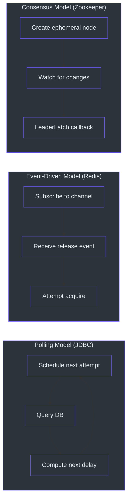
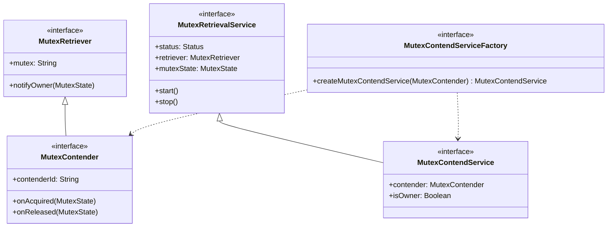
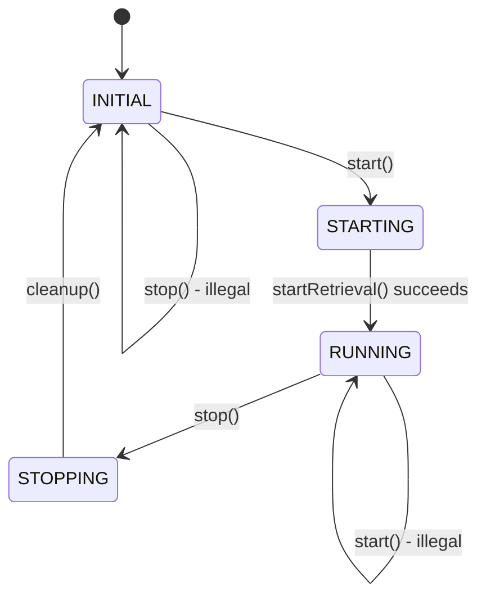
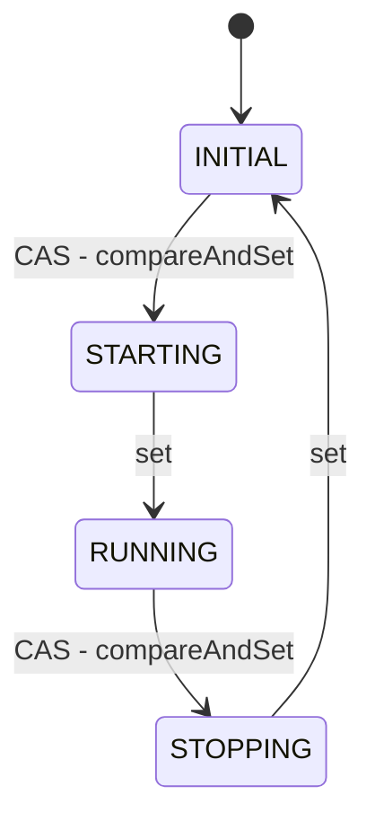
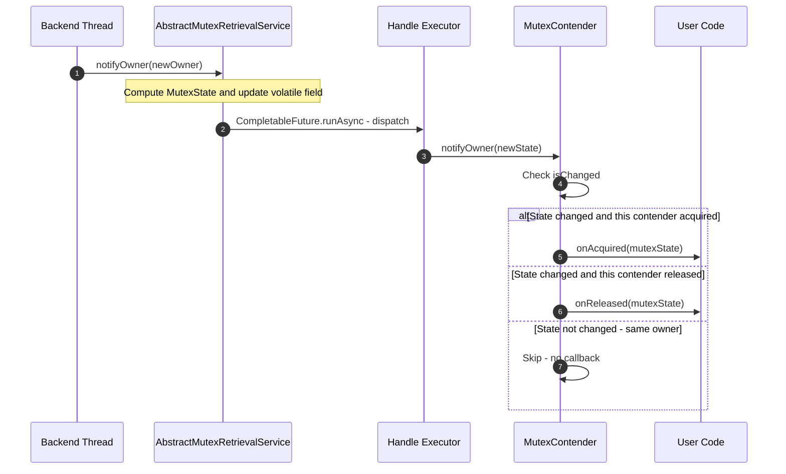

# 高级工程师指南

本指南提供 Simba 的密集架构级分析。它假设你对分布式系统、JVM 并发和存储引擎有深入的了解。代码在有帮助的地方以伪代码形式呈现；精确实现请参考源码。

---

## 核心洞察

Simba 将分布式互斥锁视为**具有可插拔存储的服务**。不变量很简单：对于给定的互斥锁名称，任意时刻最多只有一个竞争者持有所有权。库提供了三种实现，使用根本不同的存储原语来强制执行此不变量：

| 后端 | 存储原语 | 一致性模型 |
|---|---|---|
| JDBC | 使用乐观锁的关系行（`UPDATE ... WHERE version = ?`） | 通过可序列化数据库事务实现线性一致性 |
| Redis | 原子 `SET NX PX` + Lua 脚本 | 单线程 Redis 执行保证原子性 |
| Zookeeper | 通过 `LeaderLatch` 使用临时顺序 znode | ZAB 共识协议 |

核心洞察是**协议**（TTL + 转换期 + 抖动）在三者之间是完全相同的 -- 只有**存储绑定**不同。

---

## 设计权衡分析

### 轮询 vs 事件驱动竞争



| 维度 | 轮询（JDBC） | 事件驱动（Redis） | 共识（Zookeeper） |
|---|---|---|---|
| **释放后获取延迟** | 最长 `transition` 持续时间 | 亚毫秒级（发布/订阅推送） | 亚秒级（ZK watch） |
| **数据库负载** | 每周期 O(竞争者数量) 次查询 | 每次尝试 O(1) 次 Lua | 每周期 O(1) 次 ZK 操作 |
| **故障模式** | 静默（只是重试下一个周期） | 发布/订阅消息丢失意味着延迟重新获取 | 会话过期触发立即领导权变更 |
| **网络开销** | 恒定（轮询间隔） | 突发（发布/订阅 + Lua） | 恒定（ZK 心跳） |
| **运维复杂度** | 低（只需 MySQL） | 中等（Redis + 发布/订阅） | 高（ZK 集群） |

### 乐观锁 vs 悲观锁（JDBC）

JDBC 后端使用 `simba_mutex` 表中的 `version` 列实现**乐观锁**。核心 SQL 操作：

```
UPDATE simba_mutex
SET owner_id = ?, acquired_at = ?, ttl_at = ?, transition_at = ?, version = version + 1
WHERE mutex = ? AND (version = ? OR transition_at < ?)
```

这意味着：
- 竞争期间不持有行级锁
- 多个竞争者可以同时尝试；恰好一个赢得 `UPDATE`
- 失败者只看到 0 行更新，并调度下一次尝试
- `transition_at < ?` 条件允许在转换期过期后接管

**考虑过的替代方案**：悲观锁（`SELECT ... FOR UPDATE`）。被否决因为它在整个竞争周期内持有数据库锁，降低了吞吐量，并在高竞争下有死锁风险。

### TTL + 转换期模型

双时间戳模型（`ttlAt` + `transitionAt`）是 Simba 的关键设计创新：

```mermaid
gantt
    title TTL + Transition Timeline
    dateFormat X
    axisFormat %L ms

    section Owner
    Exclusive use (TTL window)    :active, ttl, 0, 5000
    Grace period (transition)     :trans, 5000, 8000

    section Contenders
    Must not contend              :done, wait1, 0, 5000
    Timing jitter window          :crit, jitter, 7800, 9000
    Can acquire                   :acq, 8000, 10000
```



- **TTL 期间**（`acquiredAt` 到 `ttlAt`）：所有者独占使用锁。其他竞争者不应尝试获取。
- **转换期间**（`ttlAt` 到 `transitionAt`）：所有者仍然可以续期（通过 `guard`），但其声明正在减弱。其他竞争者开始计时其尝试。
- **转换后**（`transitionAt` 之后）：锁可供竞争。在 `transitionAt` 附近带抖动的竞争者进行竞争。

**为什么不用单一 TTL？** 只有 TTL 时存在竞态条件：所有者的续期可能在过期后几毫秒才到达，造成领导权空档。转换期通过给所有者一个宽限窗口来吸收这个问题。这类似于 Chubby 等系统中带有续期宽限期的租约。

### 抖动策略

[`ContendPeriod.nextContenderDelay()`](https://github.com/Ahoo-Wang/Simba/blob/main/simba-core/src/main/kotlin/me/ahoo/simba/core/ContendPeriod.kt) 在计划尝试时间上添加 [-200ms, +1000ms] 范围内的随机抖动：

```
delay = (transitionAt - now) + random(-200, 1000)
```

这有两个目的：
1. **防止惊群效应**：没有抖动，所有竞争者都会在恰好 `transitionAt` 时尝试，造成数据库/Redis 负载尖峰
2. **自然负载分布**：随机分布意味着不同竞争者在略微不同的时间尝试，增加了首次尝试成功的概率

---

## `MutexOwner` 生命周期详解

[`MutexOwner`](https://github.com/Ahoo-Wang/Simba/blob/main/simba-core/src/main/kotlin/me/ahoo/simba/core/MutexOwner.kt) 值对象跟踪四个时间戳：

```
acquiredAt ---- ttlAt ---- transitionAt ---- now (expired)
     |             |              |
     |   "I own this"    "I still have       "Up for grabs"
     |                   grace time"
```

每个后端以不同方式构造 `MutexOwner`：

**JDBC**：仓库从数据库行返回 `MutexOwnerEntity`，映射为 `MutexOwner(ownerId, acquiredAt, ttlAt, transitionAt)`。

**Redis**：Lua 脚本返回 `{ownerId}@@{transitionAt}`。服务计算 `ttlAt = transitionAt - transition` 和 `acquiredAt = ttlAt - ttl`。

**Zookeeper**：领导事件产生一个简单的 `MutexOwner(contenderId)`，所有时间戳使用默认的 `Long.MAX_VALUE`（ZK 会话过期替代 TTL）。

### 转换期如何防止脑裂

没有转换期时，以下竞态条件是可能的：

```
T=0:     Owner A holds lock (TTL=2s, no transition)
T=2.000: Lock expires
T=2.001: Contender B acquires lock
T=2.002: Owner A's renewal arrives (but it's too late -- B is now owner)
         A's callback fires with the old state, A believes it is still owner
T=2.003: Both A and B believe they are the owner (split-brain!)
```

有转换期时（TTL=2s，transition=5s）：

```
T=0:     Owner A holds lock
T=2.000: TTL expires, but transition period begins
T=2.001: Owner A's renewal arrives -- accepted because transitionAt=7 > 2.001
T=2.002: A's ownership is renewed, no split-brain
```

转换期给了现有所有者在 TTL 过期后续期的窗口。竞争者只在 `transitionAt` 之后才尝试获取，此时所有者要么已经续期，要么确实已经失败。

---

## 系统架构（伪代码）

### 类层次结构



### 状态机



状态转换使用 `AtomicReferenceFieldUpdater.compareAndSet()` 防止并发转换。这意味着从 `INITIAL` 的 `start()` 和从 `RUNNING` 的 `stop()` 是唯一有效路径。

### 通知管道

```
Backend detects ownership change
  -> calls notifyOwner(MutexOwner)
    -> AbstractMutexRetrievalService.safeNotifyOwner(newOwner)
      -> compute MutexState(afterOwner, newOwner)
      -> update mutexState field
      -> CompletableFuture.runAsync({ retriever.notifyOwner(state) }, handleExecutor)
        -> MutexContender.notifyOwner(state)
          -> if state.isAcquired(myId): onAcquired(state)
          -> if state.isReleased(myId): onReleased(state)
```

通知在 `handleExecutor` 上异步分发。这防止后端线程被缓慢的回调实现阻塞。

---

## 扩展点

### 添加新后端

实现三件事：

**1. MutexContendService 子类**

```kotlin
class MyBackendMutexContendService(
    contender: MutexContender,
    handleExecutor: Executor,
    /* 后端特定依赖 */
) : AbstractMutexContendService(contender, handleExecutor) {

    override fun startContend() {
        // 订阅后端中的锁变更
        // 当所有权变更时：notifyOwner(newMutexOwner)
        // 或 notifyOwner(MutexOwner.NONE)
    }

    override fun stopContend() {
        // 释放锁
        // 取消订阅变更
        // notifyOwner(MutexOwner.NONE)
    }
}
```

**2. MutexContendServiceFactory**

```kotlin
class MyBackendMutexContendServiceFactory(
    /* 后端依赖 */
    private val handleExecutor: Executor
) : MutexContendServiceFactory {
    override fun createMutexContendService(
        mutexContender: MutexContender
    ): MutexContendService {
        return MyBackendMutexContendService(
            mutexContender, handleExecutor, /* ... */
        )
    }
}
```

**3. TCK 合规测试**

```kotlin
@TestInstance(TestInstance.Lifecycle.PER_CLASS)
class MyBackendTest : MutexContendServiceSpec() {
    override lateinit var mutexContendServiceFactory: MutexContendServiceFactory

    @BeforeAll
    fun setup() {
        mutexContendServiceFactory = MyBackendMutexContendServiceFactory(/* ... */)
    }
}
```

所有 5 个 TCK 测试用例必须通过：`start()`、`restart()`、`guard()`、`multiContend()`、`schedule()`。

### 添加 Spring Boot 自动配置

在 `simba-spring-boot-starter` 中创建三个文件：

1. `MyBackendProperties` -- `@ConfigurationProperties("simba.my-backend")`
2. `ConditionalOnSimbaMyBackendEnabled` -- 组合条件注解
3. `SimbaMyBackendAutoConfiguration` -- 注册工厂 Bean 的 `@AutoConfiguration` 类

在 `META-INF/spring/org.springframework.boot.autoconfigure.AutoConfiguration.imports` 中注册自动配置。

### 自定义 ContenderIdGenerator

默认的 `HostContenderIdGenerator` 生成格式为 `{counter}:{processId}@{hostAddress}` 的 ID。要使用基于 UUID 的 ID：

```kotlin
abstract class MyContender(mutex: String) : AbstractMutexContender(
    mutex,
    ContenderIdGenerator.UUID.generate()
)
```

或实现自定义生成器：

```kotlin
val customGenerator = ContenderIdGenerator { "my-prefix-${System.nanoTime()}" }
```

---

## 决策日志

### 为什么选择 Kotlin（而非 Java）？

1. **空安全**：类型系统在编译时区分可空和非可空引用。对于分布式系统库至关重要，因为 null 状态指示错误。
2. **数据类**：`MutexOwner` 和 `MutexState` 等值对象免费获得 `equals`/`hashCode`/`toString`。
3. **扩展函数**：fluent-assert 测试库提供的 `.assert()` 在 Java 中会很冗长。
4. **简洁性**：典型类比 Java 等价物短 30-50%，同时不牺牲可读性。
5. **JVM 互操作**：与 Java 库（Curator、Spring、HikariCP）完全兼容。

**权衡**：人才池比 Java 小。通过 Kotlin 的 Java 互操作缓解 -- 贡献者可以凭借 Java 知识阅读和理解大部分代码。

### 为什么选择模板方法（而非策略）？

`AbstractMutexContendService` 使用模板方法模式（`startContend()`/`stopContend()` 抽象方法），而非策略模式（注入 `ContentionStrategy` 接口）。

**原因**：
1. 骨架算法（状态管理、所有者重置、通知分发）在所有后端中是相同的
2. 后端实现需要访问受保护的状态（`contender`、`status`、`notifyOwner()`）
3. 模板方法避免了每个服务实例额外策略对象的开销
4. 类层次结构很浅（最多 3 层）且稳定 -- 不需要运行时策略交换

### 为什么使用 TTL + 转换期（而非单一 TTL）？

单一 TTL 在所有者的续期和竞争者的获取之间产生竞态条件。转换期提供了一个宽限窗口，其中：
- 所有者仍然可以续期（防止不必要的领导权变更）
- 竞争者可以安排其尝试（防止惊群效应）
- 系统可以吸收网络抖动和 GC 暂停

### 为什么不用协程？

1. `java.util.concurrent` 足以满足 Simba 的并发模式（定期调度、异步回调、线程暂停）
2. 没有结构化并发需求 -- 每个互斥锁独立运行
3. 避免了库代码中协程作用域管理的复杂性
4. 用户可能使用也可能不使用协程；库必须在两种场景中都能工作

### 为什么 JDBC 使用乐观锁？

悲观锁（`SELECT FOR UPDATE`）会在整个竞争周期内持有数据库锁，导致：
- 高竞争下的锁排队效应
- 多个互斥锁同时竞争时的潜在死锁
- 由于锁等待时间导致的吞吐量降低

乐观锁让所有竞争者同时尝试；数据库的版本检查确保恰好一个获胜者，且在周期之间不持有任何锁。

---

## 测试策略分析

### 为什么用 TCK 而非按后端 Mock

TCK 方法（共享抽象测试类，按后端具体测试）相比 mock 后端依赖有特定优势：

1. **行为契约**：5 个测试用例定义了 `MutexContendService` 的确切行为契约。任何通过所有 5 个测试的后端保证可以与任何其他后端互换。

2. **真实基础设施测试**：Mock 无法捕获真实数据库、Redis 服务器或 Zookeeper 集群的时序、并发和故障特性。TCK 测试在真实（或内嵌）基础设施上运行。

3. **回归防护**：如果后端变更破坏了竞争协议，TCK 会立即捕获。没有 TCK，微妙的时序 bug 可能只在生产环境中才出现。

### 5 个测试用例作为行为规范

| 测试 | 行为要求 |
|---|---|
| `start()` | 服务从空闲转换到活跃，获取所有权，并在停止时干净释放。 |
| `restart()` | 服务可以停止和重新启动，重新获取所有权。状态机正确重置到 INITIAL。 |
| `guard()` | 未显式释放的所有者通过多个 TTL 周期继续持有锁。这证明续期机制有效。 |
| `multiContend()` | 有 N 个竞争者时，任意时刻恰好一个持有锁。通过原子计数器验证：获取时必须等于 1，释放时必须等于 0。测试运行 30 秒以覆盖多个周期。 |
| `schedule()` | `AbstractScheduler` 正确获取领导权并调用 `work()`。调度器生命周期（start/stop）通过底层竞争服务工作。 |

### 为什么 `multiContend` 运行 30 秒

30 秒的持续时间不是任意的。使用大多数后端测试中的 2 秒 TTL，这覆盖了大约 15 个竞争周期。这足以测试：
- 多次所有权转换
- 随机抖动分布（不同竞争者在不同时间获胜）
- 守卫/续期周期
- 竞争者的计划尝试恰好在锁过期时到达的情况

较短的持续时间（例如 5 秒）会捕获明显的 bug，但会错过仅在多个周期后才显现的时序敏感竞态条件。

---

## 扩展点：自定义调度器策略

`AbstractScheduler` 通过 [`ScheduleConfig.Strategy`](https://github.com/Ahoo-Wang/Simba/blob/main/simba-core/src/main/kotlin/me/ahoo/simba/schedule/ScheduleConfig.kt) 支持两种策略：

- **`FIXED_RATE`**：`scheduleAtFixedRate()` -- 下一次工作调用从上一次开始的固定间隔开始。如果工作耗时超过周期，调用会堆积。
- **`FIXED_DELAY`**：`scheduleWithFixedDelay()` -- 下一次工作调用在上一次完成后固定延迟开始。不会堆积。

当工作必须在一致的挂钟时间间隔运行时（例如每 30 秒，不管花多长时间）选择 `FIXED_RATE`。当你想保证调用之间的最小间隔时选择 `FIXED_DELAY`。

### 自定义 WorkContender 行为

`AbstractScheduler` 中的 `WorkContender` 内部类创建一个单线程的 `ScheduledThreadPoolExecutor`。在 `onAcquired` 时调度工作。在 `onReleased` 时取消已调度的 future。这意味着：

- 工作仅在此实例是领导者时运行
- 当失去领导权时，下一次计划的工作调用被取消
- 如果工作正在执行时失去领导权，它将继续完成（取消默认不会中断正在运行的工作）

对于可中断的工作，覆盖 `WorkContender` 使用 `cancel(true)` 并在工作方法中处理 `InterruptedException`。

---

## `ContenderIdGenerator` 设计

[`ContenderIdGenerator`](https://github.com/Ahoo-Wang/Simba/blob/main/simba-core/src/main/kotlin/me/ahoo/simba/core/ContenderIdGenerator.kt) 提供两种策略：

**基于主机**（`HostContenderIdGenerator`）：生成格式为 `{counter}:{processId}@{hostAddress}` 的 ID。计数器是 JVM 内的（原子 long），进程 ID 标识 JVM 进程，主机地址标识机器。这产生人类可读、可调试的 ID，在重启间唯一（因为进程 ID 会变化）。

**基于 UUID**（`UUIDContenderIdGenerator`）：从随机 UUID 生成 32 字符的十六进制字符串。完全随机，不含机器标识信息。当你不想在数据库行或日志中泄露主机信息时很有用。

默认是 HOST。选择影响调试（HOST 更容易追踪）和安全性（UUID 不泄露基础设施信息）。

---

## 生产部署注意事项

### 连接池大小（JDBC）

每个 `JdbcMutexContendService` 实例创建一个单线程的 `ScheduledThreadPoolExecutor`。实际数据库连接来自 `DataSource`（通常是 HikariCP）。有 N 个应用实例和每个实例 M 个互斥锁时，连接池需要至少 M 个活跃连接（每个竞争周期一个）。HikariCP 的默认池大小（10）通常足以应对中等数量的互斥锁。

### Redis 内存使用

Redis 中每个互斥锁使用：
- 1 个字符串键（互斥锁名称 -> 所有者 ID，约 50 字节）
- 1 个有序集合（等待队列，每个竞争者约 100 字节）
- 每个竞争者 2 个发布/订阅订阅（全局频道 + 按竞争者频道）

对于 100 个互斥锁，每个有 10 个竞争者，这大约是 100KB 的 Redis 内存 -- 可以忽略不计。

### Zookeeper Znode 清理

`/simba/{mutex}` 下的 Zookeeper 临时节点在客户端会话结束时自动删除。但是，如果竞争者崩溃而没有关闭其 `LeaderLatch`，znode 将持续存在直到 ZK 会话超时过期（默认：几分钟）。这是设计如此 -- 它防止在网络问题期间过早的领导权转移。

### GC 调优

Simba 的分配率很低（`MutexOwner` 和 `MutexState` 等值对象小且短命）。不需要特殊 GC 调优。使用默认设置的标准 G1GC 即可。如果你观察到与 GC 暂停相关的领导权空档，考虑：
- 减少最大 GC 暂停时间目标（`-XX:MaxGCPauseMillis=200`）
- 增加转换期以吸收更长的暂停

---

## 可观测性和监控

Simba 不直接发出指标，但回调 API 提供了天然的插桩点。推荐收集的指标：

| 指标 | 类型 | 来源 |
|---|---|---|
| 锁获取次数 | 计数器 | `onAcquired` 回调 |
| 锁释放次数 | 计数器 | `onReleased` 回调 |
| 当前所有权状态 | 仪表（0/1） | `contendService.isOwner` |
| 竞争周期持续时间 | 直方图 | `startContend()` 调用之间的时间 |
| 后端操作延迟 | 直方图 | DB 查询 / Redis Lua / ZK 操作的时间 |

`MutexContendService.Status` 枚举（`INITIAL`、`STARTING`、`RUNNING`、`STOPPING`）也是有用的健康指标。卡在 `STARTING` 状态的服务表示后端连接问题。

### 告警建议

- **如果超过 2 倍转换期持续时间没有领导者存在**则告警：表示后端不可用或所有竞争者已崩溃
- **如果领导权在短时间内变更超过 N 次**则告警：表示不稳定（频繁 GC 暂停、网络问题或配置错误的 TTL）
- **在 `safe*` 方法中的后端错误**告警：以 ERROR 级别记录

---

## 配置调优指南

### 选择 TTL 和转换期值

| 场景 | TTL | 转换期 | 依据 |
|---|---|---|---|
| **开发/测试** | 2 秒 | 5 秒 | 快速周期便于快速迭代 |
| **生产（保守）** | 10 秒 | 10 秒 | 最小后端负载，最长 20 秒故障转移 |
| **生产（快速故障转移）** | 3 秒 | 5 秒 | 最长约 8 秒故障转移，中等后端负载 |
| **生产（最小负载）** | 30 秒 | 30 秒 | 极低后端负载，最长约 60 秒故障转移 |

### 调优抖动范围

`ContendPeriod.nextContenderDelay()` 中的默认抖动范围 [-200ms, +1000ms] 适用于大多数部署。在以下情况下调整：

- **大量竞争者（>20）**：扩大范围（例如 [-500ms, +2000ms]）以将尝试分散到更长的窗口
- **少量竞争者（<5）**：缩小范围可以减少获取延迟，因为惊群效应不是大问题
- **高延迟后端**：扩大抖动的正值端以考虑网络延迟

---

## 与替代方案的对比

### Simba vs. Redisson

| 维度 | Simba | Redisson |
|---|---|---|
| 范围 | 仅互斥锁/领导选举 | 完整分布式数据结构 |
| 后端 | JDBC、Redis、Zookeeper | 仅 Redis |
| API | 回调 + RAII + 调度器 | RAII（`RLock`）+ 异步 |
| 锁模型 | TTL + 转换期（双阶段） | 基于 watchdog 的 TTL 续期 |
| 依赖 | 极少（Spring 可选） | 重量级（Netty、Redis 编解码器） |
| Redis 协议 | Lua 脚本 + 发布/订阅 | Redisson 协议通过 Netty |

**何时选择 Simba**：你需要跨多个存储后端的领导选举或互斥锁，或者你想要最小依赖。

### Simba vs. Curator InterProcessMutex

| 维度 | Simba | Curator |
|---|---|---|
| 存储 | 可插拔（JDBC、Redis、ZK） | 仅 Zookeeper |
| API 风格 | 回调 + RAII + 调度器 | RAII（`acquire`/`release`） |
| 故障处理 | TTL + 转换期宽限期 | 基于会话（临时节点） |
| 运维成本 | 低（选择你的后端） | 高（ZK 集群） |

**何时选择 Simba**：你不想运维 Zookeeper 集群，或者你需要 MySQL/Redis 作为协调存储。

### Simba vs. ShedLock

| 维度 | Simba | ShedLock |
|---|---|---|
| 主要用途 | 分布式互斥 / 领导选举 | 定时任务锁 |
| 后端 | JDBC、Redis、ZK | JDBC、Redis、Mongo、ZK |
| API | 低层（竞争者/服务） | 基于注解（`@SchedulerLock`） |
| Spring 集成 | 手动或 starter | 深度 Spring `@Scheduled` 集成 |
| 锁模型 | TTL + 转换期带抖动 | 简单 TTL |

**何时选择 Simba**：你需要对竞争时序进行细粒度控制，或者你需要超越简单任务锁的回调/调度器 API。

---

## 扩展模型

### 按后端的扩展特性


| 指标 | JDBC | Redis | Zookeeper |
|---|---|---|---|
| 每个互斥锁最大竞争者数 | 约 50（连接池限制） | 约 100（Redis 单线程） | 约 200（ZK 会话限制） |
| 获取延迟 | 轮询间隔（可配置） | 亚毫秒级（发布/订阅） | 亚秒级（ZK watch） |
| 续期成本 | 每 TTL 1 次 DB 查询 | 每 TTL 1 次 Lua 脚本 | 自动（ZK 会话） |
| 故障检测 | TTL 过期（秒级） | TTL 过期（秒级） | 会话超时（秒级） |
| 多互斥锁扩展 | 按互斥锁行独立 | 按 Redis 键独立 | 按 znode 路径独立 |

### 水平扩展

Simba 从设计上支持水平扩展：每个应用实例运行自己的竞争者。协调发生在存储层（MySQL、Redis 或 Zookeeper），而非 Simba 本身。添加更多实例只是向同一个互斥锁添加更多竞争者。

---

## 线程安全分析

### 状态机安全

[`AbstractMutexRetrievalService`](https://github.com/Ahoo-Wang/Simba/blob/main/simba-core/src/main/kotlin/me/ahoo/simba/core/AbstractMutexRetrievalService.kt) 中的 status 字段使用 `AtomicReferenceFieldUpdater` 配合 `compareAndSet`：



- `start()` 使用 `compareAndSet(INITIAL, STARTING)` -- 只有一个线程能成功
- `stop()` 使用 `compareAndSet(RUNNING, STOPPING)` -- 只有一个线程能成功
- 成功后，两个方法对终态转换使用普通 `set()`，因为 CAS 已经提供了互斥

这意味着 `start()` 和 `stop()` 是线程安全的，即使从不同线程并发调用也不会破坏状态。重复启动或重复停止会抛出 `IllegalStateException`。

### 所有者状态安全

`mutexState` 字段是 `@Volatile` 的，带有 `protected set`。更新发生在 `safeNotifyOwner()` 中，它始终通过 `CompletableFuture.runAsync()` 从 `handleExecutor` 调用。这意味着：

1. `mutexState` 写入发生在处理执行器线程上
2. `@Volatile` 确保对所有线程的可见性
3. 顺序是：`mutexState = newState` 然后 `retriever.notifyOwner(newState)` -- 竞争者在回调触发时看到更新的状态

### SimbaLocker 线程安全

[`SimbaLocker`](https://github.com/Ahoo-Wang/Simba/blob/main/simba-core/src/main/kotlin/me/ahoo/simba/locker/SimbaLocker.kt) 在 `owner: Thread?` 字段上使用 `AtomicReferenceFieldUpdater` 实现单所有者锁：

```
acquire():
  CAS(owner, null, currentThread)  -- 仅在无线程拥有时成功
  contendService.start()
  LockSupport.park(this)           -- 阻塞直到 onAcquired

onAcquired():
  LockSupport.unpark(owner)        -- 解除等待线程的阻塞

close():
  contendService.stop()
```

`CAS` 确保只有一个线程可以尝试获取。如果另一个线程在第一个线程暂停时尝试，它会收到 `IllegalMonitorStateException`。

### Redis 后端：Lua 脚本原子性

Redis 后端在 Redis 服务器上原子执行 Lua 脚本。Redis 在命令执行上是单线程的，所以没有两个 Lua 脚本并发运行。这意味着：

- `mutex_acquire.lua`：`SET NX PX` + `PUBLISH` 是原子的 -- 获取和通知之间没有竞态
- `mutex_guard.lua`：TTL 续期原子检查所有权 -- 不能续期你不拥有的锁
- `mutex_release.lua`：释放原子检查所有权 -- 不能释放你不拥有的锁

### Zookeeper 后端：事件顺序

Zookeeper 保证会话内事件的因果顺序。`LeaderLatch` watch 前驱 znode 并在删除时收到通知。这意味着：

- 领导权变更始终以正确顺序检测
- 两个实例不能同时认为自己是领导者（ZAB 共识防止这种情况）
- 回调 `isLeader()`/`notLeader()` 在每个 latch 内按顺序调用

### Redis 发布/订阅投递语义

Redis 发布/订阅提供**最多一次**投递语义。如果订阅者在消息发布时断开连接，它将不会收到该消息。Simba 对此进行了补偿：

1. 每个竞争者订阅全局互斥锁频道和自己的按竞争者频道
2. 即使错过发布/订阅消息，计划的竞争周期（通过 `ContendPeriod`）也会在下一次轮询时检测到所有权变更
3. 守卫机制确保所有者在 TTL 过期前续期，不管发布/订阅状态如何

```
Pub/Sub delivery:
  Fast path: lock released -> PUBLISH -> contenders notified -> immediate acquire attempt
  Slow path: pub/sub missed -> next scheduled cycle detects change -> acquire attempt

Both paths converge to the same result; pub/sub only improves latency.
```

---

## Redis Lua 脚本详解

### mutex_acquire.lua

```lua
redis.replicate_commands();

local mutex = KEYS[1];
local contenderId = ARGV[1];
local transition = ARGV[2];
local mutexKey = 'simba:' .. mutex;

-- Step 1: Atomic acquire with expiry
local succeed = redis.call('set', mutexKey, contenderId, 'nx', 'px', transition)

if succeed then
    -- Won the lock. Notify all subscribers.
    local message = 'acquired@@' .. contenderId;
    redis.call('publish', mutexKey, message)
    return contenderId..'@@'..transition;
end

-- Step 2: Lost. Join the wait queue.
local contenderQueueKey = mutexKey .. ':contender';
local nowTime = redis.call('time')[1];
redis.call('zadd', contenderQueueKey, 'nx', nowTime, contenderId)

-- Step 3: Return current owner info
local ownerId = redis.call('get', mutexKey)
local ttl = redis.call('pttl', mutexKey)
return ownerId..'@@'..ttl;
```

关键设计决策：
- `NX` 标志确保当键不存在时只有一个 `SET` 成功
- `PX` 以毫秒设置过期时间，将锁和 TTL 合并在一个命令中
- 有序集合等待队列支持对等待竞争者的定向通知
- `redis.replicate_commands()` 在 Redis Cluster 中启用脚本效果复制

### mutex_guard.lua

供所有者在不释放锁的情况下续期 TTL。在续期前检查调用者是否仍是所有者。

### mutex_release.lua

原子检查所有权并释放。发布释放事件以通知等待的竞争者。

---

## 通知管道（详细版）



异步分发很重要：它防止后端线程被缓慢的用户回调阻塞。如果处理执行器是 `ForkJoinPool.commonPool()`，回调运行在共享工作线程上。在生产环境中，考虑使用专用执行器以避免与其他 ForkJoinPool 用户的资源竞争。

---

## 内存模型注意事项

### Happens-Before 关系

Simba 通过以下方式建立 happens-before 关系：

1. **`@Volatile` 字段**：`status`、`mutexState` 和 `owner` 的所有读取看到任何线程最近的写入
2. **`AtomicReferenceFieldUpdater.compareAndSet()`**：同时提供原子性和内存可见性
3. **`CompletableFuture.runAsync()`**：执行器提交建立了从提交线程到执行线程的 happens-before
4. **`ScheduledThreadPoolExecutor.schedule()`**：计划任务看到调度调用前的所有写入

### 潜在可见性间隙

从 `MutexOwnerRepository.acquireAndGetOwner()` 返回的 `mutexOwner` 对象在后端的调度线程上创建，但在处理执行器线程上读取（当竞争者回调访问 `mutexState.after` 时）。这是安全的，因为 `safeNotifyOwner()` 中对 `mutexState` 的 `@Volatile` 写入建立了 happens-before 关系。

---

## 关键源文件

| 文件 | 用途 |
|---|---|
| [`AbstractMutexRetrievalService.kt`](https://github.com/Ahoo-Wang/Simba/blob/main/simba-core/src/main/kotlin/me/ahoo/simba/core/AbstractMutexRetrievalService.kt) | 状态机、通知分发，库的"脊柱" |
| [`AbstractMutexContendService.kt`](https://github.com/Ahoo-Wang/Simba/blob/main/simba-core/src/main/kotlin/me/ahoo/simba/core/AbstractMutexContendService.kt) | 定义竞争骨架的模板方法 |
| [`ContendPeriod.kt`](https://github.com/Ahoo-Wang/Simba/blob/main/simba-core/src/main/kotlin/me/ahoo/simba/core/ContendPeriod.kt) | 带抖动的时序逻辑 -- "秘方" |
| [`MutexOwner.kt`](https://github.com/Ahoo-Wang/Simba/blob/main/simba-core/src/main/kotlin/me/ahoo/simba/core/MutexOwner.kt) | 所有权状态的不可变值对象 |
| [`MutexState.kt`](https://github.com/Ahoo-Wang/Simba/blob/main/simba-core/src/main/kotlin/me/ahoo/simba/core/MutexState.kt) | 状态转换（before/after） |
| [`SimbaLocker.kt`](https://github.com/Ahoo-Wang/Simba/blob/main/simba-core/src/main/kotlin/me/ahoo/simba/locker/SimbaLocker.kt) | 使用 `LockSupport.park/unpark` 的 RAII 锁 |
| [`AbstractScheduler.kt`](https://github.com/Ahoo-Wang/Simba/blob/main/simba-core/src/main/kotlin/me/ahoo/simba/schedule/AbstractScheduler.kt) | 领导权门控周期任务运行器 |
| [`JdbcMutexContendService.kt`](https://github.com/Ahoo-Wang/Simba/blob/main/simba-jdbc/src/main/kotlin/me/ahoo/simba/jdbc/JdbcMutexContendService.kt) | JDBC 轮询后端 |
| [`SpringRedisMutexContendService.kt`](https://github.com/Ahoo-Wang/Simba/blob/main/simba-spring-redis/src/main/kotlin/me/ahoo/simba/spring/redis/SpringRedisMutexContendService.kt) | Redis Lua + 发布/订阅后端 |
| [`ZookeeperMutexContendService.kt`](https://github.com/Ahoo-Wang/Simba/blob/main/simba-zookeeper/src/main/kotlin/me/ahoo/simba/zookeeper/ZookeeperMutexContendService.kt) | Zookeeper LeaderLatch 后端 |
| [`MutexContendServiceSpec.kt`](https://github.com/Ahoo-Wang/Simba/blob/main/simba-test/src/main/kotlin/me/ahoo/simba/test/MutexContendServiceSpec.kt) | TCK：5 个强制测试用例 |
