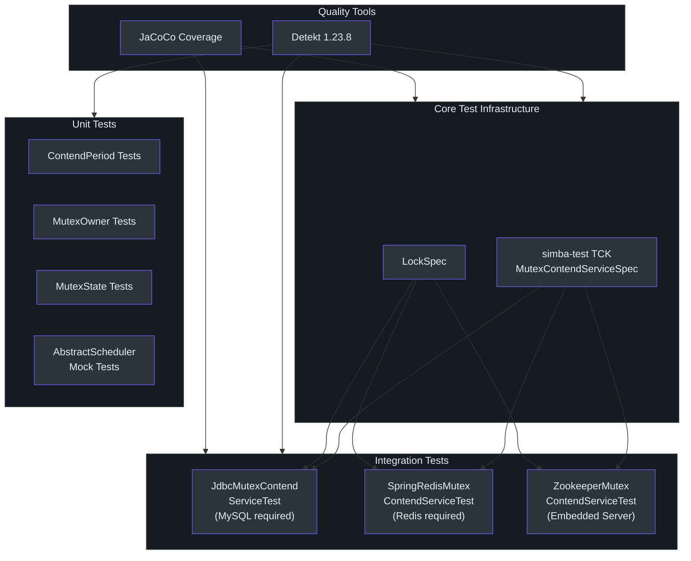
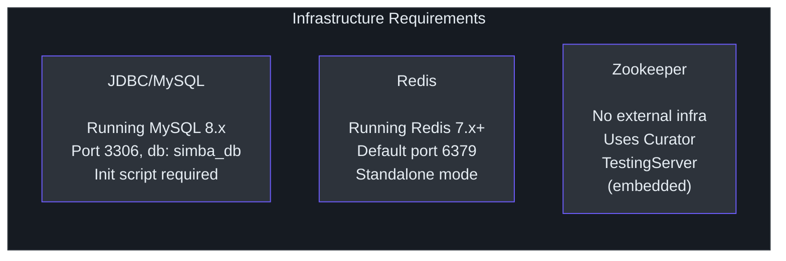
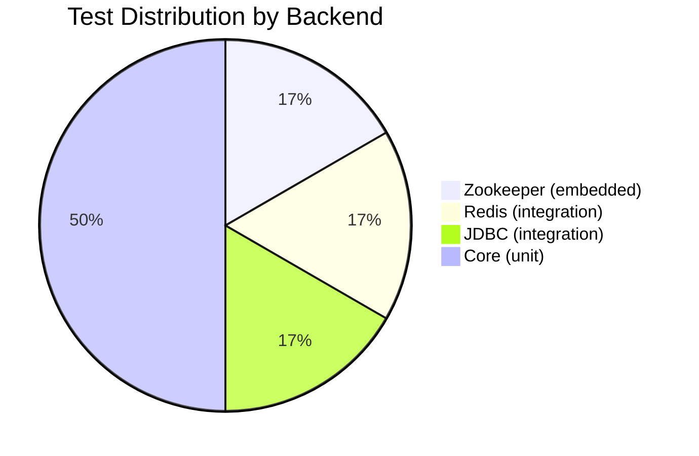
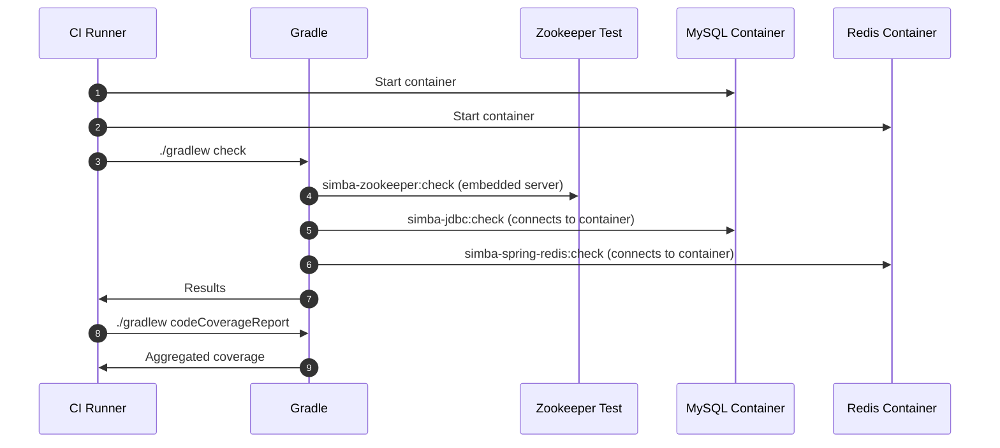

# 测试概览

Simba 的测试策略基于三层方法构建：使用 mock 的快速单元测试、使用真实基础设施的后端特定集成测试，以及强制所有三个后端（JDBC、Redis、Zookeeper）行为一致性的共享技术兼容性套件（TCK）。

## 测试策略

下图展示了整体测试方法以及测试如何从核心抽象流向后端特定实现。



## 测试金字塔

Simba 遵循为分布式系统调整的标准测试金字塔：

| 层级 | 数量 | 速度 | 基础设施 | 用途 |
|---|---|---|---|---|
| **单元测试** | 约 15 个测试 | 每个 < 1 秒 | 无 | 验证值对象（`MutexOwner`、`MutexState`、`ContendPeriod`）和时序逻辑 |
| **TCK（共享）** | 每个后端 5 个用例 | 每个 5-30 秒 | 按后端 | 验证完整的竞争生命周期：start、restart、guard、multiContend、schedule |
| **集成测试** | 5 个用例 x 3 个后端 | 每个 5-60 秒 | MySQL、Redis、ZK | 在真实基础设施上确认 TCK 合规性 |

### 5 个 TCK 测试用例

每个后端都必须通过在 [`MutexContendServiceSpec`](https://github.com/Ahoo-Wang/Simba/blob/main/simba-test/src/main/kotlin/me/ahoo/simba/test/MutexContendServiceSpec.kt) 中定义的全部五个用例：

| 测试 | 常量 | 验证内容 |
|---|---|---|
| `start()` | `START_MUTEX` | 竞争者可以获取和释放所有权。获取时触发 `onAcquired`，停止时触发 `onReleased`。 |
| `restart()` | `RESTART_MUTEX` | 在 `stop()` + `start()` 之后，同一竞争者可以重新获取和重新释放。状态正确重置。 |
| `guard()` | `GUARD_MUTEX` | 获取后，所有者通过 TTL 续期继续持有锁（等待 3 秒，然后验证仍然持有所有权）。 |
| `multiContend()` | `MULTI_CONTEND_MUTEX` | 10 个竞争者竞争同一个互斥锁。任意时刻只有一个持有。`AtomicInteger` 计数器断言互斥：获取时 `incrementAndGet()` 必须等于 1，释放时 `decrementAndGet()` 必须等于 0。运行 30 秒。 |
| `schedule()` | `SCHEDULE_MUTEX` | 验证 `AbstractScheduler` 集成：调度器获取领导权，执行其 `work()` 回调，并响应 `start()`/`stop()` 生命周期。使用 `CountDownLatch`，超时 5 秒。 |

## 后端测试要求



### JDBC/MySQL 后端

**前提条件**：一个正在运行的 MySQL 实例。

**连接默认值**（来自 [`JdbcMutexContendServiceTest`](https://github.com/Ahoo-Wang/Simba/blob/main/simba-jdbc/src/test/kotlin/me/ahoo/simba/jdbc/JdbcMutexContendServiceTest.kt)）：

```
jdbc:mysql://localhost:3306/simba_db
username: root
password: root
```

**初始化**：在首次测试执行前运行初始化脚本：

```bash
mysql -u root -proot < simba-jdbc/src/init-script/init-simba-mysql.sql
```

测试类为 5 个互斥锁常量（`start`、`restart`、`guard`、`multiContend`、`schedule`）中的每一个调用 [`jdbcMutexOwnerRepository.tryInitMutex()`](https://github.com/Ahoo-Wang/Simba/blob/main/simba-jdbc/src/test/kotlin/me/ahoo/simba/jdbc/JdbcMutexContendServiceTest.kt)。

**配置**：`initialDelay=2s`，`ttl=2s`，`transition=5s`。

### Redis 后端

**前提条件**：一个在 `localhost:6379` 上运行的 Redis 实例。

[`SpringRedisMutexContendServiceTest`](https://github.com/Ahoo-Wang/Simba/blob/main/simba-spring-redis/src/test/kotlin/me/ahoo/simba/spring/redis/SpringRedisMutexContendServiceTest.kt) 中的测试类使用默认独立模式配置的 `LettuceConnectionFactory`。

**配置**：`ttl=2s`，`transition=1s`。

Redis 后端使用 Lua 脚本进行原子操作：
- `mutex_acquire.lua` -- 尝试 `SET NX PX`，成功时发布 `acquired` 事件
- `mutex_guard.lua` -- 为当前所有者续期 TTL
- `mutex_release.lua` -- 如果调用者是所有者则释放锁

### Zookeeper 后端

**不需要外部基础设施。** [`ZookeeperMutexContendServiceTest`](https://github.com/Ahoo-Wang/Simba/blob/main/simba-zookeeper/src/test/kotlin/me/ahoo/simba/zookeeper/ZookeeperMutexContendServiceTest.kt) 中的测试类使用 Curator 的内嵌 `TestingServer`：

```kotlin
testingServer = TestingServer()
testingServer.start()
curatorFramework = CuratorFrameworkFactory.newClient(
    testingServer.connectString, RetryNTimes(1, 10)
)
curatorFramework.start()
```

这使得 Zookeeper 模块在本地和 CI 中最容易运行，无需任何外部依赖。

## 运行测试

### 所有模块

```bash
./gradlew check
```

### 单个后端模块

```bash
./gradlew simba-core:check            # 仅单元测试（不需要基础设施）
./gradlew simba-jdbc:check            # 需要 MySQL
./gradlew simba-spring-redis:check    # 需要 Redis
./gradlew simba-zookeeper:check       # 不需要外部基础设施
```

### 仅 TCK

TCK 基类位于 `simba-test`（发布为 `me.ahoo.simba:simba-test`）。它们本身不包含可执行的测试用例 -- 当后端模块扩展 `MutexContendServiceSpec` 时测试才会运行。

## 覆盖率和质量

### 静态分析（Detekt）

Detekt 配置位于 [`config/detekt/detekt.yml`](https://github.com/Ahoo-Wang/Simba/blob/main/config/detekt/detekt.yml)。关键设置：
- `autoCorrect = true`
- 运行：`./gradlew detekt`

### 代码覆盖率（JaCoCo）

`code-coverage-report` 模块聚合来自所有子模块的 JaCoCo 报告：

```bash
./gradlew codeCoverageReport
```

报告生成在 `code-coverage-report/build/reports/jacoco/` 目录下。



## CI 集成

在持续集成中，只有 Zookeeper 后端可以在没有服务容器的情况下运行。JDBC 和 Redis 后端需要以下之一：
- 由 CI 运行器提供的 Docker Compose 服务
- GitHub Actions 服务容器

典型的 CI 策略：



## 关键文件参考

| 文件 | 用途 |
|---|---|
| [`simba-test/.../MutexContendServiceSpec.kt`](https://github.com/Ahoo-Wang/Simba/blob/main/simba-test/src/main/kotlin/me/ahoo/simba/test/MutexContendServiceSpec.kt) | TCK 基类，包含 5 个强制测试用例 |
| [`simba-test/.../LockSpec.kt`](https://github.com/Ahoo-Wang/Simba/blob/main/simba-test/src/main/kotlin/me/ahoo/simba/test/LockSpec.kt) | 锁测试的 TCK 基类 |
| [`simba-jdbc/.../JdbcMutexContendServiceTest.kt`](https://github.com/Ahoo-Wang/Simba/blob/main/simba-jdbc/src/test/kotlin/me/ahoo/simba/jdbc/JdbcMutexContendServiceTest.kt) | JDBC 后端集成测试 |
| [`simba-spring-redis/.../SpringRedisMutexContendServiceTest.kt`](https://github.com/Ahoo-Wang/Simba/blob/main/simba-spring-redis/src/test/kotlin/me/ahoo/simba/spring/redis/SpringRedisMutexContendServiceTest.kt) | Redis 后端集成测试 |
| [`simba-zookeeper/.../ZookeeperMutexContendServiceTest.kt`](https://github.com/Ahoo-Wang/Simba/blob/main/simba-zookeeper/src/test/kotlin/me/ahoo/simba/zookeeper/ZookeeperMutexContendServiceTest.kt) | Zookeeper 后端集成测试（内嵌） |
| [`simba-jdbc/src/init-script/init-simba-mysql.sql`](https://github.com/Ahoo-Wang/Simba/blob/main/simba-jdbc/src/init-script/init-simba-mysql.sql) | MySQL 初始化脚本 |
| [`config/detekt/detekt.yml`](https://github.com/Ahoo-Wang/Simba/blob/main/config/detekt/detekt.yml) | Detekt 静态分析配置 |

## 下一步

- [单元测试](./unit-testing.md) -- 如何使用 MockK 和 JUnit 5 编写单元测试
- [集成测试](./integration-testing.md) -- 后端特定设置和 Docker Compose 示例
- [TCK 参考](./tck.md) -- MutexContendServiceSpec 的详细解析及其扩展方式
