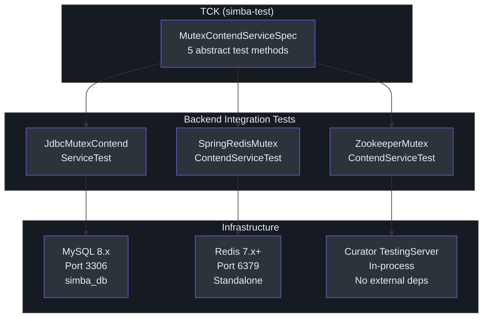
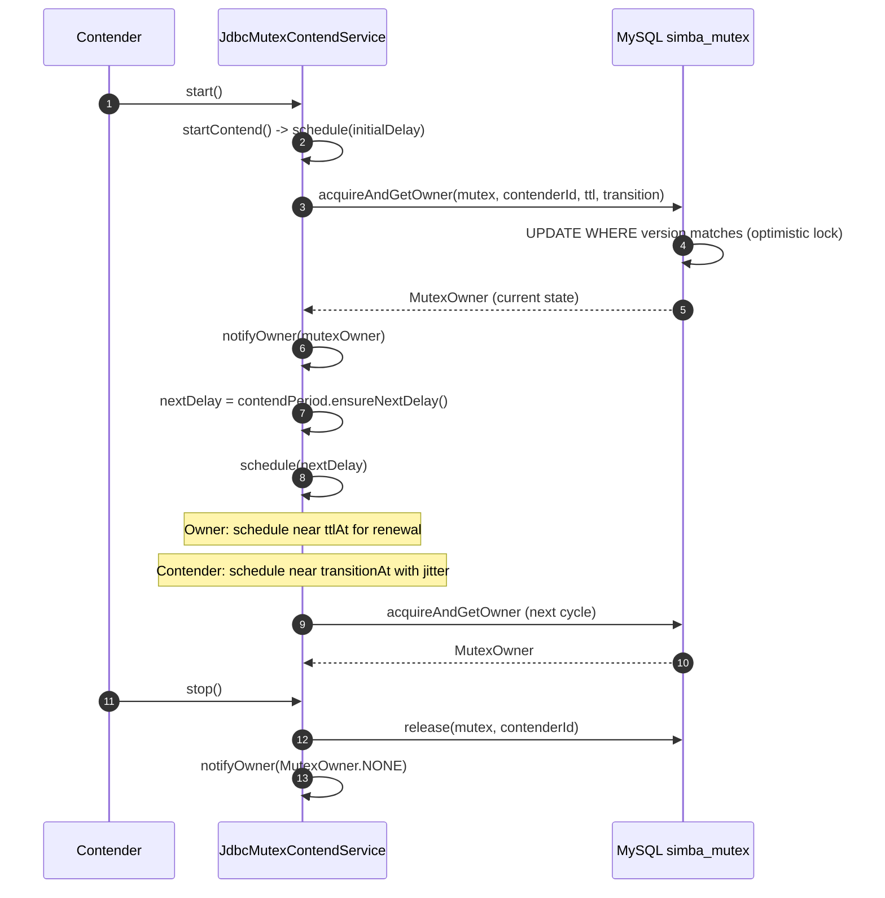
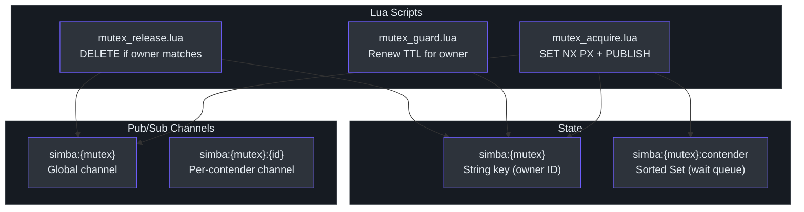
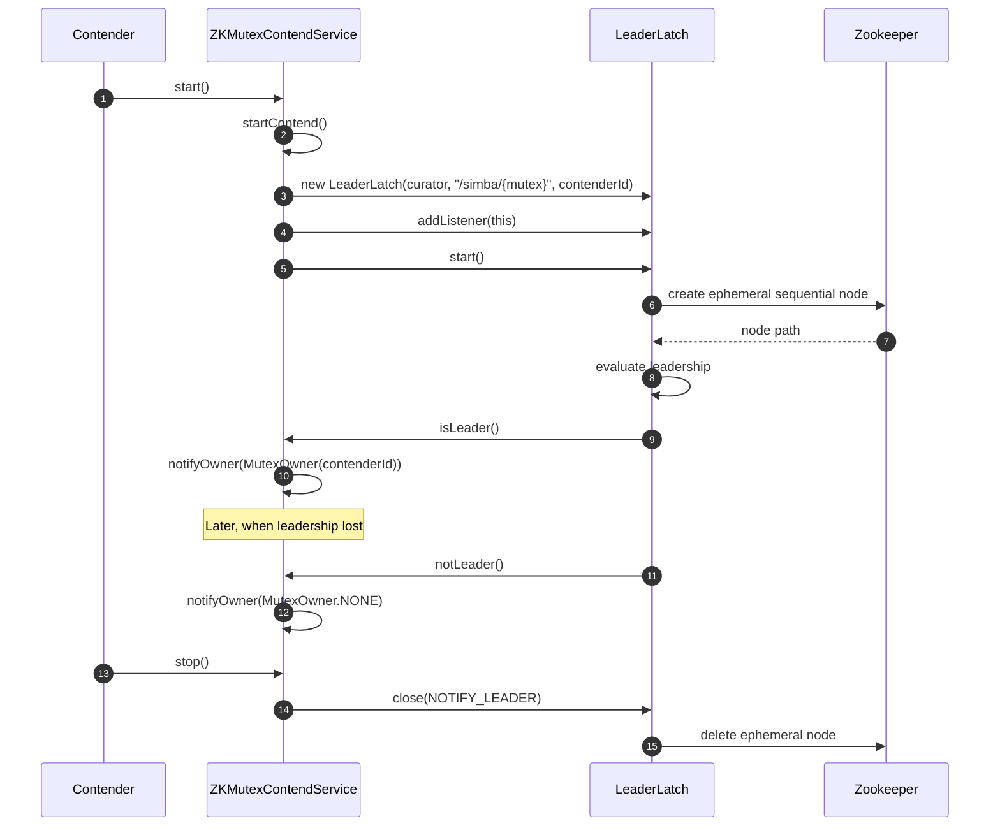

# 集成测试指南

集成测试验证每个 Simba 后端在真实基础设施上正确实现了分布式互斥协议。所有后端集成测试都扩展了 TCK 中的 `MutexContendServiceSpec`，并且必须通过相同的 5 个测试用例。

## 集成测试架构



## JDBC/MySQL 后端

### 数据库设置

JDBC 后端将互斥锁状态存储在 MySQL 表中。表结构定义在 [`init-simba-mysql.sql`](https://github.com/Ahoo-Wang/Simba/blob/main/simba-jdbc/src/init-script/init-simba-mysql.sql) 中：

```sql
CREATE DATABASE IF NOT EXISTS simba_db;
USE simba_db;

CREATE TABLE IF NOT EXISTS simba_mutex (
    mutex         VARCHAR(66) NOT NULL PRIMARY KEY COMMENT 'mutex name',
    acquired_at   BIGINT UNSIGNED NOT NULL,
    ttl_at        BIGINT UNSIGNED NOT NULL,
    transition_at BIGINT UNSIGNED NOT NULL,
    owner_id      CHAR(32)    NOT NULL,
    version       INT UNSIGNED NOT NULL
);
```

`version` 列实现了并发获取尝试的乐观锁。[`JdbcMutexOwnerRepository`](https://github.com/Ahoo-Wang/Simba/blob/main/simba-jdbc/src/main/kotlin/me/ahoo/simba/jdbc/JdbcMutexOwnerRepository.kt) 使用 `UPDATE ... WHERE version = ?` 确保每个周期只有一个竞争者成功。

### 测试类

[`JdbcMutexContendServiceTest`](https://github.com/Ahoo-Wang/Simba/blob/main/simba-jdbc/src/test/kotlin/me/ahoo/simba/jdbc/JdbcMutexContendServiceTest.kt) 设置测试基础设施：

```kotlin
@TestInstance(TestInstance.Lifecycle.PER_CLASS)
internal class JdbcMutexContendServiceTest : MutexContendServiceSpec() {

    private lateinit var jdbcMutexOwnerRepository: JdbcMutexOwnerRepository
    override lateinit var mutexContendServiceFactory: MutexContendServiceFactory

    @BeforeAll
    fun setup() {
        val hikariDataSource = HikariDataSource()
        hikariDataSource.jdbcUrl = "jdbc:mysql://localhost:3306/simba_db"
        hikariDataSource.username = "root"
        hikariDataSource.password = "root"
        jdbcMutexOwnerRepository = JdbcMutexOwnerRepository(hikariDataSource)
        mutexContendServiceFactory = JdbcMutexContendServiceFactory(
            mutexOwnerRepository = jdbcMutexOwnerRepository,
            initialDelay = Duration.ofSeconds(2),
            ttl = Duration.ofSeconds(2),
            transition = Duration.ofSeconds(5)
        )
        // 初始化所有 5 个互斥锁行
        jdbcMutexOwnerRepository.tryInitMutex(START_MUTEX)
        jdbcMutexOwnerRepository.tryInitMutex(RESTART_MUTEX)
        jdbcMutexOwnerRepository.tryInitMutex(GUARD_MUTEX)
        jdbcMutexOwnerRepository.tryInitMutex(MULTI_CONTEND_MUTEX)
        jdbcMutexOwnerRepository.tryInitMutex(SCHEDULE_MUTEX)
    }
}
```

### 竞争流程（JDBC）



### 通过 Docker Compose 使用 MySQL

```yaml
# docker-compose-test.yml
services:
  mysql:
    image: mysql:8.0
    ports:
      - "3306:3306"
    environment:
      MYSQL_ROOT_PASSWORD: root
      MYSQL_DATABASE: simba_db
    volumes:
      - ./simba-jdbc/src/init-script/init-simba-mysql.sql:/docker-entrypoint-initdb.d/init.sql
    healthcheck:
      test: ["CMD", "mysqladmin", "ping", "-h", "localhost"]
      interval: 5s
      timeout: 5s
      retries: 10
```

```bash
docker compose -f docker-compose-test.yml up -d mysql
# 等待健康检查通过
docker compose -f docker-compose-test.yml exec mysql mysqladmin ping -h localhost
# 运行测试
./gradlew simba-jdbc:check
```

## Redis 后端

### Redis 后端工作原理

Redis 后端使用三个 Lua 脚本进行原子锁操作，并使用 Redis 发布/订阅在竞争者之间进行实时通知：



`mutex_acquire.lua` 脚本（[源码](https://github.com/Ahoo-Wang/Simba/blob/main/simba-spring-redis/src/main/resources/mutex_acquire.lua)）：
1. 尝试 `SET mutexKey contenderId NX PX transition` -- 带过期时间的原子获取
2. 成功时：向全局频道发布 `acquired@@contenderId`
3. 失败时：将竞争者添加到有序集合等待队列，并返回当前所有者 + 剩余 TTL

### 测试类

[`SpringRedisMutexContendServiceTest`](https://github.com/Ahoo-Wang/Simba/blob/main/simba-spring-redis/src/test/kotlin/me/ahoo/simba/spring/redis/SpringRedisMutexContendServiceTest.kt) 创建完整的 Spring Redis 技术栈：

```kotlin
@TestInstance(TestInstance.Lifecycle.PER_CLASS)
internal class SpringRedisMutexContendServiceTest : MutexContendServiceSpec() {
    lateinit var lettuceConnectionFactory: LettuceConnectionFactory
    override lateinit var mutexContendServiceFactory: MutexContendServiceFactory
    lateinit var listenerContainer: RedisMessageListenerContainer

    @BeforeAll
    fun setup() {
        val redisStandaloneConfiguration = RedisStandaloneConfiguration()
        lettuceConnectionFactory = LettuceConnectionFactory(redisStandaloneConfiguration)
        lettuceConnectionFactory.afterPropertiesSet()
        val stringRedisTemplate = StringRedisTemplate(lettuceConnectionFactory)
        listenerContainer = RedisMessageListenerContainer()
        listenerContainer.setConnectionFactory(lettuceConnectionFactory)
        listenerContainer.afterPropertiesSet()
        listenerContainer.start()
        mutexContendServiceFactory = SpringRedisMutexContendServiceFactory(
            ttl = Duration.ofSeconds(2),
            transition = Duration.ofSeconds(1),
            redisTemplate = stringRedisTemplate,
            listenerContainer = listenerContainer,
            handleExecutor = ForkJoinPool.commonPool(),
            scheduledExecutorService = Executors.newScheduledThreadPool(1)
        )
    }
}
```

### 通过 Docker Compose 使用 Redis

```yaml
# docker-compose-test.yml（添加到现有文件）
services:
  redis:
    image: redis:7-alpine
    ports:
      - "6379:6379"
    healthcheck:
      test: ["CMD", "redis-cli", "ping"]
      interval: 5s
      timeout: 5s
      retries: 10
```

```bash
docker compose -f docker-compose-test.yml up -d redis
./gradlew simba-spring-redis:check
```

## Zookeeper 后端

### 内嵌测试服务器

Zookeeper 后端**不需要外部基础设施**。[`ZookeeperMutexContendServiceTest`](https://github.com/Ahoo-Wang/Simba/blob/main/simba-zookeeper/src/test/kotlin/me/ahoo/simba/zookeeper/ZookeeperMutexContendServiceTest.kt) 使用 Curator 的 `TestingServer`：

```kotlin
@TestInstance(TestInstance.Lifecycle.PER_CLASS)
internal class ZookeeperMutexContendServiceTest : MutexContendServiceSpec() {
    lateinit var curatorFramework: CuratorFramework
    override lateinit var mutexContendServiceFactory: MutexContendServiceFactory
    lateinit var testingServer: TestingServer

    @BeforeAll
    fun setup() {
        testingServer = TestingServer()
        testingServer.start()
        curatorFramework = CuratorFrameworkFactory.newClient(
            testingServer.connectString, RetryNTimes(1, 10)
        )
        curatorFramework.start()
        mutexContendServiceFactory = ZookeeperMutexContendServiceFactory(
            ForkJoinPool.commonPool(), curatorFramework
        )
    }

    @AfterAll
    fun destroy() {
        if (this::curatorFramework.isInitialized) curatorFramework.close()
        if (this::testingServer.isInitialized) testingServer.stop()
    }
}
```

### Zookeeper 竞争流程

Zookeeper 后端委托给 Curator 的 [`LeaderLatch`](https://github.com/Ahoo-Wang/Simba/blob/main/simba-zookeeper/src/main/kotlin/me/ahoo/simba/zookeeper/ZookeeperMutexContendService.kt)，它使用 `/simba/{mutex}` 下的临时顺序 znode：



### 运行 Zookeeper 测试

```bash
# 不需要 Docker
./gradlew simba-zookeeper:check
```

## 所有后端的完整 Docker Compose

```yaml
# docker-compose-test.yml
services:
  mysql:
    image: mysql:8.0
    ports:
      - "3306:3306"
    environment:
      MYSQL_ROOT_PASSWORD: root
      MYSQL_DATABASE: simba_db
    volumes:
      - ./simba-jdbc/src/init-script/init-simba-mysql.sql:/docker-entrypoint-initdb.d/init.sql
    healthcheck:
      test: ["CMD", "mysqladmin", "ping", "-h", "localhost"]
      interval: 5s
      timeout: 5s
      retries: 10

  redis:
    image: redis:7-alpine
    ports:
      - "6379:6379"
    healthcheck:
      test: ["CMD", "redis-cli", "ping"]
      interval: 5s
      timeout: 5s
      retries: 10
```

启动所有服务并运行所有测试：

```bash
docker compose -f docker-compose-test.yml up -d
./gradlew check
docker compose -f docker-compose-test.yml down
```

## CI 配置

### GitHub Actions 示例

```yaml
# .github/workflows/test.yml
name: Tests
on: [push, pull_request]

jobs:
  test:
    runs-on: ubuntu-latest
    services:
      mysql:
        image: mysql:8.0
        env:
          MYSQL_ROOT_PASSWORD: root
          MYSQL_DATABASE: simba_db
        ports:
          - 3306:3306
        options: >-
          --health-cmd="mysqladmin ping -h localhost"
          --health-interval=10s
          --health-timeout=5s
          --health-retries=10
      redis:
        image: redis:7-alpine
        ports:
          - 6379:6379
        options: >-
          --health-cmd="redis-cli ping"
          --health-interval=10s
          --health-timeout=5s
          --health-retries=10
    steps:
      - uses: actions/checkout@v4
      - uses: actions/setup-java@v4
        with:
          distribution: temurin
          java-version: 17
      - name: Init MySQL
        run: mysql -h 127.0.0.1 -u root -proot < simba-jdbc/src/init-script/init-simba-mysql.sql
      - name: Run tests
        run: ./gradlew check
      - name: Coverage report
        run: ./gradlew codeCoverageReport
```

## 时序注意事项

集成测试涉及真实基础设施和时序相关的行为。TCK 中使用的关键超时值：

| 测试 | 超时 | 备注 |
|---|---|---|
| `start()` | 约 5 秒 | 单次获取 + 释放周期 |
| `restart()` | 约 10 秒 | 两次获取 + 释放周期 |
| `guard()` | 3 秒休眠 | 验证 TTL 续期维持所有权 |
| `multiContend()` | 30 秒休眠 | 10 个竞争者竞争；断言任意时刻恰好 1 个所有者 |
| `schedule()` | 5 秒门闩 | 用于首次 `work()` 调用的 CountDownLatch |

`multiContend` 测试是运行时间最长且资源消耗最大的测试。它在较长时间内验证真正的互斥性。

## 故障排除

### JDBC："Connection refused"

确保 MySQL 正在运行，并且 `simba_db` 数据库已存在且 `simba_mutex` 表已初始化。验证凭据与测试配置匹配（`root`/`root`）。

### Redis："Connection refused"

确保 Redis 在 `localhost:6379` 上运行。测试使用默认的 `RedisStandaloneConfiguration`，不进行认证。

### Zookeeper：单独测试通过但套件中失败

Zookeeper 的 `TestingServer` 绑定到随机端口。如果并发运行多个测试类，确保每个类使用自己的 `TestingServer` 实例。现有的使用 `@TestInstance(PER_CLASS)` 和 `@BeforeAll`/`@AfterAll` 的测试模式已经正确处理了这一点。

### 时序不稳定测试

如果 `guard()` 或 `multiContend()` 测试不稳定，增加测试设置中的休眠持续时间或 TTL 值。当前默认值（JDBC 的 2 秒 TTL、5 秒 transition；Redis 的 2 秒 TTL、1 秒 transition）在大多数环境中都能稳定工作。

## 下一步

- [TCK 参考](./tck.md) -- 测试基类的详细解析
- [单元测试](./unit-testing.md) -- 使用 MockK 的快速隔离测试
