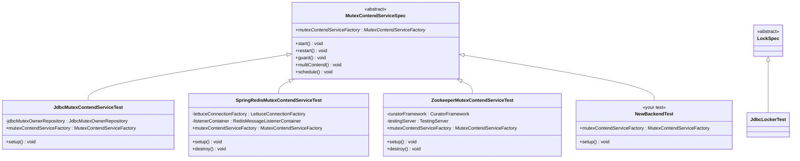
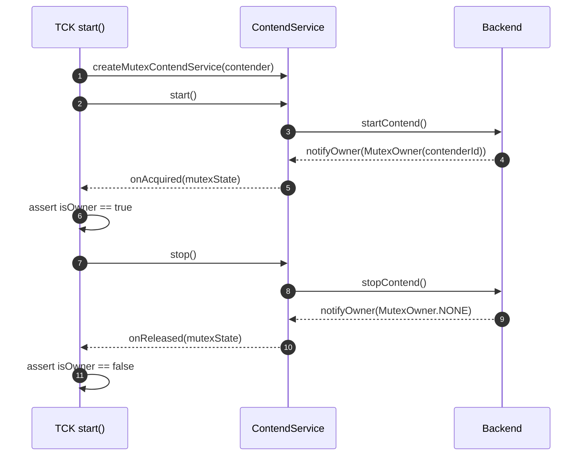
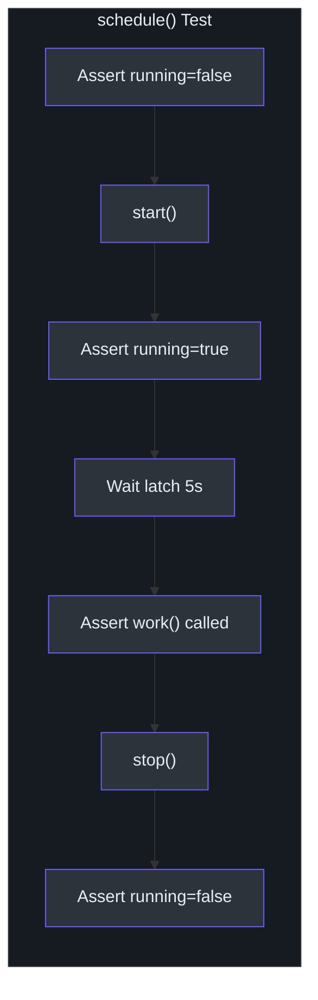

# TCK 参考

Simba 在 `simba-test` 模块（`me.ahoo.simba:simba-test`）中提供了一个技术兼容性套件（TCK）。TCK 定义了抽象测试基类，用于强制所有后端实现之间的行为一致性。任何新后端都必须通过所有 TCK 测试用例。

## 类层次结构



## MutexContendServiceSpec

[`MutexContendServiceSpec`](https://github.com/Ahoo-Wang/Simba/blob/main/simba-test/src/main/kotlin/me/ahoo/simba/test/MutexContendServiceSpec.kt) 是主要的 TCK 类。它定义了 5 个测试用例，用于验证 `MutexContendService` 的完整生命周期。

### 契约

实现者必须提供：

```kotlin
abstract val mutexContendServiceFactory: MutexContendServiceFactory
```

工厂用于在每个测试中创建带有匿名 `AbstractMutexContender` 实现的 `MutexContendService` 实例。

### 测试用例 1：`start()`

**互斥锁常量**：`START_MUTEX = "start"`

**目的**：验证基本的获取-释放生命周期。

**流程**：
1. 创建一个竞争者，将其 `onAcquired` 和 `onReleased` 回调连接到 `CompletableFuture`
2. 调用 `contendService.start()`
3. 等待 `onAcquired` future 完成
4. 断言 `contendService.isOwner == true`
5. 调用 `contendService.stop()`
6. 等待 `onReleased` future 完成
7. 断言 `contendService.isOwner == false`



### 测试用例 2：`restart()`

**互斥锁常量**：`RESTART_MUTEX = "restart"`

**目的**：验证竞争者可以停止并重新启动，重新获取锁。

**流程**：
1. 创建一个带有四个 future（acquired1、released1、acquired2、released2）的竞争者
2. 启动，等待获取，断言为所有者，停止，等待释放，断言非所有者
3. 再次启动，等待 acquired2，断言为所有者，停止，等待 released2，断言非所有者

这测试了内部状态（状态机：`INITIAL -> STARTING -> RUNNING -> STOPPING -> INITIAL`）是否正确重置，以及后端是否允许重新进入。

### 测试用例 3：`guard()`

**互斥锁常量**：`GUARD_MUTEX = "guard"`

**目的**：验证 TTL 续期 -- 所有者在多个 TTL 周期内继续持有锁。

**流程**：
1. 启动并等待获取
2. 休眠 3 秒（超过典型的 2 秒 TTL）
3. 断言 `afterOwner.ownerId == contender.contenderId`（仍由同一竞争者持有）
4. 断言 `isOwner == true`
5. 停止并验证释放

这个测试至关重要，因为它证明了"守卫"（TTL 续期）机制有效。如果没有它，锁将在第一个 TTL 后过期，并可供其他竞争者使用。

### 测试用例 4：`multiContend()`

**互斥锁常量**：`MULTI_CONTEND_MUTEX = "multiContend"`

**目的**：验证多个并发竞争者之间真正的互斥性。

**流程**：
1. 创建 10 个竞争者，每个带有一个 `AtomicInteger` 计数器
2. 在 `onAcquired` 时：`count.incrementAndGet()` 必须等于 1（恰好一个持有者）
3. 在 `onReleased` 时：`count.decrementAndGet()` 必须等于 0
4. 所有 10 个竞争者开始竞争
5. 休眠 30 秒
6. 断言 `count.get() == 1`（长时间后仍然恰好一个持有者）
7. 断言所有拥有所有者的竞争者都同意相同的 `ownerId`
8. 断言恰好 1 个竞争者与当前所有者 ID 匹配

这是最重要的并发测试。它运行 30 秒以覆盖多个竞争周期，并验证不会有两个竞争者同时认为自己持有锁。

### 测试用例 5：`schedule()`

**互斥锁常量**：`SCHEDULE_MUTEX = "schedule"`

**目的**：验证 `AbstractScheduler` 集成。

**流程**：
1. 创建一个调度器，配置 `ScheduleConfig.delay(Duration.ZERO, 1s)` 和一个递减门闩的 `work()`
2. 断言初始 `running == false`
3. 调用 `start()`，断言 `running == true`
4. 等待最多 5 秒（work 必须被调用）
5. 调用 `stop()`，断言 `running == false`



## LockSpec

[`LockSpec`](https://github.com/Ahoo-Wang/Simba/blob/main/simba-test/src/main/kotlin/me/ahoo/simba/test/LockSpec.kt) 目前是锁特定 TCK 测试的占位符：

```kotlin
abstract class LockSpec
```

后端实现可以扩展它以添加 `SimbaLocker` 特定的测试（例如超时行为、重复获取防护）。

## 如何添加新后端

### 步骤 1：实现核心服务

创建一个扩展 [`AbstractMutexContendService`](https://github.com/Ahoo-Wang/Simba/blob/main/simba-core/src/main/kotlin/me/ahoo/simba/core/AbstractMutexContendService.kt) 的类：

```kotlin
class MyBackendMutexContendService(
    contender: MutexContender,
    handleExecutor: Executor,
    // 后端特定依赖
) : AbstractMutexContendService(contender, handleExecutor) {

    override fun startContend() {
        // 在后端开始竞争锁
        // 当所有权变更时，调用 notifyOwner(MutexOwner)
    }

    override fun stopContend() {
        // 释放锁并清理资源
        // 释放后调用 notifyOwner(MutexOwner.NONE)
    }
}
```

### 步骤 2：实现工厂

```kotlin
class MyBackendMutexContendServiceFactory(
    // 依赖
    private val handleExecutor: Executor
) : MutexContendServiceFactory {

    override fun createMutexContendService(
        mutexContender: MutexContender
    ): MutexContendService {
        return MyBackendMutexContendService(
            mutexContender,
            handleExecutor,
            // ...
        )
    }
}
```

### 步骤 3：扩展 MutexContendServiceSpec

```kotlin
@TestInstance(TestInstance.Lifecycle.PER_CLASS)
internal class MyBackendMutexContendServiceTest : MutexContendServiceSpec() {

    override lateinit var mutexContendServiceFactory: MutexContendServiceFactory

    @BeforeAll
    fun setup() {
        // 初始化后端
        mutexContendServiceFactory = MyBackendMutexContendServiceFactory(
            handleExecutor = ForkJoinPool.commonPool()
        )
    }

    @AfterAll
    fun destroy() {
        // 清理资源
    }
}
```

### 步骤 4：运行 TCK

```bash
./gradlew my-backend:check
```

所有 5 个测试用例必须通过。如果任何测试失败，说明后端实现存在正确性问题。

## 后端配置对比

| 参数 | JDBC | Redis | Zookeeper |
|---|---|---|---|
| `initialDelay` | 2 秒 | 不适用（立即） | 不适用（事件驱动） |
| `ttl` | 2 秒 | 2 秒 | 不适用（临时节点） |
| `transition` | 5 秒 | 1 秒 | 不适用 |
| 竞争模型 | 轮询 | 轮询 + 发布/订阅 | Leader 选举 |
| 锁原语 | `UPDATE WHERE version=?` | `SET NX PX` | `LeaderLatch` znode |
| 续期机制 | TTL 前重新轮询 | Lua `mutex_guard.lua` | 自动（ZK 会话） |

## TCK 中的关键设计决策

1. **`start()` 测试使用 `CompletableFuture.join()`** -- 这会无限期阻塞直到回调触发，这意味着后端最终必须调用 `notifyOwner()`。如果后端有阻止此调用的 bug，测试将挂起（应该被 CI 超时捕获）。

2. **`guard()` 使用 3 秒休眠** -- 这有意比标准的 2 秒 TTL 更长。如果后端未能续期，锁将在此窗口期内过期，`afterOwner.ownerId` 断言将失败。

3. **`multiContend()` 运行 30 秒** -- 这涵盖了足够的竞争周期来捕获在较短测试中可能不会出现的竞态条件。`AtomicInteger` 计数器提供了比基于时序的断言更可靠的严格互斥检查。

4. **`schedule()` 使用 `CountDownLatch`** -- 这避免了不稳定的时序断言。测试要么在 5 秒内看到 work 回调，要么确定性地失败。

## 添加到 LockSpec

要添加锁 TCK 测试，扩展 `LockSpec` 并使用相同的 `MutexContendServiceFactory` 模式：

```kotlin
abstract class LockSpec {
    abstract val mutexContendServiceFactory: MutexContendServiceFactory

    @Test
    fun `acquire and release via Locker`() {
        val locker = SimbaLocker("tck-lock", mutexContendServiceFactory)
        locker.acquire()
        // 如果执行到这里，说明获取成功
        locker.close()
    }

    @Test
    fun `acquire with timeout throws on timeout`() {
        // 需要 mock 或无法授予锁的后端
    }
}
```

## 相关页面

- [测试概览](./index.md) -- 完整测试策略
- [单元测试](./unit-testing.md) -- 基于 MockK 的单元测试
- [集成测试](./integration-testing.md) -- 后端基础设施设置
