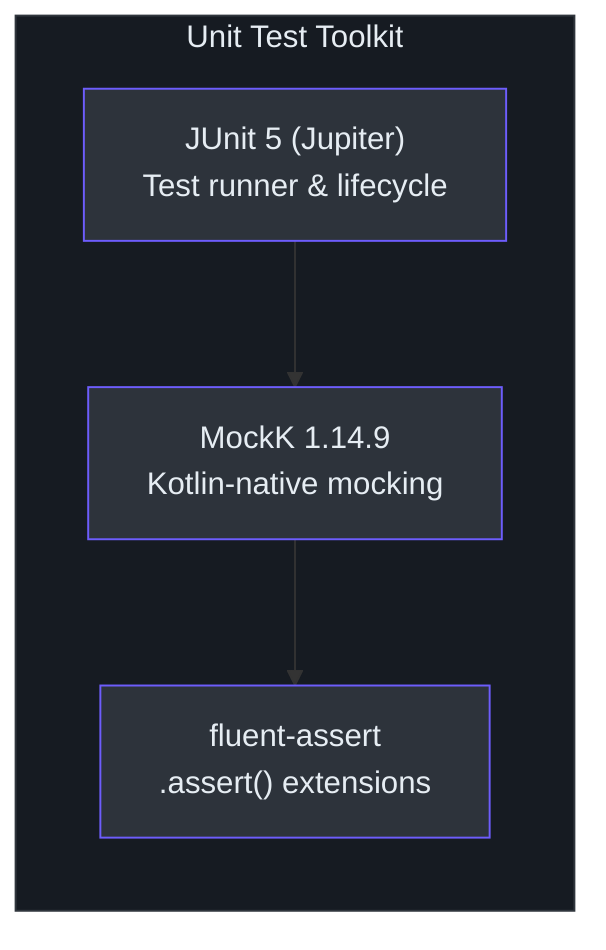
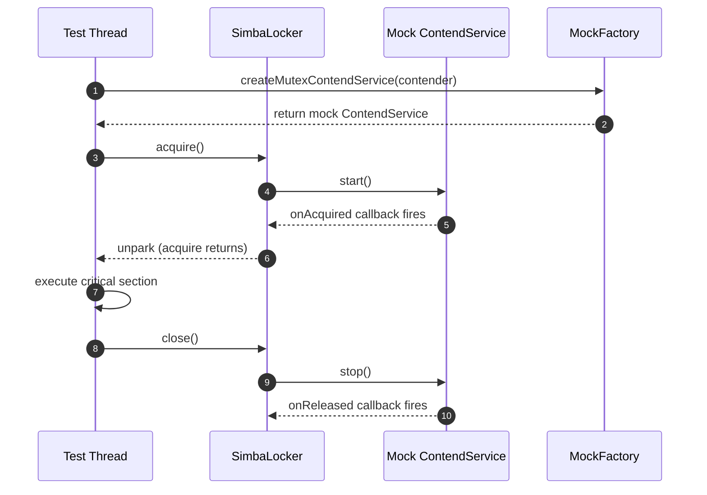
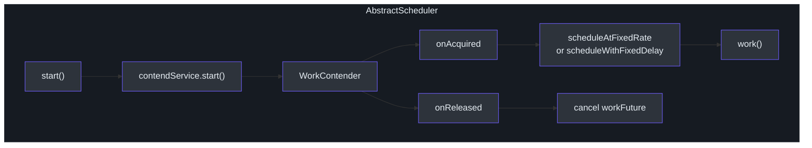

# 单元测试指南

本指南涵盖 Simba 核心组件的单元测试策略。单元测试运行速度快，不需要外部基础设施，并使用 MockK 进行 mock 来隔离验证单个组件的行为。

## 测试技术栈



| 工具 | 版本 | 用途 |
|---|---|---|
| JUnit 5 (Jupiter) | Spring Boot 4.0.5 内置 | 测试运行器和生命周期 |
| MockK | 1.14.9 | Kotlin 原生 mock |
| fluent-assert | `me.ahoo.test:fluent-assert-core` | 通过 `.assert()` 实现 Kotlin 惯用风格断言 |

**重要提示**：始终使用 `import me.ahoo.test.asserts.assert` 而不是 AssertJ 的 `assertThat()`。fluent-assert 库提供了对 AssertJ 的空安全 Kotlin 扩展函数。

## 核心值对象测试

### MutexOwner

[`MutexOwner`](https://github.com/Ahoo-Wang/Simba/blob/main/simba-core/src/main/kotlin/me/ahoo/simba/core/MutexOwner.kt) 是一个表示锁所有权状态的不可变值对象。它跟踪四个字段：

- `ownerId` -- 持有锁的竞争者
- `acquiredAt` -- 获取所有权时的时间戳
- `ttlAt` -- TTL 过期的绝对时间戳
- `transitionAt` -- 转换（宽限）期过期的绝对时间戳

```kotlin
import me.ahoo.simba.core.MutexOwner
import me.ahoo.test.asserts.assert
import org.junit.jupiter.api.Test

class MutexOwnerTest {

    @Test
    fun `isOwner returns true when contenderId matches`() {
        val owner = MutexOwner(ownerId = "contender-1")
        owner.isOwner("contender-1").assert().isTrue()
    }

    @Test
    fun `isOwner returns false when contenderId does not match`() {
        val owner = MutexOwner(ownerId = "contender-1")
        owner.isOwner("contender-2").assert().isFalse()
    }

    @Test
    fun `NONE has empty ownerId and zero timestamps`() {
        MutexOwner.NONE.ownerId.assert().isEqualTo("")
        MutexOwner.NONE.acquiredAt.assert().isEqualTo(0)
        MutexOwner.NONE.ttlAt.assert().isEqualTo(0)
        MutexOwner.NONE.transitionAt.assert().isEqualTo(0)
    }

    @Test
    fun `isInTtl returns true when ttlAt is in the future`() {
        val futureTtl = System.currentTimeMillis() + 10_000
        val owner = MutexOwner("c1", ttlAt = futureTtl)
        owner.isInTtl.assert().isTrue()
    }

    @Test
    fun `isInTtl returns false when ttlAt is in the past`() {
        val pastTtl = System.currentTimeMillis() - 10_000
        val owner = MutexOwner("c1", ttlAt = pastTtl)
        owner.isInTtl.assert().isFalse()
    }

    @Test
    fun `hasOwner returns true when transitionAt is in the future`() {
        val futureTransition = System.currentTimeMillis() + 10_000
        val owner = MutexOwner("c1", transitionAt = futureTransition)
        owner.hasOwner().assert().isTrue()
    }

    @Test
    fun `isInTransitionOf returns false for non-owner`() {
        val owner = MutexOwner(
            ownerId = "c1",
            transitionAt = System.currentTimeMillis() + 10_000
        )
        owner.isInTransitionOf("c2").assert().isFalse()
    }
}
```

### MutexState

[`MutexState`](https://github.com/Ahoo-Wang/Simba/blob/main/simba-core/src/main/kotlin/me/ahoo/simba/core/MutexState.kt) 表示从 `before`（之前的所有者）到 `after`（之后的所有者）的状态转换：

```kotlin
import me.ahoo.simba.core.MutexOwner
import me.ahoo.simba.core.MutexState
import me.ahoo.test.asserts.assert
import org.junit.jupiter.api.Test

class MutexStateTest {

    @Test
    fun `isChanged is true when owner changes`() {
        val state = MutexState(
            before = MutexOwner("c1"),
            after = MutexOwner("c2")
        )
        state.isChanged.assert().isTrue()
    }

    @Test
    fun `isChanged is false when owner does not change`() {
        val state = MutexState(
            before = MutexOwner("c1"),
            after = MutexOwner("c1")
        )
        state.isChanged.assert().isFalse()
    }

    @Test
    fun `isAcquired returns true only for the new owner on change`() {
        val state = MutexState(
            before = MutexOwner("c1"),
            after = MutexOwner("c2")
        )
        state.isAcquired("c2").assert().isTrue()
        state.isAcquired("c1").assert().isFalse()
    }

    @Test
    fun `isReleased returns true only for the old owner on change`() {
        val state = MutexState(
            before = MutexOwner("c1"),
            after = MutexOwner("c2")
        )
        state.isReleased("c1").assert().isTrue()
        state.isReleased("c2").assert().isFalse()
    }

    @Test
    fun `NONE has NONE owners on both sides`() {
        MutexState.NONE.before.assert().isEqualTo(MutexOwner.NONE)
        MutexState.NONE.after.assert().isEqualTo(MutexOwner.NONE)
        MutexState.NONE.isChanged.assert().isFalse()
    }
}
```

### ContendPeriod

[`ContendPeriod`](https://github.com/Ahoo-Wang/Simba/blob/main/simba-core/src/main/kotlin/me/ahoo/simba/core/ContendPeriod.kt) 计算下一个竞争周期的调度延迟。所有者延迟 = `ttlAt - now`。竞争者延迟包含 -200ms 到 +1000ms 之间的随机抖动：

```kotlin
import me.ahoo.simba.core.ContendPeriod
import me.ahoo.simba.core.MutexOwner
import me.ahoo.test.asserts.assert
import org.junit.jupiter.api.Test

class ContendPeriodTest {

    @Test
    fun `nextOwnerDelay returns time remaining until ttl`() {
        val ttlAt = System.currentTimeMillis() + 5000
        val owner = MutexOwner("c1", ttlAt = ttlAt, transitionAt = ttlAt + 3000)
        val period = ContendPeriod("c1")
        val delay = period.nextOwnerDelay(owner)
        delay.assert().isBetween(4500L, 5100L)
    }

    @Test
    fun `nextContenderDelay returns delay near transitionAt with jitter`() {
        val now = System.currentTimeMillis()
        val ttlAt = now + 2000
        val transitionAt = now + 5000
        val owner = MutexOwner("other", ttlAt = ttlAt, transitionAt = transitionAt)
        val period = ContendPeriod("c1")
        // Delay is transitionAt - now + random(-200..1000)
        val delay = period.nextContenderDelay(owner)
        delay.assert().isGreaterThanOrEqualTo(4800L) // 5000 - 200
        delay.assert().isLessThanOrEqualTo(6010L)    // 5000 + 1000 + margin
    }

    @Test
    fun `ensureNextDelay never returns negative`() {
        val pastTransition = System.currentTimeMillis() - 1000
        val owner = MutexOwner("other", ttlAt = pastTransition, transitionAt = pastTransition)
        val period = ContendPeriod("c1")
        period.ensureNextDelay(owner).assert().isGreaterThanOrEqualTo(0)
    }
}
```

## 测试 MutexContender 回调

[`MutexContender`](https://github.com/Ahoo-Wang/Simba/blob/main/simba-core/src/main/kotlin/me/ahoo/simba/core/MutexContender.kt) 定义了回调接口。默认的 `notifyOwner()` 实现根据状态变化分发到 `onAcquired()` 和 `onReleased()`：

```kotlin
import me.ahoo.simba.core.AbstractMutexContender
import me.ahoo.simba.core.MutexOwner
import me.ahoo.simba.core.MutexState
import me.ahoo.test.asserts.assert
import org.junit.jupiter.api.Test
import java.util.concurrent.atomic.AtomicBoolean

class MutexContenderTest {

    private class TestContender(mutex: String) : AbstractMutexContender(mutex) {
        val acquiredCalled = AtomicBoolean(false)
        val releasedCalled = AtomicBoolean(false)

        override fun onAcquired(mutexState: MutexState) {
            acquiredCalled.set(true)
        }

        override fun onReleased(mutexState: MutexState) {
            releasedCalled.set(true)
        }
    }

    @Test
    fun `notifyOwner fires onAcquired when this contender becomes owner`() {
        val contender = TestContender("test-mutex")
        val state = MutexState(
            before = MutexOwner("other"),
            after = MutexOwner(contender.contenderId)
        )
        contender.notifyOwner(state)
        contender.acquiredCalled.get().assert().isTrue()
        contender.releasedCalled.get().assert().isFalse()
    }

    @Test
    fun `notifyOwner fires onReleased when this contender loses ownership`() {
        val contender = TestContender("test-mutex")
        val state = MutexState(
            before = MutexOwner(contender.contenderId),
            after = MutexOwner("other")
        )
        contender.notifyOwner(state)
        contender.acquiredCalled.get().assert().isFalse()
        contender.releasedCalled.get().assert().isTrue()
    }

    @Test
    fun `notifyOwner does nothing when state is unchanged`() {
        val contender = TestContender("test-mutex")
        val state = MutexState(
            before = MutexOwner(contender.contenderId),
            after = MutexOwner(contender.contenderId)
        )
        contender.notifyOwner(state)
        contender.acquiredCalled.get().assert().isFalse()
        contender.releasedCalled.get().assert().isFalse()
    }
}
```

## 测试 SimbaLocker

[`SimbaLocker`](https://github.com/Ahoo-Wang/Simba/blob/main/simba-core/src/main/kotlin/me/ahoo/simba/locker/SimbaLocker.kt) 通过 `AutoCloseable` 实现 RAII 风格的锁。测试它需要 mock `MutexContendServiceFactory` 以控制获取回调何时触发：



```kotlin
import io.mockk.every
import io.mockk.mockk
import me.ahoo.simba.core.MutexContendService
import me.ahoo.simba.core.MutexContendServiceFactory
import me.ahoo.simba.core.MutexContender
import me.ahoo.simba.core.MutexOwner
import me.ahoo.simba.core.MutexState
import me.ahoo.simba.locker.SimbaLocker
import me.ahoo.test.asserts.assert
import org.junit.jupiter.api.Test
import java.util.concurrent.CompletableFuture
import java.util.concurrent.TimeUnit

class SimbaLockerTest {

    @Test
    fun `acquire blocks until onAcquired is called`() {
        val mockService = mockk<MutexContendService>()
        val mockFactory = mockk<MutexContendServiceFactory>()

        every { mockFactory.createMutexContendService(any()) } answers {
            val contender = firstArg<MutexContender>()
            // 模拟 start() 调用后的异步获取
            every { mockService.start() } answers {
                Thread {
                    TimeUnit.MILLISECONDS.sleep(100)
                    contender.notifyOwner(
                        MutexState(MutexOwner.NONE, MutexOwner(contender.contenderId))
                    )
                }.start()
            }
            every { mockService.stop() } returns Unit
            every { mockService.isOwner } returns true
            mockService
        }

        val locker = SimbaLocker("test-mutex", mockFactory)
        val acquired = CompletableFuture<Boolean>()

        val thread = Thread {
            locker.acquire()
            acquired.complete(true)
            locker.close()
        }
        thread.start()

        acquired.get(5, TimeUnit.SECONDS).assert().isTrue()
    }

    @Test
    fun `double acquire on same thread throws IllegalMonitorStateException`() {
        val mockService = mockk<MutexContendService>()
        val mockFactory = mockk<MutexContendServiceFactory>()

        every { mockFactory.createMutexContendService(any()) } returns mockService
        every { mockService.start() } returns Unit
        every { mockService.stop() } returns Unit
        every { mockService.isOwner } returns true

        val locker = SimbaLocker("test-mutex", mockFactory)
        // 直接设置 owner 字段以模拟首次获取
        // 这测试了 acquire() 中的守卫条件
        val ownerField = SimbaLocker::class.java.getDeclaredField("owner")
        ownerField.isAccessible = true
        ownerField.set(locker, Thread.currentThread())

        org.junit.jupiter.api.assertThrows<IllegalMonitorStateException> {
            locker.acquire()
        }
    }
}
```

## 测试 AbstractScheduler

[`AbstractScheduler`](https://github.com/Ahoo-Wang/Simba/blob/main/simba-core/src/main/kotlin/me/ahoo/simba/schedule/AbstractScheduler.kt) 封装了一个 `MutexContendService`，仅在持有领导权时才调度定期的 `work()` 调用。`WorkContender` 内部类管理一个 `ScheduledThreadPoolExecutor`：



```kotlin
import io.mockk.every
import io.mockk.mockk
import me.ahoo.simba.core.MutexContendService
import me.ahoo.simba.core.MutexContendServiceFactory
import me.ahoo.simba.core.MutexContender
import me.ahoo.simba.core.MutexOwner
import me.ahoo.simba.core.MutexState
import me.ahoo.simba.schedule.AbstractScheduler
import me.ahoo.simba.schedule.ScheduleConfig
import me.ahoo.test.asserts.assert
import org.junit.jupiter.api.Test
import java.time.Duration
import java.util.concurrent.CompletableFuture
import java.util.concurrent.TimeUnit

class AbstractSchedulerTest {

    @Test
    fun `scheduler calls work after acquiring leadership`() {
        val workCalled = CompletableFuture<Boolean>()
        val mockService = mockk<MutexContendService>()
        val mockFactory = mockk<MutexContendServiceFactory>()

        every { mockFactory.createMutexContendService(any()) } answers {
            val contender = firstArg<MutexContender>()
            every { mockService.start() } answers {
                Thread {
                    TimeUnit.MILLISECONDS.sleep(50)
                    contender.notifyOwner(
                        MutexState(
                            MutexOwner.NONE,
                            MutexOwner(contender.contenderId)
                        )
                    )
                }.start()
            }
            every { mockService.stop() } returns Unit
            every { mockService.running } returns true
            mockService
        }

        val scheduler = object : AbstractScheduler("test-mutex", mockFactory) {
            override val config = ScheduleConfig.delay(Duration.ZERO, Duration.ofSeconds(1))
            override val worker = "TestWorker"
            override fun work() {
                workCalled.complete(true)
            }
        }

        scheduler.start()
        workCalled.get(5, TimeUnit.SECONDS).assert().isTrue()
        scheduler.stop()
    }

    @Test
    fun `scheduler reports running state correctly`() {
        val mockService = mockk<MutexContendService>()
        val mockFactory = mockk<MutexContendServiceFactory>()

        every { mockFactory.createMutexContendService(any()) } returns mockService
        every { mockService.start() } returns Unit
        every { mockService.stop() } returns Unit
        every { mockService.running } returnsMany listOf(false, true, false)

        val scheduler = object : AbstractScheduler("test-mutex", mockFactory) {
            override val config = ScheduleConfig.delay(Duration.ZERO, Duration.ofSeconds(1))
            override val worker = "TestWorker"
            override fun work() {}
        }

        scheduler.running.assert().isFalse()
        scheduler.start()
        scheduler.running.assert().isTrue()
        scheduler.stop()
        scheduler.running.assert().isFalse()
    }
}
```

## 测试 ScheduleConfig

[`ScheduleConfig`](https://github.com/Ahoo-Wang/Simba/blob/main/simba-core/src/main/kotlin/me/ahoo/simba/schedule/ScheduleConfig.kt) 是一个包含两个工厂方法的数据类：

```kotlin
import me.ahoo.simba.schedule.ScheduleConfig
import me.ahoo.test.asserts.assert
import org.junit.jupiter.api.Test
import java.time.Duration

class ScheduleConfigTest {

    @Test
    fun `rate factory creates FIXED_RATE strategy`() {
        val config = ScheduleConfig.rate(Duration.ofSeconds(1), Duration.ofSeconds(5))
        config.strategy.assert().isEqualTo(ScheduleConfig.Strategy.FIXED_RATE)
        config.initialDelay.assert().isEqualTo(Duration.ofSeconds(1))
        config.period.assert().isEqualTo(Duration.ofSeconds(5))
    }

    @Test
    fun `delay factory creates FIXED_DELAY strategy`() {
        val config = ScheduleConfig.delay(Duration.ZERO, Duration.ofSeconds(2))
        config.strategy.assert().isEqualTo(ScheduleConfig.Strategy.FIXED_DELAY)
        config.initialDelay.assert().isEqualTo(Duration.ZERO)
        config.period.assert().isEqualTo(Duration.ofSeconds(2))
    }
}
```

## ContenderIdGenerator 测试

[`ContenderIdGenerator`](https://github.com/Ahoo-Wang/Simba/blob/main/simba-core/src/main/kotlin/me/ahoo/simba/core/ContenderIdGenerator.kt) 提供两种策略：`HOST`（主机地址 + 进程 ID + 计数器）和 `UUID`（无破折号的随机 UUID）：

```kotlin
import me.ahoo.simba.core.ContenderIdGenerator
import me.ahoo.test.asserts.assert
import org.junit.jupiter.api.Test

class ContenderIdGeneratorTest {

    @Test
    fun `HOST generator produces unique sequential ids`() {
        val id1 = ContenderIdGenerator.HOST.generate()
        val id2 = ContenderIdGenerator.HOST.generate()
        id1.assert().isNotEqualTo(id2)
        id1.assert().isNotBlank()
    }

    @Test
    fun `UUID generator produces 32-char hex strings`() {
        val id = ContenderIdGenerator.UUID.generate()
        id.assert().hasSize(32)
        id.assert().matches("[0-9a-f]{32}")
    }

    @Test
    fun `UUID generator produces unique values`() {
        val id1 = ContenderIdGenerator.UUID.generate()
        val id2 = ContenderIdGenerator.UUID.generate()
        id1.assert().isNotEqualTo(id2)
    }
}
```

## Simba 的 MockK 模式

### Mock MutexContendServiceFactory

当测试任何依赖 `MutexContendServiceFactory` 的组件时，创建一个返回可控 `MutexContendService` 的 mock：

```kotlin
fun createMockFactory(
    onAcquiredCallback: () -> Unit = {},
    onReleasedCallback: () -> Unit = {}
): MutexContendServiceFactory {
    val factory = mockk<MutexContendServiceFactory>()
    every { factory.createMutexContendService(any()) } answers {
        val contender = firstArg<MutexContender>()
        val service = mockk<MutexContendService>()
        every { service.start() } answers {
            Thread {
                contender.notifyOwner(
                    MutexState(MutexOwner.NONE, MutexOwner(contender.contenderId))
                )
                onAcquiredCallback()
            }.start()
        }
        every { service.stop() } answers {
            contender.notifyOwner(
                MutexState(MutexOwner(contender.contenderId), MutexOwner.NONE)
            )
            onReleasedCallback()
        }
        every { service.isOwner } returns true
        every { service.running } returns true
        service
    }
    return factory
}
```

### 模拟竞争失败

要测试失败场景，mock 竞争者使其永远不收到 `onAcquired` 回调：

```kotlin
@Test
fun `acquire with timeout throws TimeoutException when lock not obtained`() {
    val factory = mockk<MutexContendServiceFactory>()
    every { factory.createMutexContendService(any()) } answers {
        val service = mockk<MutexContendService>()
        every { service.start() } returns Unit  // 永远不触发 onAcquired
        every { service.stop() } returns Unit
        every { service.isOwner } returns false
        service
    }

    val locker = SimbaLocker("timeout-mutex", factory)
    org.junit.jupiter.api.assertThrows<java.util.concurrent.TimeoutException> {
        locker.acquire(java.time.Duration.ofMillis(200))
    }
    locker.close()
}
```

## 最佳实践

1. **对集成风格的测试使用 `@TestInstance(TestInstance.Lifecycle.PER_CLASS)`**，这些测试共享昂贵的设置（如后端测试 [`JdbcMutexContendServiceTest`](https://github.com/Ahoo-Wang/Simba/blob/main/simba-jdbc/src/test/kotlin/me/ahoo/simba/jdbc/JdbcMutexContendServiceTest.kt) 中所示）。

2. **优先使用 `CompletableFuture` 而不是 `Thread.sleep`** 进行异步测试的同步。使用 `future.get(timeout, TimeUnit)` 避免无限挂起。

3. **始终在 `@AfterAll` 或 `@AfterEach` 中清理资源**。Simba 服务持有线程池和订阅，必须释放。

4. **使用 fluent-assert 的 `.assert()`** 而不是 AssertJ 或 Hamcrest 的 `assertThat()`，以获得空安全、Kotlin 惯用风格的断言。

5. **同时测试成功和失败路径** -- 特别是超时行为、重复获取防护和状态转换。

## 下一步

- [集成测试](./integration-testing.md) -- 后端特定基础设施设置
- [TCK 参考](./tck.md) -- 理解共享测试基类
